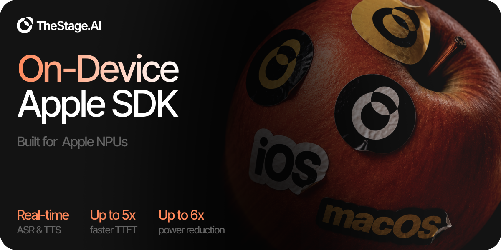
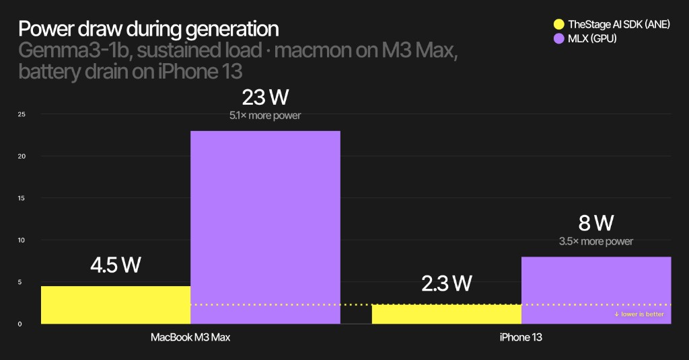
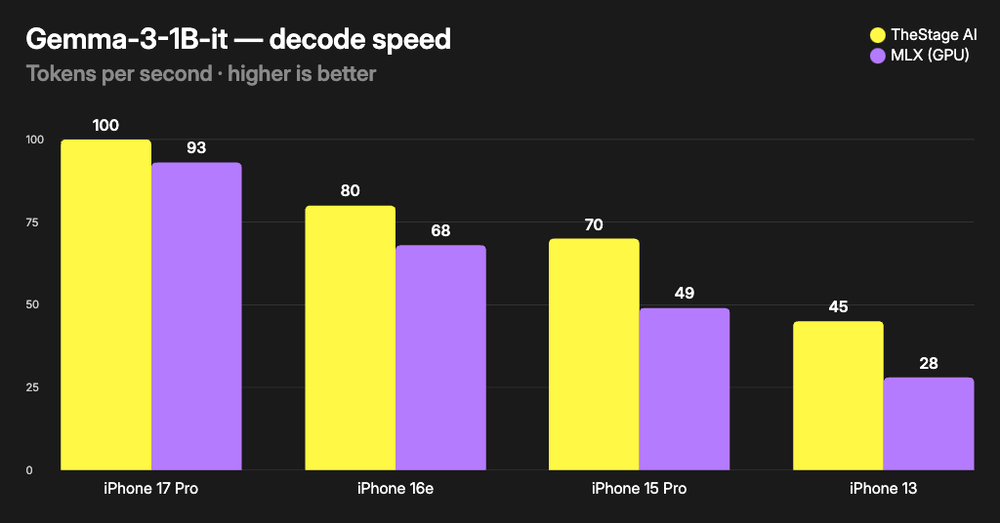
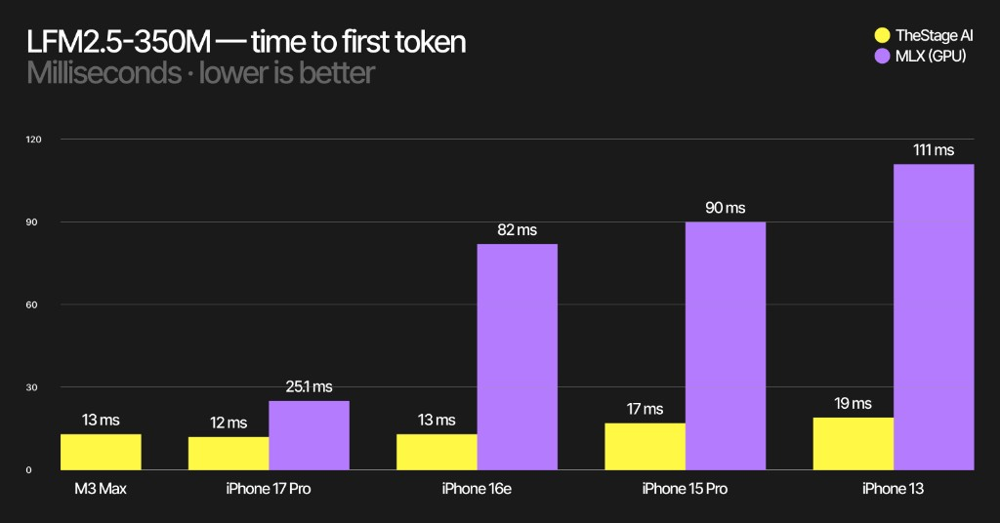
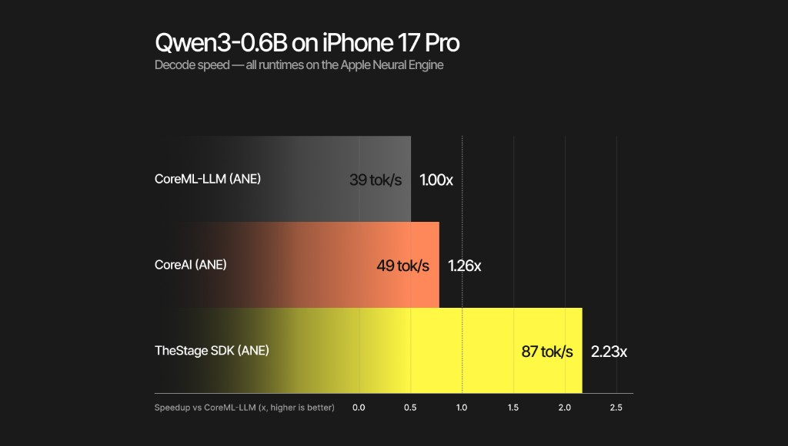

# TheStage Apple SDK



**On-device** speech, language, and audio inference for **iOS and macOS** on
Apple Silicon. Engines ship as CoreML / MLX bundles from Hugging Face; the
SDK picks ANE / GPU / CPU per device. After `initialize`, **inference never
leaves the device** — there is no server in the hot path.

| | |
| --- | --- |
| Version | **`1.2.0`** (pin this tag / SwiftPM `exact:`) |
| Platforms | iOS **18+**, macOS **15+**, Apple Silicon only |
| Surfaces | Native Swift (`TheStageSDK`) · Flutter plugin (iOS) |
| Engines | Hugging Face `TheStageAI/*` @ **`v1.2`** |
| Token | [app.thestage.ai](https://app.thestage.ai) — online `initialize` required |

> **Not supported:** iOS Simulator, Intel Macs, Android, server-side inference.

---

## Built for battery — not just tok/s

On-device generation on the **Apple Neural Engine** draws a fraction of the
power of GPU paths like MLX — phones stay cooler, laptops stay on battery,
and sustained chat / voice agents remain practical.



*Gemma3-1B, sustained load. MacBook M3 Max via macmon; iPhone 13 via battery
drain. **~5.1×** less power on M3 Max and **~3.5×** on iPhone 13 vs MLX
(GPU). Lower is better.*

Speed and latency charts live under [Performance](#performance). Numeric
tables: [benchmarks.md](./docs/benchmarks.md).

---

## Read this first

**Humans** — do the [60-second Mac quick start](#quick-start), then pick
Swift or Flutter under [Integrate](#integrate). Dive into contracts only
when something breaks.

**Agents / coding assistants** — treat this file as the index, then open
[`docs/llms.txt`](./docs/llms.txt) and the linked page for the pipeline you
touch. Hard rules:

1. Always `initialize` **before** any pipeline / `start_model`.
2. Pin the SDK to tag **`1.2.0`** (do not float `from:`).
3. Pass HF repo ids like `"TheStageAI/Qwen3-0.6B"` — omit `revision` unless
   you intentionally override (defaults track this SDK line).
4. Audio is **mono `Float` / `Float32List` in `[-1.0, 1.0]`** — never
   `Float64` / Int16 without converting.
5. Do **not** invent device IDs, seat accounting, or crypto details — see
   [licensing](./docs/licensing.md).

```text
initialize (online) ──► start_model / Pipeline(...) ──► infer / infer_stream
        │                         │
        │                         ▼
        │              HF download + cache (first time)
        ▼
   process session OK     inference fully on-device
```

---

## Table of contents

1. [What's in this repo](#whats-in-this-repo)
2. [Capabilities & model fleet](#capabilities--model-fleet)
3. [Performance](#performance)
4. [Quick start](#quick-start)
5. [Prerequisites](#prerequisites)
6. [Integrate](#integrate)
7. [Mental model](#mental-model)
8. [Contracts](#contracts) (audio · progress · Swift↔Flutter)
9. [Documentation map](#documentation-map)
10. [Troubleshooting](#troubleshooting)
11. [Secrets & license](#secrets--license)

---

## What's in this repo

| Path | Role |
| --- | --- |
| `TheStageCore.xcframework/` | Pre-built binary (`ios-arm64` + `macos-arm64`) |
| `Package.swift` + `Sources/TheStageSDK/` | SwiftPM entry — `import TheStageSDK` |
| `plugin/thestage_apple_sdk/` | Flutter plugin (iOS only); vendors the xcframework |
| `examples/` | Demos pinned to this SDK version — see [`examples/README.md`](./examples/README.md) |
| `examples/macos_swift_tts/` | **Start here** — native Swift streaming TTS on Mac (no Xcode) |
| `examples/engine_bench/` | iPhone LLM / TTS / ASR / VLM benches (Hugging Face engines) |
| `examples/tts_front_stream/` | Flutter streaming TTS on a physical iPhone |
| `examples/voice_agent/` | Flutter mic → VAD → STT → LLM → TTS with barge-in |
| `examples/voice_agent_custom_nodes/` | Flutter custom nodes + ephemeral VLM captions |
| `docs/` | Per-pipeline guides + [`llms.txt`](./docs/llms.txt) agent index |
| `scripts/setup.sh` | One-time host setup for Flutter examples |

---

## Capabilities & model fleet

Everything below is the **production `@v1.2`**
fleet. Pass the HF id as `engines_path` (or construct the typed pipeline
with the same string).

| Task | HF engines | Swift entry | Notes |
| --- | --- | --- | --- |
| Chat LLM | `TheStageAI/Qwen3-0.6B` | `TheStageLLM` | Also `gemma-3-1b-it`, LFM2.5-230M / 350M |
| ASR | `TheStageAI/thewhisper-large-v3-turbo` | `WhisperPipeline` | Also `Qwen3-ASR-0.6B` |
| TTS | `TheStageAI/neutts-nano-multilingual` | `NeuTTSMultilingualPipeline` | Prefer nano for voice agents |
| TTS | `TheStageAI/Qwen3-TTS-12Hz-0.6B-Base` | `Qwen3TTSPipeline` | Auto-routed from bundle layout |
| VAD | `TheStageAI/silero-vad` | `SileroVAD` | 512-sample chunks @ 16 kHz |
| Turn detect | `TheStageAI/smart-turn-v3` | via `TheStageVoiceAgent` | DNN end-of-turn |
| Speaker ID | `TheStageAI/redimnet2` | `SpeakerEmbedding` | 192-d embedding, 2 s window |
| Full agent | compose above | `TheStageVoiceAgent` | See [voice_agent.md](./docs/voice_agent.md) |

**Out of this release (do not pin in new apps):** full
`neutts-multilingual`, English espeak `neutts` / `NeuTTSNanoPipeline`,
wake-word, VLM / YOLO.

Model cards (contracts + acknowledgments):
[huggingface.co/TheStageAI](https://huggingface.co/TheStageAI).

---

## Performance

Release-build comparisons vs common on-device stacks. Device class and thermals
matter — treat these as relative guidance, not an SLA. Full metric tables:
[benchmarks.md](./docs/benchmarks.md).

### Decode throughput vs MLX (GPU)

Gemma-3-1B-it tokens/sec across iPhones — TheStage on ANE vs MLX on GPU
(higher is better):



### Time to first token

LFM2.5-350M TTFT — TheStage stays in the low teens of ms while MLX stretches
on older phones (lower is better):



### ANE runtime bake-off (same chip)

Qwen3-0.6B on **iPhone 17 Pro**, all paths on the Neural Engine — TheStage
SDK vs CoreML-LLM and CoreAI (higher is better):



Power / efficiency (intro highlight):
[Built for battery](#built-for-battery--not-just-toks).

---

## Quick start

### 60 seconds on Mac (no Xcode, no device)

```bash
cd examples/macos_swift_tts
export TS_API_TOKEN=th_…          # from app.thestage.ai
swift run
```

First run downloads NeuTTS engines and caches them; later runs start cold
from disk. Playback-only — no mic permission. Details:
[examples/macos_swift_tts/README.md](./examples/macos_swift_tts/README.md).

### Physical iPhone (Flutter)

```bash
./scripts/setup.sh                # idempotent; espeak only if you need nano-EN
cp examples/tts_front_stream/secrets.example.json \
   examples/tts_front_stream/secrets.json
# edit secrets.json → TS_API_TOKEN
```

In Xcode (`examples/tts_front_stream/ios/Runner.xcodeproj`): set **Team** +
unique **Bundle Identifier**, then:

```bash
cd examples/tts_front_stream
flutter pub get
flutter run --release \
    --dart-define-from-file=secrets.json \
    -d <YOUR_IPHONE_DEVICE_ID>
```

`examples/voice_agent` is the same recipe (+ `OPENAI_API_KEY` if you use
the cloud LLM provider).

---

## Prerequisites

| Requirement | Minimum | Notes |
| --- | --- | --- |
| macOS | 15.0 | Apple Silicon Mac |
| iOS | 18.0 | Physical iPhone / iPad |
| Xcode | 16.0 | For device signing / iOS apps |
| Swift | 6.0 | SwiftPM |
| Flutter / Dart | 3.24 / 3.5 | Flutter examples + plugin only |
| Network | once per process | Required for `initialize` and first engine download |

```bash
# Flutter path only
brew install flutter
flutter config --enable-swift-package-manager
```

---

## Integrate

### Native Swift (iOS + macOS)

Xcode → **File → Add Package Dependencies…** → this repo URL → product
`TheStageSDK`. Or:

```swift
.package(
    url: "https://github.com/TheStageAI/AppleSDK.git",
    exact: Version(1, 2, 0)
)
```

```swift
import TheStageSDK

let ai = TheStageAI.shared
try await ai.initialize(apiToken: "th_…")

let llm = try await TheStageLLM(
    engines_path: "TheStageAI/Qwen3-0.6B",
    on_load_progress: { p in
        print("[\(p.model)] \(p.phase) \(Int(p.fraction * 100))%")
    }
)

let result = llm.infer(
    prompt: "Give me a one-line haiku about Swift.",
    max_new_tokens: 64
)
print(result.text)
```

Two ways to drive models (same cache, same progress events):

| Style | When to use |
| --- | --- |
| Typed pipelines (`TheStageLLM(...)`, `WhisperPipeline(...)`, …) | Native Swift apps — compile-time APIs |
| `TheStageAI.shared.start_model` / `infer` / `infer_stream` | JSON lifecycle, Flutter, dynamic model sets |

### Flutter (iOS)

```yaml
dependencies:
  thestage_apple_sdk:
    git:
      url: https://github.com/TheStageAI/AppleSDK.git
      path: plugin/thestage_apple_sdk
      ref: 1.2.0
```

```bash
flutter config --enable-swift-package-manager
# Xcode → Runner → Minimum Deployments → iOS 18.0
```

```dart
import 'package:thestage_apple_sdk/thestage_apple_sdk.dart';

await TheStageFlutterSDK.initialize(api_token: 'th_…');

await TheStageFlutterSDK.start_model(
  model_name: 'llm',
  engines_path: 'TheStageAI/Qwen3-0.6B',
);

final result = await TheStageFlutterSDK.infer(
  model_name: 'llm',
  input_json: {
    'prompt': 'Give me a one-line haiku about Swift.',
    'max_new_tokens': 64,
  },
);
print(result[0]['text']);
```

More: [plugin README](./plugin/thestage_apple_sdk/README.md). Fastest
path to a working UI: copy an `examples/` app.

---

## Mental model

### Lifecycle

1. **`initialize(apiToken:)`** — online token check + device seat
   registration. Fails offline / on network errors. Once per process
   when reachable; after success, **inference is on-device** for that
   process.
2. **Load** — `Pipeline(engines_path:)` or `start_model(...)`. First hit
   downloads the HF revision for this SDK line into Application Support
   (not purged by iOS, excluded from iCloud backup).
3. **Infer** — batch `infer` or streaming `infer_stream` / TTS streamer.
4. **Stop** — `stop_model` / drop pipeline references to free memory.

### Revisions

Omit `revision:` in normal apps. This build resolves HF tags via an
internal map aligned with SDK **`1.2.0`** → fleet
**`v1.2`**. Override only when
you intentionally pin an older engine tag.

### Init & seats (product)

- Seat = `(apiToken, deviceId)` — see [licensing.md](./docs/licensing.md).
- Pricing / plans: Service Request at
  [app.thestage.ai/contact](https://app.thestage.ai/contact).
- Do not document or depend on how `deviceId` is derived.

---

## Contracts

### Audio I/O

All public audio is **PCM mono**, samples in **`[-1.0, 1.0]`**.

| Pipeline | Direction | Rate | Framing |
| --- | --- | --- | --- |
| `SileroVAD` | in | **16 kHz** | exactly **512** samples / call (stateful) |
| `WhisperPipeline` / Qwen3-ASR | in | **16 kHz** | any length; SDK windows long audio |
| NeuTTS / Qwen3-TTS | out | **24 kHz** | streamer = chunks; batch = one buffer |
| `SpeakerEmbedding` | in | **16 kHz** | **2.0 s** window (pad/trim) |

Prefer `tts.sample_rate` over hardcoding. Mic path for agents is 16 kHz;
TTS playback is 24 kHz — resample at the edge if you mix them.

Swift: `[Float]` · Flutter: **`Float32List` only**.

### Load progress

Optional `on_load_progress` (Swift) / `TheStageFlutterSDK.on_progress`
(Flutter). Phases are monotonic `0...1`:

| Phase | Band | Notes |
| --- | --- | --- |
| `downloading` | 0.00 – 0.70 | HF fetch (skipped on cache hit) |
| `extracting` | 0.70 – 0.85 | Unpack (skipped on cache hit) |
| `loading` | 0.85 – 0.99 | Pipeline construction |
| `ready` | 1.00 | Success only |

### Swift ↔ Flutter parity

| Operation | Swift | Flutter |
| --- | --- | --- |
| Initialize | `TheStageAI.shared.initialize(apiToken:)` | `TheStageFlutterSDK.initialize(api_token:)` |
| Start | `ai.start_model(...)` | `start_model(...)` |
| Stop | `ai.stop_model(model_name:)` | `stop_model(model_name:)` |
| Batch | `ai.infer(model_name:input_json:)` | `infer(...)` |
| Stream | `ai.infer_stream(...)` → `AsyncStream` | `infer_stream(...)` → `Stream` |
| TTS push | `streamer.send` / `stop_stream` | `send` / `finish_stream` / `stop_stream` |
| Progress | per-call `on_load_progress` | global `on_progress` |
| Typed pipelines | yes | no — JSON path only |

**Naming trap:** Swift `apiToken:` vs Flutter `api_token:`.

---

## Documentation map

| Doc | Open when you need… |
| --- | --- |
| [`docs/llms.txt`](./docs/llms.txt) | Agent-oriented symbol + page index |
| [llm.md](./docs/llm.md) | Chat, streaming tokens, sampling, KV |
| [whisper.md](./docs/whisper.md) | ASR, VAD chunking, languages |
| [tts.md](./docs/tts.md) | NeuTTS + Qwen3-TTS, voices, streaming |
| [vad.md](./docs/vad.md) | Silero chunk contract |
| [streaming.md](./docs/streaming.md) | Back-pressure, sentence segmentation |
| [voice_agent.md](./docs/voice_agent.md) | Full loop, barge-in, smart-turn knobs |
| [speaker_embedding.md](./docs/speaker_embedding.md) | Enroll / verify |
| [licensing.md](./docs/licensing.md) | Token, seats, offline rules |
| [logging.md](./docs/logging.md) | Support breadcrumbs |
| [benchmarks.md](./docs/benchmarks.md) | Metric definitions |
| [product_terms.md](./docs/product_terms.md) | Commercial / legal pointer |

---

## Troubleshooting

| Symptom | Likely cause | Fix |
| --- | --- | --- |
| `notInitialized` / pipelines throw at construct | Forgot `initialize` | Call it once at app start (online) |
| Init fails offline / flaky network | Online validation required | Reconnect; retry `initialize` |
| Simulator build / Metal errors | Simulator unsupported | Use a physical device or Apple Silicon Mac |
| First infer very slow | HF download | Wait for `ready`; later runs use cache |
| Flutter audio glitches / NaNs | `Float64List` or wrong rate | Use `Float32List`; match table above |
| TTS / ASR “wrong” model type | Bundle auto-route | Pass the correct HF repo; see tts.md |
| SwiftPM / plugin resolve fails | Floating version | Pin `exact:` / `ref: 1.2.0` |
| Voice agent never commits turn | Thresholds / mode | See smart-turn knobs in voice_agent.md |

---

## Secrets & license

Flutter examples load tokens via `--dart-define-from-file=secrets.json`
(from `secrets.example.json`). Keep real keys out of git. The macOS
example uses `TS_API_TOKEN` in the environment.

License: [LICENSE](LICENSE). Commercial terms:
[product_terms.md](./docs/product_terms.md).
