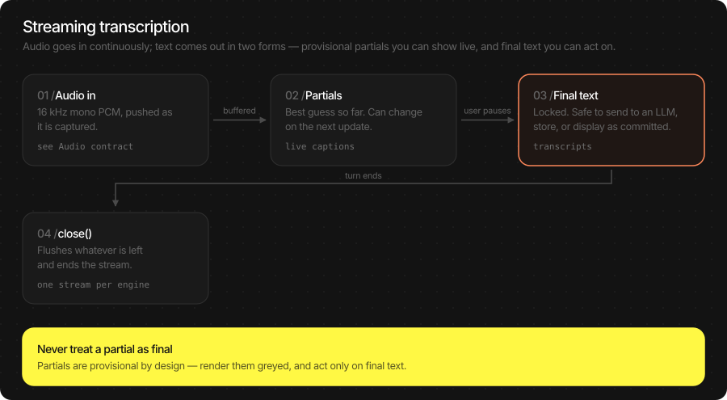
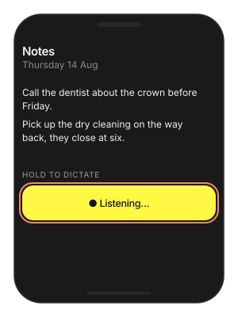
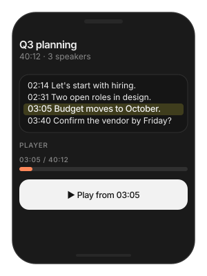
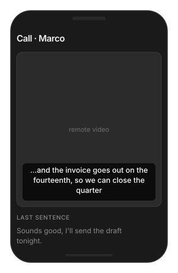
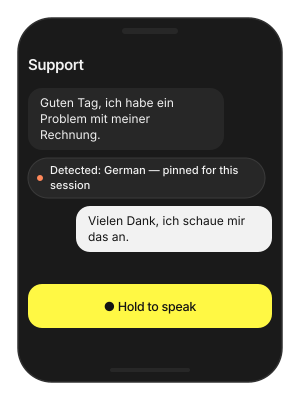
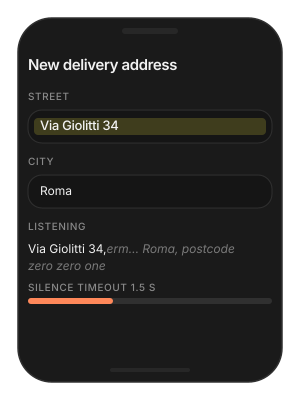

# ASR (Speech-to-Text)

On-device speech recognition. Three model families ship — **TheWhisper**,
**Qwen3-ASR** and **Parakeet-TDT** — and all take the same **16 kHz mono
float** audio and return the same `ASRResult`. Nothing you record leaves the device.

Use it in two ways: hand over a clip and get a transcript back, or open
a live session and get captions while the user is still talking.

> **Main features**
>
> - **One call for both families**: `infer(audio:config:)` on Swift,
>   `infer(model_name: "stt", …)` on Flutter. Switch model by changing
>   the engine path.
> - **Live captions**: two kinds of text at once — *committed* words that
>   will not change, and a *hypothesis* that fills in ahead of them.
> - **The SDK can own the microphone**: `ASREngine(config:)` captures,
>   detects speech and decides when a sentence ended. You only read text.
> - **Or you keep your audio pipeline**: push 16 kHz frames into
>   `open_stream` from any source.
> - **Long recordings**: pass the whole file; windowing and stitching are
>   automatic. With a VAD on the engine, each window ends in a pause and
>   silent stretches are not decoded.
> - **Word timestamps**: `timestamps: .WORD` returns every word with
>   start and end, for seeking and highlighting.
> - **Language detection**: `language: "auto"` when you do not know
>   what the user will speak.

## In this page

Here we will cover the following topics:

- [Supported models](#supported-models): the two families, what each does better, and how to pick.
- [Quick start](#quick-start): transcribe a file, live captions, or push your own PCM — Swift and Flutter side by side.
- [Transcribe audio](#transcribe-audio): the batch call, the audio contract, and per-call options.
- [Live captions](#live-captions): the two `ASREngine` modes, committed vs hypothesis text, and which knobs are worth touching.
- [Result object](#result-object): `ASRResult` fields and their Flutter JSON keys.
- [Usage Guides](#usage-guides): voice notes, meeting recordings, telephony audio, live subtitles, multilingual users, turn endings.
- [Troubleshooting](#troubleshooting): symptom → cause → fix.
- [Load Progress / Prefetch / Cleanup](#load-progress-prefetch-cleanup): first-run download, warming the cache, releasing models.

## Supported models

Three families, chosen by what your product needs rather than by API —
the calls are identical.

| Model | HF repo | Base | Device | Fleet pin |
|---|---|---|---|---|
| TheWhisper Large V3 Turbo | `TheStageAI/thewhisper-large-v3-turbo` | Whisper-large-v3-turbo | NPU | v1.1 |
| Qwen3-ASR 0.6B | `TheStageAI/Qwen3-ASR-0.6B` | 0.6B | NPU | v1.1 |
| Parakeet-TDT 0.6B v3 | `TheStageAI/parakeet-tdt-0.6b-v3` | parakeet-tdt-0.6b-v3 | NPU | v1.4 |

| Feature | TheWhisper turbo | Qwen3-ASR 0.6B | Parakeet-TDT 0.6B |
|---|---|---|---|
| Batch `infer` | yes | yes | yes |
| Live captions (`open_stream`) | yes, sentence-level commits | yes, prefix commits | yes, sentence-level commits |
| Word timestamps | yes, measured | approximate | yes, measured (from the decoder) |
| Language hint | `auto` / ISO code | `auto` / ISO code / English name | `auto` (25 European languages) |
| Long audio | 10 s windows, stitched | 8 s windows, stitched | 10 s windows, stitched |
| Voice Agent STT | yes | yes | yes |

**Which one?**

| You need… | Pick | Why |
|---|---|---|
| Live captions that read well while the user talks | **TheWhisper** | Measured word timing lets it commit whole sentences with punctuation, so text does not flicker. |
| Word-level timestamps for seeking or highlighting | **TheWhisper** | Timings are measured, not estimated. |
| Transcripts fed straight into an LLM prompt | **Qwen3-ASR** | Same tokenizer family as Qwen3 LLMs; output is plain text. |
| Fastest transcription of European speech | **Parakeet-TDT** | A transducer with no autoregressive text decoder: about 13× real time on an M2 Max, word times measured per frame. |
| Smallest footprint | **TheWhisper** | Smaller decoder, faster first result on Apple Silicon. |
| Voice Agent | Either | The agent routes automatically from the pack. |

## Quick start

Three ways to run ASR. They differ in one thing — **who owns the
microphone** — and that decides the whole shape of your code.

| You want | Who owns audio | Use |
|---|---|---|
| A transcript of a file | Nobody — you hand over samples | `infer` |
| Live captions, fastest path | **The SDK**: mic, VAD and turns | `ASREngine(config:)` / `TSASREngine` |
| Live captions inside an audio app you already have | **You** — push PCM frames | `open_stream` / `ASRStream.open` |

### Transcribe a file

**Swift**

```swift
import TheStageSDK

try await TheStageAI.shared.initialize(api_token: "your-api-token")

let stt = try await WhisperPipeline(
    engines_path: "TheStageAI/thewhisper-large-v3-turbo"
)

let samples = try AudioIO.load_wav(
    path: "/path/to/clip.wav",
    target_sample_rate: 16_000
)

let result = try stt.infer(
    audio: samples,
    config: ASRGenerationConfig(language: "en")
)
print(result.text)
```

**Flutter**

```dart
import 'package:thestage_apple_sdk/thestage_apple_sdk.dart';

await TheStageFlutterSDK.initialize(api_token: 'your-api-token');
await TheStageFlutterSDK.start_model(
  model_name: 'stt',
  engines_path: 'TheStageAI/thewhisper-large-v3-turbo',
);

// 16 kHz mono Float32 samples — here a headerless float32 file
// (see Audio contract)
final bytes = await File('/path/to/clip_16k.pcm').readAsBytes();
final pcm16k = Float32List.view(bytes.buffer);
final stt = ASREngine(stt: 'stt');
final result = await stt.infer(
  // Float32List, 16 kHz mono
  pcm16k,
  config: const ASRGenerationConfig(language: 'en'),
);
print(result.text);
```

### Live captions — the SDK owns the microphone

The shortest path to working captions. You get text; the SDK handles
capture, voice detection, and deciding where one utterance ends.

**Swift**

```swift
var config = TSAgentConfig(
    vad: "TheStageAI/silero-vad",
    stt: "TheStageAI/thewhisper-large-v3-turbo"
)
config.asr_generation = ASRGenerationConfig(
    language: "en",
    timestamps: .WORD
)

let engine = ASREngine(config: config)
let captions = Task {
    for await turn in engine.turns.recv() {
        committedLabel.text = turn.committed
        hypothesisLabel.text =
            turn.end_of_turn ? "" : turn.hypothesis
    }
}

// the SDK now owns the microphone
try await engine.start()
// ... later
await engine.stop()
await captions.value
```

**Flutter**

```dart
final asr = TSASREngine();

asr.turns.listen((turn) {
  committed.value  = turn.committed;
  hypothesis.value = turn.end_of_turn ? '' : turn.hypothesis;
});

await asr.start(config: {
  'vad': 'TheStageAI/silero-vad',
  'stt': 'TheStageAI/thewhisper-large-v3-turbo',
  'language': 'en',
});
// ... later
await asr.stop();
```

> [!TIP]
> **Subscribe before** `start()`. A listener attached afterwards misses
> everything already emitted — the usual report is "captions are empty".

### Live captions — you own the audio

Use this when your app already has an audio pipeline and you want to push
frames into ASR yourself.

**Swift**

```swift
let silero = try SileroVAD(engines_path: "TheStageAI/silero-vad")
let engine = ASREngine(pipeline: stt, vad: silero)
let stream = try await engine.open_stream(
    ASRGenerationConfig(language: "en", timestamps: .WORD)
)

// Your audio source. MicAudioSource is the SDK's microphone capture:
// 16 kHz mono [Float], one 512-sample frame every 32 ms. Any 16 kHz source works.
let mic = MicAudioSource(sample_rate: 16_000)

let captions = Task {
    for await turn in stream.turns {
        committedLabel.text  = turn.committed
        hypothesisLabel.text = turn.end_of_turn ? "" : turn.hypothesis
    }
}
let pump = Task {
    // ends when mic.stop() is called
    for await frame in mic.stream {
        stream.send(frame)
    }
}

try mic.start()
// ... the user taps "stop"
mic.stop()
await pump.value
// the transcript to store
let result = await stream.close()
await captions.value
print(result.text)
```

**Flutter**

```dart
await TheStageFlutterSDK.start_model(
  model_name: 'vad', engines_path: 'TheStageAI/silero-vad');
await TheStageFlutterSDK.start_model(
  model_name: 'stt', engines_path: 'TheStageAI/thewhisper-large-v3-turbo');

final stream = await ASRStream.open(
  model_name: 'stt',
  vad_model_name: 'vad',
  generation: const ASRGenerationConfig(language: 'en'),
);
final captions = stream.events.listen((e) {
  if (!e.is_turn) return;
  committed.value  = e.payload['committed'] as String;
  hypothesis.value = e.payload['end_of_turn'] == true
      ? '' : e.payload['hypothesis'] as String;
});

// Your audio source: 16 kHz mono Float32 samples. The plugin does not capture
// the microphone for push streams — for a live mic use TSASREngine above.
// Here the audio is a headerless 16 kHz float32 file, sent in 100 ms frames.
final bytes = await File('/path/to/clip_16k.pcm').readAsBytes();
final pcm = Float32List.view(bytes.buffer);
for (var i = 0; i < pcm.length; i += 1600) {
  await stream.send(pcm.sublist(i, min(i + 1600, pcm.length)));
}
final result = await stream.close();
await captions.cancel();
print(result.text);
```

### Important API

| Purpose | Swift | Flutter |
|---|---|---|
| Load a model | `try await WhisperPipeline(engines_path:)` / `Qwen3ASRPipeline(…)` | `start_model(model_name: 'stt', engines_path:)` |
| Transcribe a clip | `try stt.infer(audio:config:)` → `ASRResult` | `ASREngine(stt:).infer(audio, config:)` → `ASRResult` |
| Live, SDK owns mic | `ASREngine(config:)`; `start()` / `stop()` | `TSASREngine()`; `start(config:)` / `stop()` |
| Live, you push audio | `ASREngine(pipeline:vad:)` → `open_stream(…)` → `ASRStream` | `ASRStream.open(model_name:vad_model_name:)` |
| Release | drop the pipeline | `stop_model(model_name: 'stt')` |

## Transcribe audio

One call, one transcript. Give it 16 kHz mono float samples of any
length — a two-second command or a forty-minute meeting — and it returns
the text, and if asked, every word with its start and end time.

**Swift**

```swift
let stt = try await WhisperPipeline(
    engines_path: "TheStageAI/thewhisper-large-v3-turbo"
)

let samples = try AudioIO.load_wav(
    path: "/path/to/meeting.wav",
    // resampled for you
    target_sample_rate: 16_000
)

let result = try stt.infer(
    audio: samples,
    config: ASRGenerationConfig(
        language: "en",
        timestamps: .WORD,
        // for long audio, see below
        overlap: 0.2
    )
)

print(result.text)
for word in result.words ?? [] {
    print("\(word.t0)s–\(word.t1)s  \(word.text)")
}
```

**Flutter**

```dart
await TheStageFlutterSDK.start_model(
  model_name: 'stt',
  engines_path: 'TheStageAI/thewhisper-large-v3-turbo',
);

// 16 kHz mono Float32 samples — here a headerless float32 file
// (see Audio contract)
final bytes = await File('/path/to/clip_16k.pcm').readAsBytes();
final pcm16k = Float32List.view(bytes.buffer);
final stt = ASREngine(stt: 'stt');
final result = await stt.infer(
  // Float32List
  pcm16k,
  config: const ASRGenerationConfig(
    language: 'en',
    timestamps: ASRTimestampMode.WORD,
    // for long audio, see below
    overlap: 0.2,
  ),
);

print(result.text);
for (final w in result.words ?? const <ASRWord>[]) {
  print('${w.t0}s–${w.t1}s  ${w.text}');
}
```

**Audio contract** — `infer` does not convert audio. It must already be:

| Sample rate | **16 000 Hz**. Anything else decodes as time-warped speech and returns nonsense or nothing. `AudioIO.load_wav` resamples files; for live buffers, resample before you call. |
|---|---|
| Channels | **Mono.** |
| Format | Float in `[-1, 1]`: Swift `[Float]`, Flutter `Float32List` (not `Float64List`). From Int16: `Float(sample) / 32768`. |
| Loudness | Do **not** peak-normalise. The models expect natural levels. |

**Per-call options** — `ASRGenerationConfig`:

| Field | Default | Meaning |
|---|---|---|
| `language` | `"en"` | ISO code, or `"auto"` to let the model detect it. Qwen3-ASR also accepts an English name (`"German"`). A wrong hint is worse than no hint — TheWhisper will decode foreign speech as English. |
| `timestamps` | `.WORD` | `.NONE` is fastest; `.SEGMENT` gives phrase ranges; `.WORD` gives every word with `t0` / `t1`. |
| `overlap` | `0.2` | Long audio is cut into windows (10 s TheWhisper and Parakeet, 8 s Qwen3-ASR). `0.2` reuses 20% of each window in the next, so a word on a cut is decoded by both windows and kept once. `0` decodes every sample once and loses words that straddle a cut. |
| `max_new_tokens` | derived | Cap on decode per window. Leave unset — the default follows the real audio length. |
| `return_tokens` | `false` | Include token IDs in the result. Debugging only. |

## Live captions



Live recognition gives you text while the user is still speaking. It
comes as **two kinds of text at once**, and a caption UI needs both:

- **committed** — locked in. It will not be rewritten. Append it.
- **hypothesis** — the model's current best guess at what is still being
  said. It *will* be rewritten. Render it in a separate, lighter label.

`ASREngine` is one class with **two modes**, chosen by which
initializer you call:

|  | `ASREngine(config:)` | `ASREngine(pipeline:vad:)` |
|---|---|---|
| Who captures audio | The SDK | You |
| How audio gets in | Automatically, from the mic | `stream.send(frame)` |
| Start / stop | `start()` / `stop()` | `open_stream()` / `close()` |
| Voice detection & turns | Built in | Pass a `vad:`, or none |
| Flutter | `TSASREngine` | `ASRStream.open` |
| Read results from | `turns`, `transcripts`, `partial_transcripts` | `stream.turns`, `stream.partials` |

### Rendering a caption

The one pattern to get right. `ASRTurn` carries `committed`,
`hypothesis`, `display` (the two joined) and `end_of_turn`.

**Swift**

```swift
var config = TSAgentConfig(
    vad: "TheStageAI/silero-vad",
    stt: "TheStageAI/thewhisper-large-v3-turbo"
)
let engine = ASREngine(config: config)

for await turn in engine.turns.recv() {
    // ✅ two labels: solid text, then a dimmed guess
    committedLabel.text  = turn.committed
    hypothesisLabel.text = turn.end_of_turn ? "" : turn.hypothesis

    // ✅ one label, if you must
    captionLabel.text = turn.display

    // ❌ appending display doubles words when the guess firms up
    // transcript += turn.display
}
```

**Flutter**

```dart
// started with asr.start(config:) as in Quick start
final asr = TSASREngine();

asr.turns.listen((turn) {
  // ✅ two widgets: solid text, then a dimmed guess
  committed.value  = turn.committed;
  hypothesis.value = turn.end_of_turn ? '' : turn.hypothesis;

  // ✅ one widget, if you must
  caption.value = turn.display;

  // ❌ appending display doubles words when the guess firms up
  // transcript += turn.display;
});
```

### Important API

Channels on `ASREngine(config:)` and `TSASREngine`:

| Channel | What arrives |
|---|---|
| `turns` | Every `ASRTurn`. Final turns are never dropped. |
| `transcripts` | One final string per completed utterance. |
| `partial_transcripts` | Live text for a caption label. Latest value wins; intermediate values may be skipped if your UI is slow. |
| `vad_probabilities` | Per-frame speech probability, for a mic meter. |
| `events` | Lifecycle and error events. |

Calls on `ASRStream` (Swift and Flutter):

| Call | Use it to |
|---|---|
| `send(_:)` | Push 16 kHz mono frames. Any frame size. |
| `flush()` | Force a commit at a pause you detected yourself. |
| `close()` | End the session and get the authoritative `ASRResult`. |
| `cancel()` | Abandon the session — barge-in, or the user left the screen. |

> [!TIP]
> `close()` returns the transcript you should store. The live text you
> rendered from `partials` is cosmetic and may differ — it was produced
> before the model had heard the end of the sentence.

> [!CAUTION]
> The two modes do not mix. `engine.config` and `engine.state` exist
> only for `ASREngine(config:)`; reading them on a `pipeline:`-built
> engine traps at runtime rather than returning nil.

**Per-engine configuration** — `TSAgentConfig` for `ASREngine(config:)`.
Changing any of it means `stop()` then `start()`.

| Field | Controls |
|---|---|
| `asr_generation` | Language and timestamp mode — the same `ASRGenerationConfig`. |
| `turn_config` | When an utterance is over: `silence_timeout_ms` (default 608), `asr_silence_hangover_ms`, `max_accumulation_ms` (30 000). |
| `vad_config` | How sensitive capture is: `threshold` (0.5), `pre_roll_s` (0.35), onset window. |
| `asr_streaming_config` | Commit policy — see below. |
| `audio` / `audio_node_factory` | Microphone settings, or a complete replacement audio source. |

> [!NOTE]
> Turn policy and capture sensitivity are separate on purpose. "It cuts me
> off mid-sentence" is `turn_config.silence_timeout_ms`. "It starts on a
> door click" is `vad_config.threshold`. Reaching for the wrong one is
> the most common tuning mistake here.

On Flutter, `TSASREngine.start(config:)` accepts `vad`, `stt`,
`vad_device`, `stt_device`, `stt_revision`, `language`,
`turn_silence_timeout_ms` and `turn_asr_silence_hangover_ms`. The
rest is deliberately not exposed — the per-model policy is already tuned.

**Commit policy** — `ASRStreamingConfig`. Streaming has to decide *when
a word is safe to show as final*. Leaving this empty picks the right
policy for the loaded model; most apps never set it.

| Algorithm | Runs on | Behaviour |
|---|---|---|
| `THESTAGE_V5` | Models with word timing (TheWhisper — its default) | Commits a sentence at a time, so punctuation and casing are right and text stops flickering. |
| `NAIVE` | Any streaming model (Qwen3-ASR default) | Commits the longest prefix that repeated decodes agree on. Simple and portable; more rewriting on screen. |

| Field | Default | Raise it / lower it when |
|---|---|---|
| `n_confirmations` | 2 | Raise for fewer rewrites on screen, at the cost of text appearing later. |
| `commit_lag_s` | 1.0 s TheWhisper · 2.0 s Qwen3-ASR | How far behind live audio a word must be before it locks. Raise if endings get corrected; lower for snappier captions. |
| `endpoint_silence_s` | 1.5 s TheWhisper · 3.5 s Qwen3-ASR | How much hush ends a turn. Raise for speakers who pause to think; lower for quick back-and-forth. |
| `max_repeats` | 3 | Raise if genuine repetition ("no no no", counting) is being eaten; lower if a stuck decoder reaches the transcript. |
| `speech_onset_s` | 0.2 s | Raise if door clicks and keyboard noise start turns. |

> [!CAUTION]
> `THESTAGE_V5` needs a model that reports word timings. Asking for it
> on one that does not fails at `open_stream` with the missing
> capability named — it does not silently downgrade. If in doubt, pass
> nothing.

**Sentence formatting** — committed text is punctuated and capitalised
for you, script-aware across the 28 shipped TheWhisper languages. Pass
`format_turns: false` in `ASRStreamingConfig`, or your own
`ASRTextFormatter` to `ASREngine(pipeline:vad:formatter:)`, if your
UI wants raw words.

## Result object

`ASRResult` is what `infer` and `close()` return. Swift gets a
struct; Flutter gets the same fields as JSON, with one alias.

**Swift**

```swift
let stt = try await WhisperPipeline(
    engines_path: "TheStageAI/thewhisper-large-v3-turbo"
)
var config = TSAgentConfig(
    vad: "TheStageAI/silero-vad",
    stt: "TheStageAI/thewhisper-large-v3-turbo"
)

let result = try stt.infer(audio: samples, config: config)

// the transcript
result.text
// detected ISO code, with language: "auto"
result.language
// seconds, with timestamps: .WORD
result.words?.first?.t0
// audio seconds per wall second
result.metrics.rtf
```

**Flutter**

```dart
await TheStageFlutterSDK.start_model(
  model_name: 'stt',
  engines_path: 'TheStageAI/thewhisper-large-v3-turbo',
);

// Typed — pcm16k: Float32List, 16 kHz mono (see Audio contract)
final result = await ASREngine(stt: 'stt').infer(pcm16k);
result.text;
result.language;
result.words?.first.t0;

// Raw JSON, if you call TheStageFlutterSDK.infer directly
final rows = await TheStageFlutterSDK.infer(
  model_name: 'stt', input_json: {'audio': pcm16k, 'language': 'en'});
// the transcript (also under 'text')
rows[0]['transcription'];
// [{text, t0, t1}], with 'timestamps': 'WORD'
rows[0]['words'];
```

| Swift | Flutter JSON | Meaning |
|---|---|---|
| `text` | `transcription` / `text` | The transcript. |
| `words` | `words` | `[ASRWord]` — `text`, `t0`, `t1` in seconds. Only with `timestamps: .WORD` / `.SEGMENT`. |
| `language` | `language` | ISO code the model detected. Set with `language: "auto"`. |
| `metrics.rtf` | `metrics.rtf` | Audio seconds per wall second. 20 means a minute of audio in 3 s. |
| `decode_seconds` | `decode_seconds` | Decoder wall time. |
| `tokens` | `tokens` | Token IDs, only with `return_tokens`. |

## Usage Guides

Each guide is one app we are building: what it is, what users expect,
what to use from the SDK, what it looks like, and the code.

### Press-and-hold dictation

> **Problem**
>
> **Building** — a notes app with a microphone button under the text.
>
> **Users want** — hold the button, say a sentence, let go, and see
> the words appear at once. No live captions, no waiting spinner.
>
> **Hard part** — audio must reach the model at exactly 16 kHz mono,
> each press must produce one accurate transcript, and the model must
> not be reloaded between presses.

**Solution — what to use**

- `MicAudioSource` — the SDK's microphone capture; delivers 16 kHz
  mono `[Float]` frames while the button is held.
- `WhisperPipeline` — loaded once for the screen's lifetime.
- `infer(audio:config:)` — once, on release, with
  `timestamps: .NONE` (the fastest decode when you only need text).
- Flutter: `TSASREngine` — `start` on press, `stop` on release;
  the transcript arrives on `transcripts`.



**Swift**

```swift
final class Dictation {
    private let stt: WhisperPipeline
    // SDK microphone: 16 kHz mono frames
    private let mic = MicAudioSource(sample_rate: 16_000)
    private var buffer: [Float] = []
    private var pump: Task<Void, Never>?

    init(stt: WhisperPipeline) { self.stt = stt }

    // Button pressed
    func begin() throws {
        buffer.removeAll(keepingCapacity: true)
        try mic.start()
        pump = Task {
            for await frame in mic.stream { buffer.append(contentsOf: frame) }
        }
    }

    // Button released
    func end() async throws -> String {
        mic.stop()
        await pump?.value
        let result = try stt.infer(
            audio: buffer,
            config: ASRGenerationConfig(language: "en", timestamps: .NONE)
        )
        return result.text
    }
}

// Once per screen
let stt = try await WhisperPipeline(
    engines_path: "TheStageAI/thewhisper-large-v3-turbo"
)
let dictation = Dictation(stt: stt)
```

**Flutter**

```dart
// The SDK owns capture on Flutter: start on press, stop on release.
final asr = TSASREngine();
final sub = asr.transcripts.listen((text) => note.value += '$text ');

Future<void> onPressStart() => asr.start(config: {
      'vad': 'TheStageAI/silero-vad',
      'stt': 'TheStageAI/thewhisper-large-v3-turbo',
      'language': 'en',
    });
Future<void> onPressEnd() => asr.stop();
```

> [!TIP]
> - Keep the pipeline alive between presses. Loading is the slow part;
>   a warm `infer` on one sentence is well under a second.
> - `timestamps: .NONE` — you do not need word timings here, and it
>   is the fastest mode.
> - Ignore releases under ~300 ms; they are taps, not sentences, and
>   the model will invent a word for them.

### Transcribe a recording the user already has

> **Problem**
>
> **Building** — a meeting recorder. Recordings are 30–60 minutes.
>
> **Users want** — a transcript after the meeting, and to tap any
> sentence to jump the player to that moment.
>
> **Hard part** — a 40-minute file must go in as one call without
> losing words at window boundaries, and every word needs a time.

**Solution — what to use**

- `AudioIO.load_wav(path:target_sample_rate:)` — reads the file
  (anything `AVAudioFile` reads: WAV, M4A, CAF) and resamples to
  16 kHz.
- `infer(audio:config:)` with the **whole file** — windowing and
  stitching are automatic. Through `ASREngine` with a VAD, every window
  ends in a confirmed pause where one exists in its second half, and a
  window with no speech is skipped; windows stay contiguous audio, so
  punctuation and word clocks are unchanged.
- `overlap` — `0.2` by default: 20 % of each window is reused so a word
  on a cut is not lost. It applies to every cut that could not be placed
  in a pause; a cut inside a pause has nothing to lose and takes none.
- `timestamps: .WORD` — `t0` / `t1` per word, which is your seek
  position.



**Swift**

```swift
let stt = try await WhisperPipeline(
    engines_path: "TheStageAI/thewhisper-large-v3-turbo"
)

// any file AVAudioFile reads, resampled to 16 kHz
let samples = try AudioIO.load_wav(
    path: recordingURL.path,
    target_sample_rate: 16_000
)
let result = try stt.infer(
    audio: samples,
    config: ASRGenerationConfig(
        language: "en", timestamps: .WORD, overlap: 0.2
    )
)

// Group words into rows for the list; tap → seek
let words = result.words ?? []
func seek(to word: ASRWord) {
    player.seek(to: CMTime(seconds: word.t0, preferredTimescale: 1_000))
}
```

**Flutter**

```dart
await TheStageFlutterSDK.start_model(
  model_name: 'stt',
  engines_path: 'TheStageAI/thewhisper-large-v3-turbo',
);

// 16 kHz mono float samples of the recording
final bytes = await File('/path/to/recording_16k.pcm').readAsBytes();
final pcm16k = Float32List.view(bytes.buffer);

final result = await ASREngine(stt: 'stt').infer(
  pcm16k,
  config: const ASRGenerationConfig(
    language: 'en',
    timestamps: ASRTimestampMode.WORD,
    overlap: 0.2,
  ),
);

// tap → seek
void seek(ASRWord word) =>
    player.seek(Duration(milliseconds: (word.t0 * 1000).round()));
```

> [!TIP]
> - Windows decode one after another: expect about `duration / rtf`
>   of wall time. On an M-series Mac a 40-minute file takes about two
>   minutes — run it off the main thread and show progress.
> - `overlap` defaults to `0.2`, so a word that straddles a cut is
>   decoded by both windows. `0` is faster and *will* lose those words.
> - Build rows from `result.words` (each has `t0` / `t1`), not by
>   splitting `result.text` — the text has no times.

### Audio arrives from somewhere else

> **Problem**
>
> **Building** — a call-centre app that receives 8 kHz Int16 audio
> over the network, and a video app whose camera session runs at
> 48 kHz stereo.
>
> **Users want** — transcripts, same as from the microphone.
>
> **Hard part** — neither format is what `infer` accepts, and
> feeding them directly does not fail: it returns nonsense.

**Solution — what to use**

- Convert **before** the call: Int16 → Float with `/ 32768`; any rate
  or channel count → 16 kHz mono with `AVAudioConverter`.
- `infer` never converts for you — by design, so a wrong rate is
  caught at your code, not inside the model.
- Flutter: the plugin passes samples through unchanged; resample in
  your audio layer and send `Float32List`.

**Swift**

```swift
import AVFoundation

// Int16 → Float
// what your network / call SDK hands you
let int16Samples: [Int16] = incomingFrame.samples
let floats = int16Samples.map { Float($0) / 32_768 }

// 48 kHz stereo → 16 kHz mono, once per buffer
let src = AVAudioFormat(commonFormat: .pcmFormatFloat32,
                        sampleRate: 48_000, channels: 2, interleaved: false)!
let dst = AVAudioFormat(commonFormat: .pcmFormatFloat32,
                        sampleRate: 16_000, channels: 1, interleaved: false)!
let converter = AVAudioConverter(from: src, to: dst)!
// run converter.convert(to:error:withInputFrom:) over your buffers,
// then hand the mono 16 kHz floats to infer / stream.send
```

**Flutter**

```dart
// Int16 → Float32List
// what your network / call SDK hands you
final Int16List int16Samples = incomingFrame.samples;
final floats = Float32List.fromList(
  [for (final s in int16Samples) s / 32768.0],
);
// Resample to 16 kHz in your audio layer before calling infer —
// the plugin passes samples through unchanged.
```

> [!TIP]
> - The symptom of a wrong rate is not an error, it is a wrong
>   transcript: empty, or a few unrelated words. Check the rate first.
> - Downmix stereo by averaging the channels; do not just take the left
>   one if the speaker may be panned.
> - `Float64List` does not round-trip the Flutter platform channel.
>   Always `Float32List`.

### Live subtitles in a call or video UI

> **Problem**
>
> **Building** — an accessibility feature for a video-call app:
> subtitles of what the remote party is saying.
>
> **Users want** — text that appears as the person speaks, does not
> jump around, and stays put once a sentence is finished.
>
> **Hard part** — the audio is the *remote* party's, not the
> microphone's, and the SDK's own mic would hear the wrong person.

**Solution — what to use**

- `ASREngine(pipeline:vad:)` + `open_stream` — the push path, fed
  with the call SDK's remote PCM.
- `ASRTurn.committed` / `hypothesis` — render the two differently:
  solid for committed, lighter for the guess.
- `end_of_turn` — move the finished sentence into the history and
  clear the live line.
- Flutter: `ASRStream.open` with the same events.



**Swift**

```swift
let stt = try await WhisperPipeline(
    engines_path: "TheStageAI/thewhisper-large-v3-turbo"
)
let silero = try SileroVAD(engines_path: "TheStageAI/silero-vad")
let engine = ASREngine(pipeline: stt, vad: silero)
let stream = try await engine.open_stream(
    ASRGenerationConfig(language: "en", timestamps: .WORD)
)

let render = Task {
    for await turn in stream.turns {
        if turn.end_of_turn {
            subtitles.commit(turn.committed)        // sentence is done
        } else {
            subtitles.live(committed: turn.committed,
                           guess: turn.hypothesis)
        }
    }
}

// The remote party's audio from your call SDK, 16 kHz mono frames
let remoteAudio16k: AsyncStream<[Float]> = callSDK.remotePCM16k
for await frame in remoteAudio16k { stream.send(frame) }
_ = await stream.close()
await render.value
```

**Flutter**

```dart
await TheStageFlutterSDK.start_model(
  model_name: 'vad', engines_path: 'TheStageAI/silero-vad');
await TheStageFlutterSDK.start_model(
  model_name: 'stt', engines_path: 'TheStageAI/thewhisper-large-v3-turbo');

final stream = await ASRStream.open(
  model_name: 'stt',
  vad_model_name: 'vad',
  generation: const ASRGenerationConfig(language: 'en'),
);
final render = stream.events.listen((e) {
  if (!e.is_turn) return;
  final committed  = e.payload['committed'] as String;
  final hypothesis = e.payload['hypothesis'] as String;
  if (e.payload['end_of_turn'] == true) {
    subtitles.commit(committed);
  } else {
    subtitles.live(committed: committed, guess: hypothesis);
  }
});

// The remote party's audio from your call SDK, 16 kHz mono frames
final Stream<Float32List> remoteAudio16k = callSdk.remotePcm16k;
await for (final Float32List frame in remoteAudio16k) {
  await stream.send(frame);
}
await stream.close();
await render.cancel();
```

> [!TIP]
> - Subscribe to `turns` / `events` **before** the first `send`.
> - Style the guess visibly lighter. Users forgive a guess that looks
>   like a guess; they do not forgive solid text that changes.
> - Leave `ASRStreamingConfig` empty: TheWhisper's default commits
>   whole sentences, which is what subtitles want.

### Users who speak several languages

> **Problem**
>
> **Building** — a support app shipped across Europe.
>
> **Users want** — to just talk, in German or French or Italian,
> without picking a language first.
>
> **Hard part** — a wrong language hint is worse than none: TheWhisper
> told `"en"` will transcribe German speech as English-sounding
> nonsense rather than fail.

**Solution — what to use**

- `language: "auto"` on the **first** utterance; read
  `result.language` to learn what was spoken.
- Pin that code for the rest of the session — a correct hint is
  faster and more accurate than detection.
- Show the detected language so the user can correct it.



**Swift**

```swift
let stt = try await WhisperPipeline(
    engines_path: "TheStageAI/thewhisper-large-v3-turbo"
)

// First utterance: detect
var result = try stt.infer(
    audio: firstUtterance,
    config: ASRGenerationConfig(language: "auto")
)
// e.g. "de"
let detected = result.language ?? "en"
languageChip.text = "Detected: \(Locale.current.localizedString(forLanguageCode: detected) ?? detected)"

// Later utterances: pin it
result = try stt.infer(
    audio: nextUtterance,
    config: ASRGenerationConfig(language: detected)
)
```

**Flutter**

```dart
await TheStageFlutterSDK.start_model(
  model_name: 'stt',
  engines_path: 'TheStageAI/thewhisper-large-v3-turbo',
);
final stt = ASREngine(stt: 'stt');

// First utterance: detect
var result = await stt.infer(
  firstUtterance, config: const ASRGenerationConfig(language: 'auto'));
// e.g. 'de'
final detected = result.language ?? 'en';

// Later utterances: pin it
result = await stt.infer(
  nextUtterance, config: ASRGenerationConfig(language: detected));
```

> [!TIP]
> - If transcripts look like word salad, check the hint before anything
>   else.
> - Qwen3-ASR also accepts English names — `"Japanese"` — handy when
>   the value comes from a settings screen.
> - Codes are ISO 639-1 (`en fr de es pt ru ja ko zh ar hi it` …).

### The engine ends turns too early — or too late

> **Problem**
>
> **Building** — a voice form: the user dictates an address field by
> field.
>
> **Users want** — to pause and think mid-address without the field
> being submitted half-finished; other users want a snappy "done" the
> moment they stop.
>
> **Hard part** — "the user has finished" is a policy, not a fact, and
> the right value differs between dictation and quick commands.

**Solution — what to use**

- `ASREngine(config:)` — the SDK owns the mic and the turn policy.
- `TurnConfig.silence_timeout_ms` — how long a pause means "done":
  ~600 ms for commands, 1 000–1 500 ms for dictation.
- `asr_silence_hangover_ms` — trailing audio still sent to the
  decoder so the last word is not clipped; leave the default.
- Flutter: `turn_silence_timeout_ms` on `TSASREngine.start`.



**Swift**

```swift
var config = TSAgentConfig(
    vad: "TheStageAI/silero-vad",
    stt: "TheStageAI/thewhisper-large-v3-turbo"
)
var turn = TurnConfig()
// default 608: wait longer for thinkers
turn.silence_timeout_ms = 1_500
turn.asr_silence_hangover_ms = 300
config.turn_config = turn

let engine = ASREngine(config: config)
Task { for await text in engine.transcripts.recv() { field.text = text } }
try await engine.start()
// stop() then start() after changing turn_config
```

**Flutter**

```dart
final asr = TSASREngine();
asr.transcripts.listen((text) => field.value = text);
await asr.start(config: {
  'vad': 'TheStageAI/silero-vad',
  'stt': 'TheStageAI/thewhisper-large-v3-turbo',
  'language': 'en',
  // default 608
  'turn_silence_timeout_ms': 1500,
  'turn_asr_silence_hangover_ms': 300,
});
// stop() then start() to change it
```

> [!TIP]
> - `silence_timeout_ms` is a product decision; there is no single
>   right value. Dictation and commands want different screens.
> - The hangover is not the timeout. Leave it unless final words are
>   being cut.
> - If the engine *starts* turns on background noise, that is
>   `vad_config.threshold` (Swift), not the turn policy.

## Troubleshooting

| Symptom | Cause | Fix |
|---|---|---|
| Empty or nonsense transcript | Audio is not 16 kHz mono float. | Check the rate first. Convert Int16 with `/ 32768`. See [Audio arrives from somewhere else](#audio-arrives-from-somewhere-else). |
| Words drop mid-file | `overlap` was set to `0` and a word straddled a window cut. | Leave `overlap` at its default `0.2`, or raise it. |
| Foreign speech comes out as English | Wrong `language` hint. | `language: "auto"`, then pin the detected code. |
| "Thank you." on silence | Decoder ran on hush without VAD. | Use `ASREngine(config:)` or pass `SileroVAD` into `open_stream`; gate `infer` on speech. |
| Captions are empty | Subscribed after `start()` / first `send`. | Subscribe first. |
| Text jumps around | Rendering `display` as if it were final. | Two labels: `committed` solid, `hypothesis` dimmed. |
| Slow on long recordings | Windows decode sequentially. | Expected; show progress. Skip silence by streaming turns instead of one giant buffer. |
| `open_stream` throws about a missing capability | `THESTAGE_V5` requested on a model without word timing. | Leave `algorithm` unset. |
| Model load fails | `initialize` not called, or cold download on the UI path. | `initialize(api_token:)` first; prefetch on a splash screen. |
| Flutter type error on `audio` | `Float64List` on the platform channel. | `Float32List`. |

## Load Progress / Prefetch / Cleanup

First run downloads and prepares the pack; later runs hit the cache.
Show progress the first time, warm the cache on a splash screen, and
release models you are done with.

**Swift**

```swift
let ai = TheStageAI.shared

// Progress
let stt = try await WhisperPipeline(
    engines_path: "TheStageAI/thewhisper-large-v3-turbo",
    on_load_progress: { p in
        print("[\(p.model)] \(p.phase) \(Int(p.fraction * 100))%")
    }
)

// Prefetch on a splash screen, construct later
let engines_dir = try await ai.prefetch_engines(
    repo_id: "TheStageAI/thewhisper-large-v3-turbo"
)
let stt = try await WhisperPipeline(engines_path: engines_dir)

// Cleanup: drop the reference, or
_ = try ai.stop_model(model_name: "stt")
```

**Flutter**

```dart
// Progress
TheStageFlutterSDK.on_progress.listen((event) {
  if (event['model_name'] != 'stt') return;
  print('[stt] ${event['phase']} ${((event['progress'] ?? 0) * 100).round()}%');
});

await TheStageFlutterSDK.start_model(
  model_name: 'stt',
  engines_path: 'TheStageAI/thewhisper-large-v3-turbo',
);

// Cleanup
await TheStageFlutterSDK.stop_model(model_name: 'stt');
```

Phases: `downloading` → `extracting` → `loading` → `ready`. Cache
hits skip the first two. Full contract: [Get started](./README.md)
(**Load Progress**).
