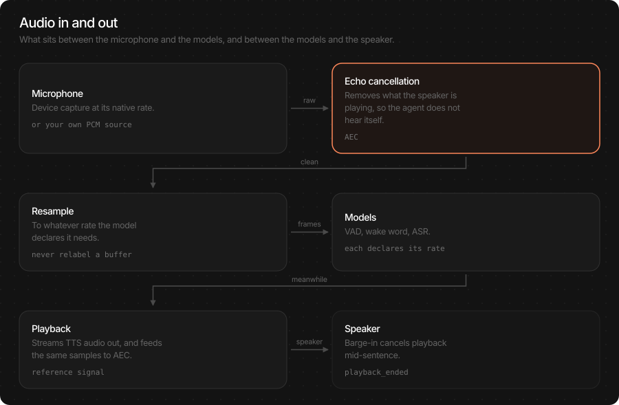
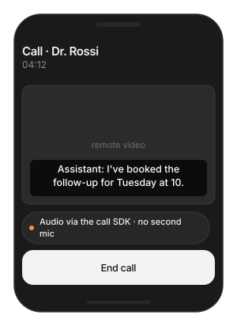
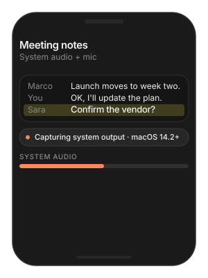
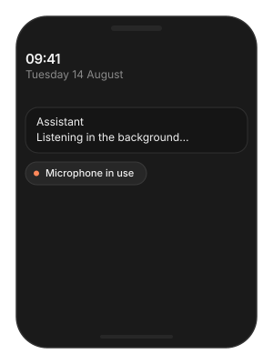

# Audio Nodes

How audio gets into and out of the Voice Agent and the SDK-owned ASR
engine. By default the SDK captures the microphone, cancels the echo of
its own playback, and plays speech through the device speaker — and
that is all most apps need. This page is for when it is not: a
different sample rate, a call app that already has audio, or capturing
what is playing on a Mac.

> **Main features**
>
> - **Works out of the box**: microphone in, speaker out, echo
>   cancellation on iOS — with no configuration.
> - **One config object**: `config.audio` holds rates, echo
>   cancellation and playback behaviour.
> - **Bring your own audio**: a custom node feeds the SDK PCM from a call
>   provider or any source, and receives playback PCM back.
> - **Mac system audio**: capture what other apps are playing, for
>   meeting transcription.
> - **Typed PCM**: every buffer carries its sample rate, so nothing is
>   mislabelled.

## In this page

Here we will cover the following topics:

- [Quick start](#quick-start): the default audio path, and the three settings people actually change.
- [Configure audio](#configure-audio): rates, echo cancellation, and every field with its default.
- [Echo cancellation by route](#echo-cancellation-by-route): which `aec_method` on which platform.
- [Bring your own audio](#bring-your-own-audio): the custom node contract.
- [Usage Guides](#usage-guides): a 48 kHz session, a call app, meeting capture on a Mac, background audio on iPhone.
- [Troubleshooting](#troubleshooting): symptom → cause → fix.

## Quick start



You do not have to touch audio to get a working voice agent. When you
do, it is one of three things: the speaker rate, echo cancellation, or
replacing the microphone with your own source.

**Swift**

```swift
var config = TSAgentConfig(
    vad: "TheStageAI/silero-vad",
    stt: "TheStageAI/thewhisper-large-v3-turbo",
    tts: "TheStageAI/neutts-nano-multilingual",
    llm: llm
)

// match your AVAudioSession
config.audio.sample_rate_out = 48_000
// iOS default; .NONE on Mac speakers
config.audio.aec_method = .VPIO

let agent = TSVoiceAgent(config: config)
try await agent.start()
```

**Flutter**

```dart
final agent = TSVoiceAgent();
await agent.start(config: {
  'vad': 'TheStageAI/silero-vad',
  'stt': 'TheStageAI/thewhisper-large-v3-turbo',
  'tts': 'TheStageAI/neutts-nano-multilingual',
  'llm_provider': 'local', 'llm_model': 'llm',

  // match your audio session
  'sample_rate_out': 48000,
  // 'vpio' | 'neural' | 'none'
  'aec_method': 'vpio',
});
```

### Important API

| Purpose | Swift | Flutter |
|---|---|---|
| Audio settings | `config.audio` (`AudioEngineConfig`) | keys on the `start` config |
| Replace the audio node | `config.audio_node_factory` | — (native host only) |
| Typed buffer | `PCM(samples:sample_rate:)` | `Float32List` + explicit rate |
| Mac system audio | `CoreAudioTapNode(audio_config:mode:)` | — (native host only) |

Changes to audio apply on the next `start()`: `stop()` first.

## Configure audio

`config.audio` is an `AudioEngineConfig`. The defaults are right for
a phone held to the face or on a desk; change them for a specific
reason.

**Swift**

```swift
// "llm" loaded with start_model
let llm = TSLocalLLMProvider(model_path: "llm")
let session = LLMChatEngine(
    llm: llm).chat_session(system_prompt: "You are a helpful assistant.",
    memory: .SLIDING(max_turns: 10)
)
var config = TSAgentConfig(
    vad: "TheStageAI/silero-vad",
    stt: "TheStageAI/thewhisper-large-v3-turbo",
    tts: "TheStageAI/neutts-nano-multilingual",
    llm: llm
)

// mic → VAD / ASR. Leave it.
config.audio.sample_rate_in  = 16_000
// speaker. Match your session.
config.audio.sample_rate_out = 24_000
// codec native. Leave it.
config.audio.tts_sample_rate = 24_000

// Apple VPIO graph on
config.audio.voice_processing = true
// .VPIO | .NEURAL | .NONE
config.audio.aec_method = .VPIO
// auto gain — usually off
config.audio.agc = false
config.audio.aec_warmup_ms = 250

// no-AEC fallback
config.audio.mute_mic_during_playback = false
config.audio.barge_in_drop_ms = 250
```

**Flutter**

```dart
// agent as in Quick start; agentConfig is its model map
final agent = TSVoiceAgent();

await agent.start(config: {
  // ...models...
  'sample_rate_in': 16000,
  'sample_rate_out': 24000,
  'tts_sample_rate': 24000,
  'aec_method': 'vpio',
  'aec_warmup_ms': 250,
  'interrupt_min_playback_ms': 250,
});
```

| Field | Default | Change it when |
|---|---|---|
| `sample_rate_in` | 16 000 | Never — VAD and ASR need 16 kHz. A custom node can deliver any rate; it is resampled once. |
| `sample_rate_out` | 24 000 | Your `AVAudioSession` runs at 48 kHz, or playback sounds fast or slow. |
| `tts_sample_rate` | 24 000 | Never — it is the codec's native rate. |
| `voice_processing` | iOS true · macOS false | Turning off Apple's voice-processing graph entirely. Rare. |
| `aec_method` | iOS `.VPIO` · macOS `.NONE` | See `Echo cancellation by route`_. |
| `agc` | false | Almost never — automatic gain lifts room noise into what VAD hears as speech. |
| `aec_warmup_ms` | 250 | The agent interrupts itself on its *first* reply only — raise so AEC has a reference before the first sentence. |
| `mute_mic_during_playback` | false | No echo cancellation is possible on this route (Mac speakers, some Bluetooth). Barge-in is disabled while it speaks. |
| `barge_in_drop_ms` | 250 | Audio dropped at the moment of a barge-in so the tail of the agent's own voice is not transcribed. |

> [!NOTE]
> Echo cancellation and noise suppression are one feature on the
> built-in node — Apple's Voice Processing IO does both. There is no
> separate noise-suppression switch.

## Echo cancellation by route

Echo cancellation exists so the agent does not hear its own speech and
interrupt itself. Which method works depends on the platform and where
the sound comes out — not on preference.

| Route | `aec_method` | Why |
|---|---|---|
| iOS, speaker or earpiece | `.VPIO` (default) | Apple's hardware AEC is reliable on the phone's fixed geometry. |
| iOS, headphones | `.VPIO` still fine | No path from speaker to mic; VPIO costs nothing. |
| macOS, built-in speakers | `.NONE` (default) + `interrupt_mode = .none`, or headphones | No reliable hardware AEC on Mac speakers. Treat as a platform constraint. |
| macOS, headphones | `.NONE` | Nothing to cancel. |
| Transcription only, no playback | `.NONE` | AEC cancels *your own* playback; there is none. |
| Mac system-audio capture | `.NONE` only | Anything else throws `AEC_UNSUPPORTED`. |
| Any platform, VPIO unavailable | `.NEURAL` | On-device neural AEC. Needs 16 kHz capture. Set `aec_engines_path` to a local `dtln-aec` export or leave `nil` to fetch `TheStageAI/dtln-aec`. |

> [!CAUTION]
> `voice_processing = true` does **not** mean echo cancellation works
> on Mac speakers. If a Mac app must use speakers, disable speech
> barge-in (`interrupt_mode = .none`) or set
> `mute_mic_during_playback`.

## Bring your own audio

When your app already owns audio — a calling SDK, a game engine, a
hardware device — replace the built-in node with one that pushes PCM in
and receives playback PCM out. The SDK resamples capture once to what
ASR needs; you never label 48 kHz samples as 16 kHz.

**Swift**

```swift
// "llm" loaded with start_model
let llm = TSLocalLLMProvider(model_path: "llm")
var config = TSAgentConfig(
    vad: "TheStageAI/silero-vad",
    stt: "TheStageAI/thewhisper-large-v3-turbo",
    tts: "TheStageAI/neutts-nano-multilingual",
    llm: llm
)

public final class ProviderAudioNode: TSAgentNode, AgentAudioNode {
    public let capabilities = AgentAudioCapabilities(
        microphone: true, system_output: false,
        app_remote_audio: true, playback: true
    )
    // → SDK
    public let capture_out  = AgentChannel<PCM>()
    // ← SDK (TTS)
    public let playback_in  = AgentChannel<PCM>()

    public init() { super.init(id: "provider_audio") }

    // Your provider calls this with each remote/local frame
    public func receive(_ samples: [Float], sample_rate: Int) {
        capture_out.send(PCM(samples: samples, sample_rate: sample_rate))
    }

    public override func on_start() async throws {
        Task {
            for await pcm in playback_in.recv() {
                provider.play(pcm.samples, rate: pcm.sample_rate)
            }
        }
    }
    public override func on_stop() async {
        capture_out.close(); playback_in.close()
    }
}

config.audio_node_factory = { _ in ProviderAudioNode() }
```

**Flutter**

Custom audio nodes are implemented in the native host (Swift) and
registered there; the Dart side then uses the agent as usual. The
Swift tab is the code you add to the iOS runner.

| Member | Role |
|---|---|
| `capabilities` | What this node can do. The SDK checks before start. |
| `capture_out` | You send `PCM` here. Any rate; mono or the SDK downmixes. |
| `playback_in` | The SDK sends TTS `PCM` here at `sample_rate_out`. Play it. |
| `on_start` / `on_stop` | Connect and disconnect your provider. Close both channels on stop. |

A factory cannot be combined with `audio_source` / `audio_sink`;
startup rejects the conflict. Your node owns its own echo-cancellation
story — `aec_method` configures only the built-in node.

## Usage Guides

### Playback is fast, slow, or crackles

> **Problem**
>
> **Building** — an app that plays music through a 48 kHz session and
> also runs the Voice Agent.
>
> **Users want** — the assistant at a natural pitch on every device, no
> click when it starts speaking.
>
> **Hard part** — the agent's speaker rate and the session rate differ,
> so the OS switches rates under the app.

**Solution — what to use**

- `TSAgentConfig.audio.sample_rate_out = 48_000` — the agent resamples
  TTS once, at the output.
- Leave `sample_rate_in` alone — the models need 16 kHz.
- Standalone TTS has its own `sample_rate_out`; set one or the other.

**Swift**

```swift
// "llm" loaded with start_model
let llm = TSLocalLLMProvider(model_path: "llm")
var config = TSAgentConfig(
    vad: "TheStageAI/silero-vad",
    stt: "TheStageAI/thewhisper-large-v3-turbo",
    tts: "TheStageAI/neutts-nano-multilingual",
    llm: llm
)

config.audio.sample_rate_out = 48_000
// sample_rate_in and tts_sample_rate stay at their defaults
```

**Flutter**

```dart
final agent = TSVoiceAgent();
// agentConfig: the model map from Quick start
await agent.start(config: {...agentConfig, 'sample_rate_out': 48000});
```

> [!TIP]
> - This is the agent's speaker rate. Standalone TTS has its own
>   `sample_rate_out` on `TTSGenerationConfig` — do not set both.
> - Do not change `sample_rate_in`; the models need 16 kHz.

### Voice assistant inside a call app

> **Problem**
>
> **Building** — a telehealth app built on a calling SDK that already
> owns the microphone and speaker.
>
> **Users want** — the assistant hears the remote party and speaks into
> the call — without a second microphone permission or an echo.
>
> **Hard part** — the device has one owner; the SDK must neither open
> the mic nor play to the speaker itself, and echo cancellation is now
> the provider's job.

**Solution — what to use**

- A custom audio node — push the provider's remote PCM into
  `capture_out`, play `playback_in` through the provider.
- `PCM(samples:sample_rate:)` — always the provider's real rate.
- `config.audio_node_factory = { _ in node }` — the SDK never opens
  the mic when a factory is set.
- `config.audio.aec_method = .NONE` — the call SDK cancels echo.
- Flutter: register the Swift node in the iOS runner; the Dart API is
  unchanged.



**Swift**

```swift
// "llm" loaded with start_model
let llm = TSLocalLLMProvider(model_path: "llm")
var config = TSAgentConfig(
    vad: "TheStageAI/silero-vad",
    stt: "TheStageAI/thewhisper-large-v3-turbo",
    tts: "TheStageAI/neutts-nano-multilingual",
    llm: llm
)

// from the contract above
let node = ProviderAudioNode()
// your calling SDK's client: it delivers remote PCM to you
callSDK.onRemoteAudio = { samples, rate in
    node.receive(samples, sample_rate: rate)
}

config.audio_node_factory = { _ in node }
// the call SDK cancels echo
config.audio.aec_method = .NONE
let agent = TSVoiceAgent(config: config)
try await agent.start()
```

**Flutter**

In the iOS runner, register the Swift node as above; the Dart agent
API is unchanged.

> [!TIP]
> - Keep the provider's real `sample_rate` on every `PCM`. Mislabelled
>   rates are the top cause of "speech is too fast".
> - One owner of the device: the provider. The SDK never opens the mic
>   when a factory is set.
> - Echo cancellation is the provider's job on this route.

### Transcribe a meeting playing on a Mac

> **Problem**
>
> **Building** — a macOS notes app.
>
> **Users want** — a transcript of the Zoom or Meet call running in
> another app, plus what they say themselves.
>
> **Hard part** — another app's audio is not the microphone; capturing
> it needs a system tap, a permission, and macOS 14.2 or later.

**Solution — what to use**

- `CoreAudioTapNode(audio_config:mode:)` — `.SYSTEM_OUTPUT` for the
  remote side, `.SYSTEM_OUTPUT_AND_MICROPHONE` for both.
- `config.audio_node_factory` — hand the tap to the engine.
- `ASREngine(config:)` — transcription-only owner, no TTS.
- `config.audio.aec_method = .NONE` — required for a tap.
- `NSAudioCaptureUsageDescription` in `Info.plist`.



**Swift**

```swift
// "llm" loaded with start_model
let llm = TSLocalLLMProvider(model_path: "llm")
var config = TSAgentConfig(
    vad: "TheStageAI/silero-vad",
    stt: "TheStageAI/thewhisper-large-v3-turbo",
    tts: "TheStageAI/neutts-nano-multilingual",
    llm: llm
)

// required for a tap
config.audio.aec_method = .NONE
config.audio_node_factory = { audio in
    CoreAudioTapNode(
        audio_config: audio,
        mode: .SYSTEM_OUTPUT_AND_MICROPHONE
    )
}
// transcription-only owner
let engine = ASREngine(config: config)
try await engine.start()
```

**Flutter**

macOS only, native host. Not available from the Flutter plugin.

> [!TIP]
> - Add `NSAudioCaptureUsageDescription` to `Info.plist` and ship a
>   stable signed identity; the user grants System Audio Recording once.
> - `.SYSTEM_OUTPUT` alone captures the remote side; add
>   `_AND_MICROPHONE` for the local speaker.
> - It captures *all* system sound, including notifications. Filter on
>   your side if that matters.
> - iOS cannot capture another app's audio. For iPhone, use the
>   provider's API or join the meeting from a Mac.

### Keep listening in the background on iPhone

> **Problem**
>
> **Building** — a voice assistant on iPhone.
>
> **Users want** — to lock the phone mid-conversation and keep talking.
>
> **Hard part** — iOS suspends audio capture on lock unless the app
> declares it.

**Solution — what to use**

- `UIBackgroundModes` → `audio` in `Info.plist`; nothing changes
  in code.
- Stop the agent when the conversation ends — background listening costs
  battery.



```xml
<key>UIBackgroundModes</key>
<array>
    <string>audio</string>
</array>
```

> [!TIP]
> - iOS shows the orange microphone indicator while the app listens in
>   the background; users expect it.
> - Stop the agent when the conversation is over — background listening
>   is a battery cost.

## Troubleshooting

| Symptom | Cause | Fix |
|---|---|---|
| Agent interrupts itself | No working echo cancellation on this route. | iOS: `.VPIO`. Mac speakers: `interrupt_mode = .none` or headphones. First reply only: raise `aec_warmup_ms`. |
| Speech too fast / slow | Player rate ≠ real rate, or a mislabelled `PCM`. | Set `sample_rate_out`; keep the provider's true rate on buffers. |
| `AEC_UNSUPPORTED` | `CoreAudioTapNode` with VPIO or neural AEC. | `aec_method = .NONE`. |
| `AUDIO_CAPTURE_PERMISSION_DENIED` | System Audio Recording not granted. | Add the usage description; grant in System Settings. |
| Startup rejects the config | `audio_node_factory` combined with `audio_source` / `audio_sink`. | Use one or the other. |
| Remote party is silent on iPhone | iOS does not expose another app's audio. | Provider API, or capture on macOS. |
