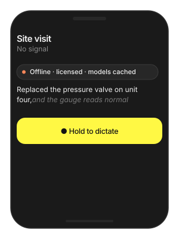

# Licensing & Device Identity

How seats work when your app embeds the SDK, and what that means for
your code: one `initialize` call, an online check on first use, and
offline operation after that. Commercial terms are in the
[Apple SDK Product Terms](./product_terms.md).

> **Main features**
>
> - **One call**: `initialize(api_token:)` registers the device and
>   unlocks every pipeline.
> - **Online once**: the token is validated on first model start; after
>   that inference is fully offline.
> - **Offline grace**: a temporary loss of connectivity does not stop a
>   registered device.
> - **Stable seats**: reinstalling the same app on the same device keeps
>   the same seat.

## Quick start

**Swift**

```swift
import TheStageSDK

// Once per process, before any pipeline or start_model
try await TheStageAI.shared.initialize(api_token: token)
```

**Flutter**

```dart
import 'package:thestage_apple_sdk/thestage_apple_sdk.dart';

// Once per process, before any start_model
await TheStageFlutterSDK.initialize(api_token: token);
```

### Important API

| Term | Meaning |
|---|---|
| **Seat** | One `(apiToken, deviceId)` pair. Two tokens on one phone are two seats; one token on two phones is two seats. |
| **`apiToken`** | Identifies your organisation. Generate it at [app.thestage.ai](https://app.thestage.ai/) → Profile → API tokens. |
| **`deviceId`** | Identifies the registered device for that token. Survives reinstalls of the same app. |
| **Grace period** | After a successful online validation, the device keeps working offline for a limited window. |

## Usage Guides

### Keep the token out of the binary

> **Problem**
>
> **Building** — any shipping app.
>
> **Users want** — nothing; this is for you — the token must not be in
> git or readable from the bundle.
>
> **Hard part** — `initialize` needs the token at runtime, so it has
> to come from somewhere the build controls.

**Solution — what to use**

- Build setting → `Info.plist` →
  `Bundle.main.object(forInfoDictionaryKey:)` at launch.
- Flutter: `--dart-define-from-file=secrets.json` →
  `String.fromEnvironment`.
- `.gitignore` the secrets file and the xcconfig.
- Or fetch it from your backend on first launch.

**Swift**

```swift
// Build setting → Info.plist → read at launch
let token = Bundle.main.object(forInfoDictionaryKey: "TS_API_TOKEN") as! String
try await TheStageAI.shared.initialize(api_token: token)
```

**Flutter**

```dart
// flutter run --dart-define-from-file=secrets.json
const token = String.fromEnvironment('TS_API_TOKEN');
await TheStageFlutterSDK.initialize(api_token: token);
```

> [!TIP]
> - Add `secrets.json` / the xcconfig to `.gitignore`.
> - Rotating a token does not change seats already registered.

### Ship an app that works with no network

> **Problem**
>
> **Building** — a field-service app used in places with no signal for
> days.
>
> **Users want** — dictation and transcription keep working underground
> and on site.
>
> **Hard part** — the licence validates online and the models download
> online; both have to happen while there is still connectivity.

**Solution — what to use**

- `TheStageAI.shared.initialize(api_token:)` during onboarding, online
  — renews the offline grace period.
- `prefetch_engines(repo_id:)` for every model right after.
- In the field the same calls are served from cache.
- Call `initialize` again whenever the app has connectivity.



**Swift**

```swift
// Onboarding, online:
try await TheStageAI.shared.initialize(api_token: token)
_ = try await TheStageAI.shared.prefetch_engines(
    repo_id: "TheStageAI/thewhisper-large-v3-turbo")

// In the field, offline: same calls, served from cache.
```

**Flutter**

```dart
await TheStageFlutterSDK.initialize(api_token: token);
await TheStageFlutterSDK.prefetch_engines(
  repo_id: 'TheStageAI/thewhisper-large-v3-turbo');
```

> [!TIP]
> - The offline grace period renews on every successful online
>   `initialize`; call it whenever the app has connectivity.
> - First-run download needs network regardless — do it on onboarding.

## Troubleshooting

| Symptom | Cause | Fix |
|---|---|---|
| Pipelines throw "not initialized" | `initialize` not awaited before construction. | Await it first, once per process. |
| Works on Wi-Fi, fails after a week offline | Grace period expired. | Call `initialize` whenever online; it renews silently. |
| Seat count higher than devices | Multiple tokens in use, or test tokens on production devices. | One token per app; open a Service Request at [app.thestage.ai/contact](https://app.thestage.ai/contact) for plan questions. |
