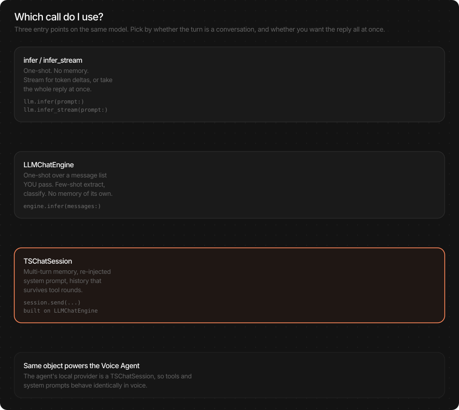
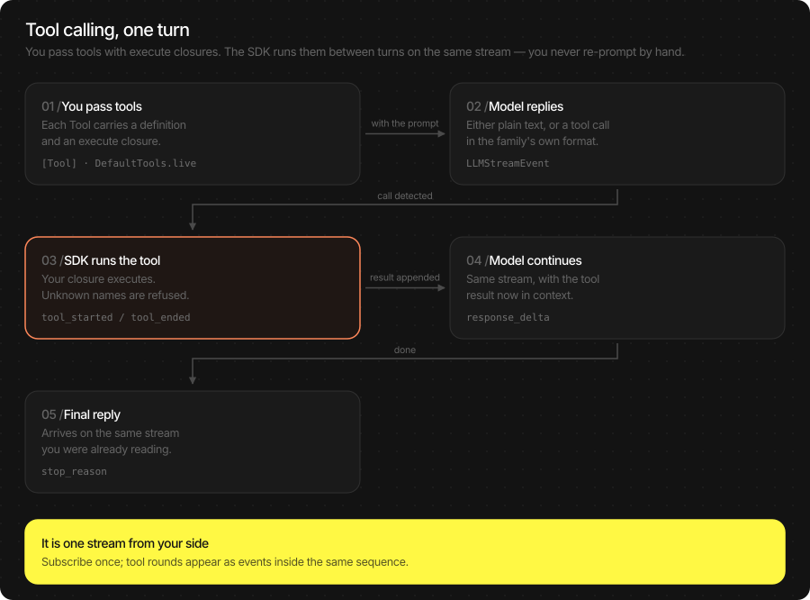
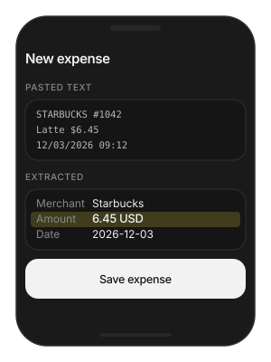
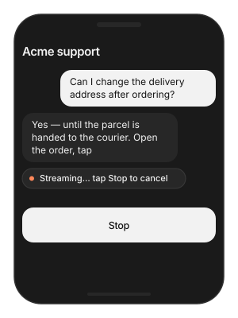
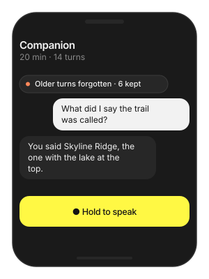
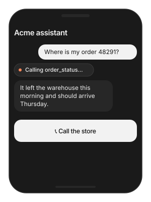

# LLM (Language Model)

On-device chat models — Qwen3, LFM2.5 and Gemma 3 — running fully on the
Neural Engine. Tokenisation, the chat template, the KV cache, sampling
and stop policy all ship inside the pack; you send text and read text.
Nothing the user types leaves the device, and there is no per-token
cost.

Use it three ways: one answer from one prompt, a streamed reply for a
chat screen, or a conversation that remembers — with tools the model
can call in any of them.

> **Main features**
>
> - **On-device chat**: Qwen3-0.6B, LFM2.5-230M / 350M and Gemma3-1B —
>   no server round-trip, no per-token cost.
> - **Streaming and batch**: `infer` for a full reply, `infer_stream`
>   for token deltas, on the same object.
> - **Conversations with memory**: `TSChatSession` keeps history,
>   re-injects the system prompt and survives tool rounds.
> - **Tool calling**: pass `[Tool]` with `execute` closures and the
>   SDK runs them between turns on the same stream. A built-in
>   `DefaultTools` catalog covers weather, time, search and phone
>   actions.
> - **Structured extraction**: few-shot `LLMChatEngine` calls at
>   `temperature = 0` turn receipts, chats and forms into JSON.
> - **Qwen3 thinking**: opt-in reasoning prelude for hard questions;
>   off by default for chat.
> - **Reproducible output**: same `seed` + `temperature = 0` on the
>   same device and pack gives the same text.

## In this page

Here we will cover the following topics:

- [Supported models](#supported-models): the four packs, what each supports, and how to pick.
- [Quick start](#quick-start): one answer, a streamed reply, or a conversation — Swift and Flutter side by side.
- [Generate text](#generate-text): `infer` and `infer_stream`, and the generation knobs with their defaults.
- [Conversations](#conversations): the three ways to call the same model, and when each is right.
- [Tool calling](#tool-calling): let the model call your functions; the built-in catalog.
- [Result object](#result-object): `LLMResult` fields and their Flutter JSON keys.
- [Usage Guides](#usage-guides): structured extraction, chat screens, memory limits, app functions as tools, thinking, reproducible tests.
- [Troubleshooting](#troubleshooting): symptom → cause → fix.
- [Load Progress / Prefetch / Cleanup](#load-progress-prefetch-cleanup): first-run download, warming the cache, releasing models.

## Supported models

Four packs. They share one API; they differ in size, tool support and
whether they can reason before answering.

| Model | HF repo | Size | Device | Fleet pin |
|---|---|---|---|---|
| Qwen3-0.6B | `TheStageAI/Qwen3-0.6B` | 0.6B | NPU | v1.1 |
| LFM2.5-230M | `TheStageAI/LFM2.5-230M` | 230M | NPU | v1.1 |
| LFM2.5-350M | `TheStageAI/LFM2.5-350M` | 350M | NPU | v1.1 |
| Gemma3-1B | `TheStageAI/gemma-3-1b-it` | 1B | NPU | v1.1 |

| Feature | Qwen3-0.6B | LFM2.5-230M | LFM2.5-350M | Gemma3-1B |
|---|---|---|---|---|
| Chat + streaming | yes | yes | yes | yes |
| Tool calling | yes | yes | yes | — |
| Thinking mode | yes | — | — | — |

**Which one?**

| You need… | Pick | Why |
|---|---|---|
| A voice assistant with tools | **Qwen3-0.6B** | Tools, thinking when needed, and the same tokenizer as Qwen3-ASR. |
| The smallest, fastest chat | **LFM2.5-230M** | Lowest memory and first-token latency; still calls tools. |
| Structured extraction from documents | **LFM2.5-350M** | Better instruction following than 230M at little extra cost. |
| Longest, most fluent replies | **Gemma3-1B** | Largest pack; no tool calling — passing `tools` throws. |

Context window is fixed per pack. Prompt, history and the reply share
it; the SDK trims history for you in a session.

## Quick start

Three ways to use the model. Pick by whether this call is the whole
job or one turn of a conversation.

| You want | Memory | Use |
|---|---|---|
| One answer from one prompt | none | `infer(prompt:)` |
| A reply streamed into a chat bubble | none | `infer_stream(prompt:)` |
| A conversation that remembers | kept by the SDK | `TSChatSession` (Swift) / `messages` (Flutter) |

### One answer

**Swift**

```swift
import TheStageSDK

try await TheStageAI.shared.initialize(api_token: "your-api-token")

let llm = try await TSLLM(
    engines_path: "TheStageAI/Qwen3-0.6B"
)

// the pack's tuned sampling
var config = llm.generation_defaults
config.max_new_tokens = 128
config.enable_thinking = false

let result = llm.infer(
    prompt: "Give me a two-line haiku about the ocean.",
    system_prompt: "You are a concise assistant.",
    config: config
)
print(result.text)
```

**Flutter**

```dart
import 'package:thestage_apple_sdk/thestage_apple_sdk.dart';

await TheStageFlutterSDK.initialize(api_token: 'your-api-token');
await TheStageFlutterSDK.start_model(
  model_name: 'llm',
  engines_path: 'TheStageAI/Qwen3-0.6B',
);

final rows = await TheStageFlutterSDK.infer(
  model_name: 'llm',
  input_json: {
    'prompt': 'Give me a two-line haiku about the ocean.',
    'system_prompt': 'You are a concise assistant.',
    'max_new_tokens': 128,
    'enable_thinking': false,
  },
);
print(rows[0]['text']);
```

### A streamed reply

**Swift**

```swift
let llm = try await TSLLM(engines_path: "TheStageAI/Qwen3-0.6B")
var config = llm.generation_defaults
config.enable_thinking = false

for await chunk in llm.infer_stream(
    prompt: "Tell me a short story.",
    config: config
) {
    if chunk.is_final {
        print("\n\(chunk.tokens_per_second ?? 0) tok/s")
    } else {
        // append, never replace
        bubble.text += chunk.text
    }
}
```

**Flutter**

```dart
await TheStageFlutterSDK.start_model(
  model_name: 'llm',
  engines_path: 'TheStageAI/Qwen3-0.6B',
);

final stream = TheStageFlutterSDK.infer_stream(
  model_name: 'llm',
  input_json: {
    'prompt': 'Tell me a short story.',
    'max_new_tokens': 512,
    'enable_thinking': false,
  },
);
await for (final chunk in stream) {
  if (chunk['is_final'] == true) break;
  bubble.value += chunk['delta'] as String? ?? '';
}
```

### A conversation that remembers

**Swift**

```swift
let llm = try await TSLLM(engines_path: "TheStageAI/Qwen3-0.6B")
var config = llm.generation_defaults
config.enable_thinking = false

let session = LLMChatEngine(llm: llm).chat_session(
    system_prompt: "You are a friendly assistant. Answer in one sentence.",
    memory: .SLIDING(max_turns: 10)
)

for await event in try session.infer_stream(
    user_request: "My name is Ada.", config: config
) {
    if case .text_delta(let t) = event { print(t, terminator: "") }
}

for await event in try session.infer_stream(
    user_request: "What is my name?", config: config
) {
    if case .text_delta(let t) = event { print(t, terminator: "") }
}
// "Your name is Ada."
```

**Flutter**

```dart
await TheStageFlutterSDK.start_model(
  model_name: 'llm',
  engines_path: 'TheStageAI/Qwen3-0.6B',
);

// Keep history in the app; send it on every turn.
final history = <Map<String, String>>[
  {'role': 'user',      'content': 'My name is Ada.'},
  {'role': 'assistant', 'content': 'Nice to meet you, Ada.'},
  {'role': 'user',      'content': 'What is my name?'},
];

final stream = TheStageFlutterSDK.infer_stream(
  model_name: 'llm',
  input_json: {
    'messages': history,
    'system_prompt': 'You are a friendly assistant. Answer in one sentence.',
    'max_new_tokens': 128,
    'enable_thinking': false,
  },
);
final reply = StringBuffer();
await for (final chunk in stream) {
  if (chunk['is_final'] == true) break;
  reply.write(chunk['delta'] ?? '');
}
history.add({'role': 'assistant', 'content': reply.toString()});
```

### Important API

| Purpose | Swift | Flutter |
|---|---|---|
| Load a model | `try await TSLLM(engines_path:)` | `start_model(model_name: 'llm', engines_path:)` |
| One answer | `llm.infer(prompt:system_prompt:config:)` → `LLMResult` | `infer(model_name:input_json:)` → `rows[0]` |
| Streamed reply | `llm.infer_stream(prompt:system_prompt:config:)` → `LLMStreamChunk` | `infer_stream(model_name:input_json:)` → `chunk['delta']` |
| Conversation | `LLMChatEngine(llm:).chat_session(…)` → `TSChatSession` | `'messages'` in `input_json` on `infer_stream` |
| Tools | `infer_stream(prompt:tools: [Tool], …)` → `LLMStreamEvent` | `'tools'` in `input_json`; handle `tool_call` chunks |
| Release | drop the object | `stop_model(model_name: 'llm')` |

## Generate text

One prompt in, one reply out. `infer` returns when the reply is
complete; `infer_stream` yields tokens as they are produced, so a
chat screen fills in while the user watches. Both take the same
`LLMGenerationConfig`.

**Swift**

```swift
let llm = try await TSLLM(engines_path: "TheStageAI/Qwen3-0.6B")

var config = llm.generation_defaults
config.max_new_tokens = 256
// factual; raise for creative
config.temperature = 0.3
config.enable_thinking = false

// Batch
let result = llm.infer(
    prompt: "Summarise this in two sentences: \(article)",
    system_prompt: "You are a precise editor.",
    config: config
)
if result.stop_reason == "max_new_tokens" {
    // reply was cut off — raise the cap or show "…"
}

// Streaming
for await chunk in llm.infer_stream(
    prompt: "Summarise this in two sentences: \(article)",
    system_prompt: "You are a precise editor.",
    config: config
) {
    if !chunk.is_final { bubble.text += chunk.text }
}
```

**Flutter**

```dart
await TheStageFlutterSDK.start_model(
  model_name: 'llm',
  engines_path: 'TheStageAI/Qwen3-0.6B',
);

final input = {
  'prompt': 'Summarise this in two sentences: $article',
  'system_prompt': 'You are a precise editor.',
  'max_new_tokens': 256,
  // factual; raise for creative
  'temperature': 0.3,
  'enable_thinking': false,
};

// Batch
final rows = await TheStageFlutterSDK.infer(
  model_name: 'llm', input_json: input);
if (rows[0]['stop_reason'] == 'max_new_tokens') {
  // reply was cut off — raise the cap or show "…"
}

// Streaming
await for (final chunk in TheStageFlutterSDK.infer_stream(
  model_name: 'llm', input_json: input)) {
  if (chunk['is_final'] == true) break;
  bubble.value += chunk['delta'] as String? ?? '';
}
```

**Generation options** — `LLMGenerationConfig` (Swift) or the same
keys in `input_json` (Flutter). Start from `llm.generation_defaults`:
it holds the sampling the pack was tuned with, and anything you do not
set keeps that value.

| Field | Pack default | Change it when |
|---|---|---|
| `max_new_tokens` | 512 | Replies are cut off (`stop_reason == "max_new_tokens"`) — raise. Short answers only — lower to 128 for speed. |
| `temperature` | 0.7 | `0` for extraction and tests; `0.3` factual; `0.9` creative. |
| `top_k` / `top_p` / `min_p` | 20 / 1.0 / 0 | Leave alone unless you are tuning a specific voice of output. |
| `repetition_penalty` | 1.0 | `1.05`–`1.1` if long answers start looping. |
| `enable_thinking` | true | **Set false for chat.** Qwen3 only; adds a reasoning prelude that eats the token budget and looks like a pause in the UI. |
| `seed` | random | Set for reproducible tests, with `temperature = 0`. |
| `stop_sequences` | `[]` | Stop early on a marker your prompt format defines. |

Chat template, end-of-sequence tokens and the context window are baked
into the pack; there is nothing to set.

## Conversations



A chat app needs the model to remember the last turn. A form filler
needs it to forget everything and follow a few examples. Those are
different calls, and picking the wrong one is the most common source
of "the model ignored my context".

| Use this | When | Not when |
|---|---|---|
| `llm.infer(prompt:)` | One user string plus a system prompt. The call is the whole job. | The next turn must remember this one. |
| `LLMChatEngine` | You own the **full message list for one call**: few-shot extract, classify, rewrite. Nothing is stored. | The user will talk for several turns. |
| `TSChatSession` | A conversation. You send the next user request; the session keeps history, re-injects the system prompt and stores tool rounds. | A one-shot job. |

**Swift**

```swift
let llm = try await TSLLM(engines_path: "TheStageAI/Qwen3-0.6B")
var config = llm.generation_defaults
config.enable_thinking = false

let engine = LLMChatEngine(llm: llm)

// Few-shot, one call, no memory
let extracted = try await engine.infer(
    messages: [
        .user(EXAMPLE_INPUT),
        .assistant(EXAMPLE_OUTPUT),
        .user(liveText),
    ],
    system_prompt: SCHEMA_PROMPT,
    tools: [],
    config: config
)

// Conversation with memory
let session = engine.chat_session(
    system_prompt: "You are a helpful assistant.",
    tools: [],
    memory: .SLIDING(max_turns: 10)
)
let reply = try await session.infer(user_request: "Hi!", config: config)
// grows by two: user + assistant
print(session.history.count)
// start a new conversation
session.clear()
```

**Flutter**

```dart
await TheStageFlutterSDK.start_model(
  model_name: 'llm',
  engines_path: 'TheStageAI/Qwen3-0.6B',
);

// Both shapes use the same call; you own the list.
// Few-shot, one call:
final extracted = TheStageFlutterSDK.infer_stream(
  model_name: 'llm',
  input_json: {
    'messages': [
      {'role': 'user',      'content': exampleInput},
      {'role': 'assistant', 'content': exampleOutput},
      {'role': 'user',      'content': liveText},
    ],
    'system_prompt': schemaPrompt,
    'temperature': 0,
    'enable_thinking': false,
  },
);

// Conversation: append each reply to `history` and resend it.
// Trim the oldest turns yourself when the reply stops fitting.
```

### Important API

`TSChatSession` — created by `LLMChatEngine(llm:).chat_session(…)`:

| Member | Role |
|---|---|
| `infer(user_request:config:)` | Send the next user turn; returns `LLMResult`. |
| `infer_stream(user_request:config:)` | Same, as `AsyncStream<LLMStreamEvent>`. Render `text_delta`. |
| `system_prompt` / `tools` | Change between turns; applied on the next request. |
| `history` | The messages the model will see next. Read-only view. |
| `clear()` | New conversation, same model. |
| `cancel_in_flight()` | Stop the current reply — the user tapped "stop". |
| `memory: .SLIDING(max_turns:)` | How many user-led turns are kept. Older ones drop off; the system prompt never does. |

> [!NOTE]
> There is no role argument on a session — you send **user** text; the
> session writes the assistant and tool turns itself. A canned
> assistant reply for few-shot belongs in `LLMChatEngine`.

On Flutter, `messages` is honoured by `infer_stream`; batch `infer`
reads only `prompt`.

## Tool calling



A tool is a function you write that the model may decide to call —
look up an order, check the weather, open Maps. You describe it with a
name, a description and a JSON schema; the SDK teaches the model the
pack's wire format, parses the call, runs your closure, feeds the
result back and continues the reply on the **same stream**. Your loop
never sees markup.

**Swift**

```swift
let llm = try await TSLLM(engines_path: "TheStageAI/Qwen3-0.6B")

let orderStatus = Tool(
    name: "order_status",
    description: "Look up the delivery status of an order by its number.",
    parameters: [
        "type": "object",
        "properties": [
            "order_id": ["type": "string", "description": "Order number"],
        ],
        "required": ["order_id"],
    ],
    execute: { call in
        let id = call.arguments["order_id"] as? String ?? ""
        // any String
        return try await orders.statusJSON(for: id)
    }
)

var config = llm.generation_defaults
config.enable_thinking = false

for await event in try llm.infer_stream(
    prompt: "Where is my order 4471?",
    // yours + built-ins
    tools: [orderStatus] + DefaultTools.live,
    system_prompt: DefaultTools.voice_system_prompt,
    config: config
) {
    switch event {
    case .text_delta(let t):            bubble.text += t
    case .tool_call(let call):          showChip("Checking \(call.name)…")
    // never shown or spoken
    case .tool_result:                  break
    case .final(let stop, _, _, _, _, _, _): done(stop)
    default:                            break
    }
}
```

**Flutter**

```dart
await TheStageFlutterSDK.start_model(
  model_name: 'llm',
  engines_path: 'TheStageAI/Qwen3-0.6B',
);

// Flutter runs the tool itself: the stream ends at the tool call,
// you execute it, append the result, and ask again.
final tools = [
  {
    'name': 'order_status',
    'description': 'Look up the delivery status of an order by its number.',
    'parameters': {
      'type': 'object',
      'properties': {
        'order_id': {'type': 'string', 'description': 'Order number'},
      },
      'required': ['order_id'],
    },
  },
];
final history = [
  {'role': 'user', 'content': 'Where is my order 4471?'},
];

Future<void> turn() async {
  final stream = TheStageFlutterSDK.infer_stream(
    model_name: 'llm',
    input_json: {'messages': history, 'tools': tools, 'enable_thinking': false},
  );
  await for (final chunk in stream) {
    switch (chunk['kind']) {
      case 'text_delta':
        bubble.value += chunk['delta'] as String? ?? '';
      case 'tool_call':
        final name = chunk['name'] as String;
        final args = chunk['arguments'] as Map;
        final result = await orders.statusJson(args['order_id']);
        history.add({'role': 'tool', 'content': result});
        // continue the reply
        await turn();
        return;
      case 'final':
        return;
    }
  }
}
await turn();
```

### Important API

Events on a tool-enabled stream:

| Swift `LLMStreamEvent` | Flutter `chunk['kind']` | What to do |
|---|---|---|
| `.text_delta(String)` | `text_delta` | Append to the bubble. Speak it, if you have TTS. **Only this.** |
| `.tool_call(ToolCall)` | `tool_call` (`name`, `arguments`) | Show a chip. Swift runs `execute` for you; Flutter runs it and resends. |
| `.tool_result(name:content:)` | `tool_result` | Nothing — it is for the model. |
| `.thinking_delta(String)` | `thinking_delta` | Optional "thinking…" indicator; never render as the answer. |
| `.final(stop_reason:…)` | `final` | Turn is over. Read `stop_reason` here. |

Built-in tools — `DefaultTools`:

| Set | Tools |
|---|---|
| `.live` | `get_weather`, `get_local_time`, `web_search` — the voice default. |
| `.web` | `.live` + `wikipedia_summary`, `calculate` |
| `.phone` | `open_url`, `dial_phone`, `open_maps`, `compose_sms`, `compose_email`, `copy_to_clipboard`, `get_battery` — open system UI; the user confirms. |
| `.voice` | `.web` + `.phone` |

`max_tool_rounds` (default **4**) caps how many times the model may
call tools in one turn, so a confused model cannot loop.

> [!CAUTION]
> Gemma3-1B has no tool support — passing `tools` throws. Check
> `llm.supports_tool_calling` if the model is user-selectable. Batch
> `infer(prompt:tools:)` also works (`result.tool_calls` /
> `result.final_text`) but a chat UI wants the stream.

## Result object

`LLMResult` is what `infer` returns. The final stream chunk carries
the same metrics.

**Swift**

```swift
let llm = try await TSLLM(engines_path: "TheStageAI/Qwen3-0.6B")
var config = llm.generation_defaults
config.enable_thinking = false

let result = llm.infer(prompt: prompt, config: config)

// the reply (includes <think> if thinking was on)
result.text
// the reply with thinking and tool markup removed
result.final_text
// "eos" | "max_new_tokens" | "stop_sequence"
result.stop_reason
result.tokens_per_second
// seconds
result.time_to_first_token
```

**Flutter**

```dart
await TheStageFlutterSDK.start_model(
  model_name: 'llm',
  engines_path: 'TheStageAI/Qwen3-0.6B',
);

final rows = await TheStageFlutterSDK.infer(
  model_name: 'llm',
  input_json: input,
);
final r = rows[0];

// the reply
r['text'];
// with thinking and tool markup removed
r['final_text'];
// 'eos' | 'max_new_tokens' | 'stop_sequence'
r['stop_reason'];
r['tokens_per_second'];
r['time_to_first_token'];
```

| Swift | Flutter JSON | Meaning |
|---|---|---|
| `text` | `text` | Raw reply. |
| `final_text` | `final_text` | Reply with `<think>` and tool markup stripped. Show this. |
| `thinking` | `thinking` | The reasoning prelude, when thinking was on. |
| `tool_calls` | `tool_calls` | `[ToolCall]` — `name`, `arguments`. Batch only. |
| `stop_reason` | `stop_reason` | `eos` = finished naturally; `max_new_tokens` = cut off; `stop_sequence` = hit a stop string. |
| `prompt_tokens` / `generated_tokens` | same | Sizes, for budgeting the context window. |
| `time_to_first_token` / `tokens_per_second` | same | Latency and speed. |

## Usage Guides

Each guide is one production question: what you are building, what to
use, the code, and what not to forget.

### Turn a receipt or message into structured data

> **Problem**
>
> **Building** — an expense app: the user pastes a receipt or a bank
> SMS and gets a filled-in expense.
>
> **Users want** — paste, see merchant / amount / date filled in, tap
> save. No typing, no server round-trip, works on a plane.
>
> **Hard part** — the output must parse every time — one stray word
> breaks the JSON — and the same input must give the same result
> thousands of times a day.

**Solution — what to use**

- `TSLLM` — loaded once for the screen's lifetime.
- `LLMChatEngine.infer(messages:...)` — one call with a system prompt,
  one worked example, and the pasted text; it remembers nothing between
  calls, which is what you want here.
- `temperature = 0` — greedy decoding, so the output is repeatable and
  a failure is debuggable.
- `final_text` — the field to parse (markup stripped).
- Flutter: `infer_stream` with `messages` — batch `infer` ignores
  history.



**Swift**

```swift
let llm = try await TSLLM(engines_path: "TheStageAI/Qwen3-0.6B")

let SYSTEM = """
Extract {merchant, amount, currency, date} from the text. \
Reply with JSON only. Use null for missing fields.
"""

var config = llm.generation_defaults
config.temperature = 0
config.max_new_tokens = 96
config.enable_thinking = false

// the text the user pasted into the field
let pastedText: String = pasteField.text

let engine = LLMChatEngine(llm: llm)
let result = try await engine.infer(
    messages: [
        .user("STARBUCKS #1042  $6.45  12/03/2026"),
        .assistant(#"{"merchant":"Starbucks","amount":6.45,"currency":"USD","date":"2026-12-03"}"#),
        .user(pastedText),
    ],
    system_prompt: SYSTEM,
    tools: [],
    config: config
)
let fields = try JSONDecoder().decode(Receipt.self,
                                      from: Data(result.final_text.utf8))
```

**Flutter**

```dart
await TheStageFlutterSDK.start_model(
  model_name: 'llm',
  engines_path: 'TheStageAI/Qwen3-0.6B',
);

const system =
    'Extract {merchant, amount, currency, date} from the text. '
    'Reply with JSON only. Use null for missing fields.';

// the text the user pasted into the field
final pastedText = pasteController.text;

final out = StringBuffer();
await for (final chunk in TheStageFlutterSDK.infer_stream(
  model_name: 'llm',
  input_json: {
    'messages': [
      {'role': 'user', 'content': 'STARBUCKS #1042  \$6.45  12/03/2026'},
      {'role': 'assistant', 'content':
        '{"merchant":"Starbucks","amount":6.45,"currency":"USD","date":"2026-12-03"}'},
      {'role': 'user', 'content': pastedText},
    ],
    'system_prompt': system,
    'temperature': 0,
    'max_new_tokens': 96,
    'enable_thinking': false,
  },
)) {
  if (chunk['is_final'] == true) break;
  out.write(chunk['delta'] ?? '');
}
final fields = jsonDecode(out.toString());
```

> [!TIP]
> - Parse `final_text`, not `text` — it has markup stripped.
> - One good example beats three mediocre ones; the context window is
>   small on these packs.
> - Wrap `jsonDecode` in a retry: at `temperature = 0` a second call
>   with the same input is deterministic, so if it fails once it will
>   fail again — log it and fall back to a regex.
> - Worked recipes for extract / classify / rewrite:
>   [apple_sdk_on_device_small_llms](https://docs.thestage.ai/tutorials/source/apple_sdk_on_device_small_llms.html).

### A chat screen that streams without glitches

> **Problem**
>
> **Building** — a support chat for a retail app, answered by the
> on-device model.
>
> **Users want** — the reply appears word by word, a Stop button really
> stops it, and a reply cut short by the length cap does not look
> finished.
>
> **Hard part** — tokens must be appended, not re-rendered; abandoning
> a stream keeps the model generating for nobody; the length cap is
> silent unless you read `stop_reason`.

**Solution — what to use**

- `LLMChatEngine.chat_session(system_prompt:memory:)` — owns the
  history so each turn is one call.
- `infer_stream(user_request:config:)` — `text_delta` events go
  straight into the bubble.
- `session.cancel_in_flight()` — the Stop button.
- `.final` event — read `stop_reason`; `"max_new_tokens"` means
  mark the bubble as truncated.
- `enable_thinking = false` on Qwen3 — otherwise the first seconds
  look like a hang.



**Swift**

```swift
let llm = try await TSLLM(engines_path: "TheStageAI/Qwen3-0.6B")

let session = LLMChatEngine(llm: llm).chat_session(
    system_prompt: "You are the support assistant for Acme. Be brief.",
    memory: .SLIDING(max_turns: 8)
)
var config = llm.generation_defaults
config.max_new_tokens = 384
config.enable_thinking = false

// the message the user just sent
let userText: String = composer.text

let replyTask = Task {
    for await event in try session.infer_stream(
        user_request: userText, config: config
    ) {
        switch event {
        case .text_delta(let t):
            bubble.text += t
        case .final(let stop, _, _, _, _, _, _):
            if stop == "max_new_tokens" { bubble.markTruncated() }
        default: break
        }
    }
}
stopButton.onTap = { session.cancel_in_flight() }
```

**Flutter**

```dart
await TheStageFlutterSDK.start_model(
  model_name: 'llm',
  engines_path: 'TheStageAI/Qwen3-0.6B',
);

// your conversation so far: {'role','content'} maps, newest last
final history = [...chat.messages, {'role': 'user', 'content': composer.text}];

final sub = TheStageFlutterSDK.infer_stream(
  model_name: 'llm',
  input_json: {
    'messages': history,
    'system_prompt': 'You are the support assistant for Acme. Be brief.',
    'max_new_tokens': 384,
    'enable_thinking': false,
  },
).listen((chunk) {
  if (chunk['is_final'] == true) {
    if (chunk['stop_reason'] == 'max_new_tokens') bubble.markTruncated();
    return;
  }
  bubble.value += chunk['delta'] as String? ?? '';
});
stopButton.onPressed = () => sub.cancel();
```

> [!TIP]
> - Append deltas; never rebuild the bubble from scratch per token.
> - Always drain or cancel the stream. Abandoning a consumer mid-reply
>   leaves the model generating for nobody.
> - Keep the system prompt short — it is paid for on every turn.
> - `enable_thinking = false` on Qwen3, or the first seconds look like
>   a hang.

### Keep the conversation on device without running out of context

> **Problem**
>
> **Building** — a companion app that talks for twenty minutes at a
> time.
>
> **Users want** — the assistant remembers the thread of the
> conversation and never suddenly stops mid-sentence.
>
> **Hard part** — small packs have a small context window; the app has
> to decide what the model is allowed to forget, and facts pinned in
> the history are the first thing to go.

**Solution — what to use**

- `chat_session(memory: .SLIDING(max_turns:))` — the session drops the
  oldest exchanges first; the system prompt is re-injected every turn
  and never drops.
- `session.system_prompt` — where durable facts live (name,
  preferences), not in history.
- `session.clear()` — new topic, same loaded model.
- Flutter: you own the `messages` list — keep the last N exchanges
  yourself.



**Swift**

```swift
let llm = try await TSLLM(engines_path: "TheStageAI/Qwen3-0.6B")
let persona = "You are Sam, a warm hiking companion. Keep replies short."

let session = LLMChatEngine(llm: llm).chat_session(
    system_prompt: persona,
    // ~6 exchanges of context
    memory: .SLIDING(max_turns: 6)
)

// Pin facts the model must never forget into the system prompt,
// not into history:
session.system_prompt = persona + "\nThe user's name is Ada. They like hiking."

// New topic, same model:
session.clear()
```

**Flutter**

```dart
// You own the list on Flutter. Keep the last N exchanges and put
// durable facts in the system prompt.
const maxTurns = 6;
void trim(List<Map<String, String>> history) {
  while (history.where((m) => m['role'] == 'user').length > maxTurns) {
    history.removeAt(0);
  }
}
```

> [!TIP]
> - Memory is counted in *turns*, not tokens; the session also trims by
>   tokens so a long paste does not overflow.
> - Durable facts go in the system prompt; history is for the flow of
>   the conversation.
> - `stop_reason == "max_new_tokens"` on every reply means the window
>   is full of history — lower `max_turns`.

### Let the model call your app's functions

> **Problem**
>
> **Building** — a retail assistant that answers from live data.
>
> **Users want** — ask "where is my order?" and hear the real status;
> say "call the store" and have the dialler open — without a menu.
>
> **Hard part** — the model must know *when* to call each function, its
> answer must never expose the raw payload, and phone actions must stay
> under the user's control.

**Solution — what to use**

- `Tool(name:description:parameters:execute:)` — one per function; the
  `description` says when to use it.
- `DefaultTools.phone` — dial / maps / SMS that open system UI for the
  user to confirm.
- `chat_session(system_prompt:tools:memory:)` —
  `DefaultTools.voice_system_prompt` explains the tools to the model.
- `.tool_call` event — show a "checking…" chip; `.text_delta` — the
  only thing the user sees.
- Flutter: tools are plain JSON; you run the function on `tool_call`
  and send the result back.



**Swift**

```swift
let llm = try await TSLLM(engines_path: "TheStageAI/Qwen3-0.6B")
var config = llm.generation_defaults
config.enable_thinking = false

let orderStatus = Tool(
    name: "order_status",
    description: "Delivery status for an order number.",
    parameters: ["type": "object",
                 "properties": ["order_id": ["type": "string"]],
                 "required": ["order_id"]],
    execute: { call in
        let id = call.arguments["order_id"] as? String ?? ""
        // your API client; returns a short JSON string
        return try await orders.statusJSON(for: id)
    }
)

let session = LLMChatEngine(llm: llm).chat_session(
    system_prompt: DefaultTools.voice_system_prompt + "\nYou help Acme customers.",
    tools: [orderStatus] + DefaultTools.phone,
    memory: .SLIDING(max_turns: 8)
)

// the message the user just sent
let userText: String = composer.text

for await event in try session.infer_stream(
    user_request: userText, config: config
) {
    if case .text_delta(let t) = event { bubble.text += t }
    if case .tool_call(let call) = event { chip.show(call.name) }
}
```

**Flutter**

```dart
// Flutter executes tools itself — see the Tool calling section
// above for the full loop. The tool list is plain JSON:
final tools = [
  {
    'name': 'order_status',
    'description': 'Delivery status for an order number.',
    'parameters': {
      'type': 'object',
      'properties': {'order_id': {'type': 'string'}},
      'required': ['order_id'],
    },
  },
];
// On 'tool_call': run your API, append {'role': 'tool', 'content': json},
// and call infer_stream again with the same tools.
```

> [!TIP]
> - Return a **short JSON string** from `execute`. The model reads it
>   verbatim; a 4 KB payload eats the context window.
> - Describe *when* to call the tool in `description`, not just what it
>   does — that is what the model keys on.
> - Never speak or display `tool_result`; it is for the model.
> - Qwen3 and LFM2.5 call tools; Gemma3-1B does not.

### Replies are slow to start, or begin with a blank

> **Problem**
>
> **Building** — any chat or assistant on a Qwen3 pack.
>
> **Users want** — the first word within a moment of asking, never a
> bubble that shows `<think>` or nothing at all.
>
> **Hard part** — Qwen3 reasons before it answers, and that reasoning
> shares the token budget with the reply — a short cap leaves no room
> for an answer.

**Solution — what to use**

- `enable_thinking = false` — for chat and everything latency-bound.
- `enable_thinking = true` with `max_new_tokens` ≥ 1024 — only for
  genuinely hard questions.
- `final_text` — always what you render; `thinking` — optional to
  show.
- LFM2.5 and Gemma3 ignore the flag.

**Swift**

```swift
let llm = try await TSLLM(engines_path: "TheStageAI/Qwen3-0.6B")

// Chat: off
var chat = llm.generation_defaults
chat.enable_thinking = false
chat.max_new_tokens = 256

// Hard reasoning: on, with headroom
var reason = llm.generation_defaults
reason.enable_thinking = true
reason.max_new_tokens = 1024
reason.temperature = 0.6

let r = llm.infer(prompt: "Why does ice float?", config: reason)
// the reasoning, if you want to show it
print(r.thinking ?? "")
// the answer
print(r.final_text)
```

**Flutter**

```dart
await TheStageFlutterSDK.start_model(
  model_name: 'llm',
  engines_path: 'TheStageAI/Qwen3-0.6B',
);

// Chat: off
final chat = {'enable_thinking': false, 'max_new_tokens': 256};

// Hard reasoning: on, with headroom
final reason = {
  'enable_thinking': true,
  'max_new_tokens': 1024,
  'temperature': 0.6,
};

final rows = await TheStageFlutterSDK.infer(
  model_name: 'llm',
  input_json: {'prompt': 'Why does ice float?', ...reason},
);
// the reasoning
print(rows[0]['thinking']);
// the answer
print(rows[0]['final_text']);
```

> [!TIP]
> - Show `final_text`, never raw `text`, when thinking is on.
> - Thinking tokens count against `max_new_tokens`; `256` with
>   thinking on often yields an empty answer.
> - LFM2.5 and Gemma3 ignore the flag.

### Make outputs reproducible for tests

> **Problem**
>
> **Building** — CI that compares model output to golden files.
>
> **Users want** — a green build when nothing changed, and a red one
> only when the model or the prompt did.
>
> **Hard part** — sampling is random by design, a fleet update can swap
> the pack under the test, and different chips can differ at the last
> token.

**Solution — what to use**

- `temperature = 0` plus `seed` — deterministic on one device and
  pack revision.
- `revision:` on the model — pin it so a fleet update cannot change
  the golden.
- One device class per golden set.

**Swift**

```swift
let llm = try await TSLLM(engines_path: "TheStageAI/Qwen3-0.6B")

var config = llm.generation_defaults
config.temperature = 0
config.seed = 42
config.max_new_tokens = 64
config.enable_thinking = false

let a = llm.infer(prompt: "Write a haiku about the ocean.", config: config)
let b = llm.infer(prompt: "Write a haiku about the ocean.", config: config)
XCTAssertEqual(a.text, b.text)
```

**Flutter**

```dart
await TheStageFlutterSDK.start_model(
  model_name: 'llm',
  engines_path: 'TheStageAI/Qwen3-0.6B',
);

final input = {
  'prompt': 'Write a haiku about the ocean.',
  'temperature': 0,
  'seed': 42,
  'max_new_tokens': 64,
  'enable_thinking': false,
};
final a = await TheStageFlutterSDK.infer(
  model_name: 'llm',
  input_json: input,
);
final b = await TheStageFlutterSDK.infer(
  model_name: 'llm',
  input_json: input,
);
expect(a[0]['text'], b[0]['text']);
```

> [!TIP]
> - Pin `revision:` on the model in tests so a fleet update cannot
>   change the golden.
> - Different chips (M2 vs A17) may differ at the last token. Run
>   goldens on one device class.

## Troubleshooting

| Symptom | Cause | Fix |
|---|---|---|
| Reply cut off mid-sentence | `stop_reason == "max_new_tokens"`. | Raise `max_new_tokens`; in a session, lower `max_turns`. |
| Seconds of silence, then the answer | Qwen3 thinking is on. | `enable_thinking = false` for chat. |
| Bubble shows `<think>` | Rendering `text` with thinking on. | Render `final_text`. |
| Model "forgot" the previous turn | Using `infer(prompt:)` for a conversation. | `TSChatSession` (Swift) or `messages` on `infer_stream` (Flutter). |
| Passing `tools` throws | Gemma3-1B has no tool support. | Use Qwen3 or LFM2.5; check `supports_tool_calling`. |
| Tool never gets called | Description does not say when to use it. | Rewrite `description` as "Use when the user asks …". |
| Garbled or wrong-language output | Temperature too high, or template tokens pasted into `prompt`. | Start from `generation_defaults`; send plain text only. |
| Long answers loop | No repetition penalty. | `repetition_penalty = 1.05`–`1.1`. |
| Out of memory | Several pipelines loaded at once. | Use a smaller pack; stop ASR / TTS / VLM you are not using. |
| Flutter: history ignored | `messages` sent to batch `infer`. | Use `infer_stream`. |

## Load Progress / Prefetch / Cleanup

First run downloads and prepares the pack; later runs hit the cache.
Show progress the first time, warm the cache on a splash screen, and
release models you are done with.

**Swift**

```swift
let ai = TheStageAI.shared

// Progress
let llm = try await TSLLM(
    engines_path: "TheStageAI/Qwen3-0.6B",
    on_load_progress: { p in
        print("[\(p.model)] \(p.phase) \(Int(p.fraction * 100))%")
    }
)

// Prefetch on a splash screen, construct later
let engines_dir = try await ai.prefetch_engines(repo_id: "TheStageAI/Qwen3-0.6B")
let llm = try await TSLLM(engines_path: engines_dir)

// Cleanup: drop the reference, or
_ = try ai.stop_model(model_name: "llm")
```

**Flutter**

```dart
// Progress
TheStageFlutterSDK.on_progress.listen((event) {
  if (event['model_name'] != 'llm') return;
  print('[llm] ${event['phase']} ${((event['progress'] ?? 0) * 100).round()}%');
});

await TheStageFlutterSDK.start_model(
  model_name: 'llm',
  engines_path: 'TheStageAI/Qwen3-0.6B',
);

// Cleanup
await TheStageFlutterSDK.stop_model(model_name: 'llm');
```

Phases: `downloading` → `extracting` → `loading` → `ready`. Cache
hits skip the first two. Full contract: [Get started](./README.md)
(**Load Progress**).
