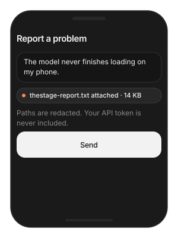

# Logging & Debugging

What the SDK can tell you when something goes wrong, and how to get it
into a support ticket or a crash reporter. Logs never include your API
token, prompts, or anything about how models are protected.

> **Main features**
>
> - **Session log file**: one call writes everything the SDK does to a
>   file you choose, with a copy in the console.
> - **Your own sink**: route SDK log lines into your app's logger.
> - **Support report**: a redacted text blob describing device, models
>   and recent activity, ready to attach to a ticket.
> - **Crash breadcrumbs**: structured JSON for Crashlytics or Sentry.
> - **Console streaming**: every line also goes to the unified log under
>   the `TheStageAI` subsystem.

## Quick start

Turn on a session log at launch during development or QA; turn it off
for release.

**Swift**

```swift
import TheStageSDK

let llm = try await TSLLM(engines_path: "TheStageAI/Qwen3-0.6B")
let session = LLMChatEngine(
    llm: llm).chat_session(system_prompt: "You are a helpful assistant.",
    memory: .SLIDING(max_turns: 10)
)

let url = FileManager.default.temporaryDirectory
    .appendingPathComponent("thestage-session.log")
try TheStageAI.start_session_log(to: url, level: .debug, tee_console: true)

// ... run the app ...

// attach this file to a ticket
let path = TheStageAI.end_session_log()
```

**Flutter**

```dart
// SDK developer logs appear in `flutter run` output automatically
// after initialize(). No extra call.
await TheStageFlutterSDK.initialize(api_token: token);
```

### Important API

| Swift | Role |
|---|---|
| `TheStageAI.start_session_log(to:level:tee_console:)` | Write the log to a file; `level` default `.debug`; console copy on. |
| `TheStageAI.end_session_log()` | Close the file and return its URL. |
| `TheStageAI.log_level` | Threshold for all sinks. |
| `TheStageAI.set_developer_log_sink(_:)` | Route lines into your logger. `TSPrintLogSink()` prints. |
| `await TheStageAI.debugReport()` | Redacted support report as text. |
| `TheStageAI.user_breadcrumbs_json()` | Structured JSON for crash reporters. |

On the command line, the same lines stream from the unified log:

```bash
log stream --info --predicate 'subsystem == "TheStageAI"'
```

## Usage Guides

### Attach diagnostics to a support ticket

> **Problem**
>
> **Building** — any app with a "report a problem" screen.
>
> **Users want** — to send what happened without being asked for logs,
> tokens or screenshots.
>
> **Hard part** — the SDK saw things you cannot reproduce — device,
> pack, load phases — and the report must be safe to forward.

**Solution — what to use**

- `TheStageAI.debugReport(app_header:)` — one text report; paths
  redacted, no token.
- Attach it to the ticket as a file.
- Flutter: expose it through a small platform call in the runner.



**Swift**

```swift
func sendDiagnostics() async {
    let report = await TheStageAI.debugReport(app_header: "MyApp 2.3.1")
    // your support SDK
    ticket.attach(text: report, name: "thestage-report.txt")
}
```

**Flutter**

```dart
// Capture `flutter run` / device console output for the session,
// or expose the Swift debugReport() through a small platform call
// in your runner.
```

> [!TIP]
> - The report redacts file paths and never contains the API token.
> - Ask for the report, never for the user's token.

### Send SDK breadcrumbs to a crash reporter

> **Problem**
>
> **Building** — an app with Crashlytics or Sentry.
>
> **Users want** — crash reports that say which model was loading, or
> which turn the agent was in.
>
> **Hard part** — the crash reporter only knows what you attach before
> the crash.

**Solution — what to use**

- `TheStageAI.user_breadcrumbs_json()` — small, safe to attach on
  every upload.
- Set it as a custom key when the reporter uploads.

**Swift**

```swift
let crumbs = TheStageAI.user_breadcrumbs_json()
Crashlytics.crashlytics().setCustomValue(
    String(decoding: crumbs, as: UTF8.self), forKey: "thestage")
```

**Flutter**

```dart
// Expose user_breadcrumbs_json() through a platform call in the
// runner and forward it to your reporter's custom keys.
```

> [!TIP]
> - Breadcrumbs are small and safe to attach on every upload.

### Route SDK logs into your own logger

> **Problem**
>
> **Building** — an app that already ships logs to a backend with its
> own levels.
>
> **Users want** — SDK output in the same stream, same format.
>
> **Hard part** — two loggers writing to the console is noise; the
> SDK's `.debug` level is per-chunk verbose.

**Solution — what to use**

- `TSLogSink` — implement `log(level:category:event:message:)`.
- `TheStageAI.set_developer_log_sink(...)` and ``TheStageAI.log_level
  = .info` — ship with `.info`` or higher.
- Flutter: native-side only; install in the iOS runner.

**Swift**

```swift
struct MySink: TSLogSink {
    func log(level: TSLogLevel, category: String, event: String, message: String) {
        AppLogger.shared.write(
            level: level.rawValue,
            "[TheStage/\(category)] \(event): \(message)"
        )
    }
}
TheStageAI.set_developer_log_sink(MySink())
TheStageAI.log_level = .info
```

**Flutter**

```dart
// Native-side only; install the sink in the iOS runner.
```

> [!TIP]
> - `.debug` is verbose (per-chunk timings). Ship with `.info` or
>   higher.

## Troubleshooting

| Symptom | Cause | Fix |
|---|---|---|
| No SDK lines in the console | Level too high, or no sink. | `start_session_log` with `tee_console: true`, or `log stream`. |
| Log file is empty | `end_session_log` not called before reading. | Call it, then read the returned URL. |
