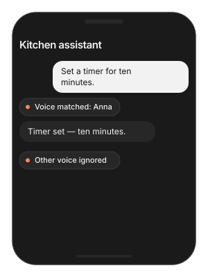
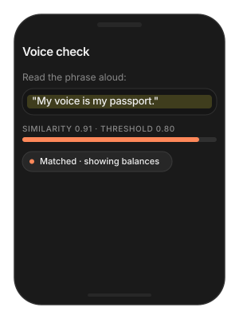

# Speaker embedding

Turns two seconds of someone's voice into a fingerprint you can compare.
Enrol a user once, then check whether the person speaking now is them —
on device, without storing audio. In the Voice Agent it lets the
assistant respond only to its owner.

> **Main features**
>
> - **One vector per voice**: a 192-dimensional embedding from 2 s of
>   16 kHz audio.
> - **One number to compare**: cosine similarity in `[-1, 1]`; you
>   choose the accept threshold.
> - **Store the vector, not the voice**: 192 floats are all you keep.
> - **Voice Agent integration**: enrol a speaker and the agent ignores
>   everyone else.

## Quick start

**Swift**

```swift
try await TheStageAI.shared.start_model(
    model_name: "speaker_id",
    engines_path: "TheStageAI/redimnet2"
)

// 2 s of the user's voice
let pcm16k = try AudioIO.load_wav(
    path: enrolClipURL.path,
    target_sample_rate: 16_000
)
// Enrol: 2 s of the user's voice → 192-d vector
let enrolled = try TheStageAI.shared.infer(
    model_name: "speaker_id",
    input_json: ["audio": pcm16k]
)
let reference = enrolled[0]["embedding"] as! [Double]

let newPcm16k = try AudioIO.load_wav(
    path: checkClipURL.path,
    target_sample_rate: 16_000
)
// Verify: new audio + reference → similarity
let check = try TheStageAI.shared.infer(
    model_name: "speaker_id",
    input_json: ["audio": newPcm16k, "embedding": reference]
)
// accept if > 0.75
let similarity = check[0]["similarity"] as! Double
```

**Flutter**

```dart
await TheStageFlutterSDK.start_model(
  model_name: 'speaker_id',
  engines_path: 'TheStageAI/redimnet2',
);

// Enrol — pcm16k: Float32List, 16 kHz mono, 2 s (here a headerless float32 file)
final enrolBytes = await File('/path/to/enrol_16k.pcm').readAsBytes();
final pcm16k = Float32List.view(enrolBytes.buffer);
final enrolled = await TheStageFlutterSDK.infer(
  model_name: 'speaker_id',
  input_json: {'audio': pcm16k},
);
final reference = (enrolled[0]['embedding'] as List).cast<double>();

// Verify
final checkBytes = await File('/path/to/check_16k.pcm').readAsBytes();
final newPcm16k = Float32List.view(checkBytes.buffer);
final check = await TheStageFlutterSDK.infer(
  model_name: 'speaker_id',
  input_json: {'audio': newPcm16k, 'embedding': reference},
);
// accept if > 0.75
final similarity = check[0]['similarity'] as double;
```

### Important API

| Input / output | Meaning |
|---|---|
| `audio` | 16 kHz mono float, **2.0 s** (32 000 samples). Shorter is padded, longer is trimmed. |
| `embedding` (out) | `[Double]` of length 192, L2-normalised. Store this. |
| `embedding` (in) | A stored reference. When present, the call also returns… |
| `similarity` (out) | Cosine similarity between the fresh audio and the reference. |

Model: `TheStageAI/redimnet2`. Runs on CPU by default.

## Usage Guides

### Only the owner can talk to the assistant

> **Problem**
>
> **Building** — a kitchen assistant shared by a family.
>
> **Users want** — it acts on the parent's voice and stays quiet when
> the kids shout at it.
>
> **Hard part** — the reference has to be captured once, stored safely,
> and compared on every turn without slowing the conversation.

**Solution — what to use**

- ``TheStageAI.shared.infer(model_name: "speaker_id", input_json:
  ["audio": …])` — one enrolment sentence → `embedding`` vector.
- Store the vector (Keychain), never the audio.
- `TSAgentConfig.speaker_id` + `interrupt_mode = .vad_speaker_id` —
  the agent compares every turn.
- `agent.enroll_speaker(vector)` after `start()`.
- Flutter: same keys on `agent.start(config:)` and
  `agent.enroll_speaker(embedding:)`.



**Swift**

```swift
// Onboarding: "please say a sentence" — 2 s recorded to a WAV
let enrolWavURL: URL = recorder.fileURL
let enrolmentPcm = try AudioIO.load_wav(
    path: enrolWavURL.path,
    target_sample_rate: 16_000
)
let rows = try TheStageAI.shared.infer(
    model_name: "speaker_id", input_json: ["audio": enrolmentPcm])
let owner = rows[0]["embedding"] as! [Double]
// your Keychain wrapper — store the vector, never the audio
keychain.store(owner, for: "owner_voice")

// Every launch
var config = TSAgentConfig(
    vad: vadRepo,
    stt: sttRepo,
    tts: ttsRepo,
    llm: llm
)
config.speaker_id = "TheStageAI/redimnet2"
config.interrupt_mode = .vad_speaker_id
let agent = TSVoiceAgent(config: config)
try await agent.start()
await agent.enroll_speaker(keychain.load("owner_voice"))
```

**Flutter**

```dart
// agent as in Quick start; agentConfig is its model map
final agent = TSVoiceAgent();

await agent.start(config: {
  // ...models...
  'speaker_id': 'TheStageAI/redimnet2',
  'interrupt_mode': 'vad_speaker_id',
});
// the vector you stored at enrolment
final ownerVector = await secureStorage.readDoubles('owner_voice');
await agent.enroll_speaker(embedding: ownerVector);
```

> [!TIP]
> - Enrol from a quiet 2–3 s sentence; a cough or a laugh makes a poor
>   reference.
> - The agent's default accept threshold is 0.75. Lower it if the owner
>   is rejected on a bad mic; raise it if others get through.
> - Store the vector, never the audio.

### Verify a voice at login

> **Problem**
>
> **Building** — a banking app that wants a lightweight second factor.
>
> **Users want** — read a phrase, see balances — no code to type.
>
> **Hard part** — the threshold decides false accepts against false
> rejects, and a voice alone is not a security boundary.

**Solution — what to use**

- ``infer(model_name: "speaker_id", input_json: ["audio": …,
  "embedding": stored])` → `similarity``.
- Pick the threshold on your own enrolments (ten people, cross-compare);
  `0.8` is a starting point.
- Combine with a device credential for anything sensitive.



**Swift**

```swift
// the phrase just recorded, and the vector stored at enrolment
let phrasePcm: [Float] = try AudioIO.load_wav(
    path: recorder.fileURL.path,
    target_sample_rate: 16_000
)
let storedReference: [Double] = keychain.load("owner_voice")

let check = try TheStageAI.shared.infer(
    model_name: "speaker_id",
    // 2 s, 16 kHz mono
    input_json: ["audio": phrasePcm,
                 "embedding": storedReference])
let ok = (check[0]["similarity"] as! Double) > 0.8
```

**Flutter**

```dart
// the phrase just recorded, and the vector stored at enrolment
final phrasePcm = await recorder.samples16k();
final storedReference = await secureStorage.readDoubles('owner_voice');

final check = await TheStageFlutterSDK.infer(
  model_name: 'speaker_id',
  input_json: {
    // Float32List, 2 s, 16 kHz
    'audio': phrasePcm,
    'embedding': storedReference,
  });
final ok = (check[0]['similarity'] as double) > 0.8;
```

> [!TIP]
> - Pick the threshold on your own data: enrol ten people, cross-compare,
>   and set it between the same-speaker and different-speaker clusters.
> - This is a convenience signal, not a security boundary on its own.
>   Combine with a device credential for anything sensitive.

## Troubleshooting

| Symptom | Cause | Fix |
|---|---|---|
| Similarity is low for the same person | Different microphone or noisy enrolment. | Re-enrol on the device in use; enrol in quiet. |
| Similarity is high for different people | Threshold too low. | Raise it; measure on your users. |
| Empty embedding | Audio not 16 kHz mono, or far shorter than 2 s. | Resample; capture at least 2 s. |
