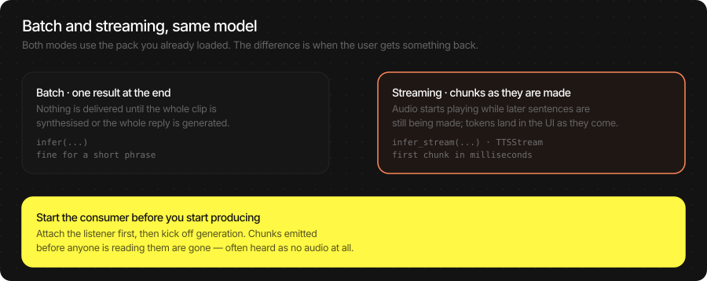
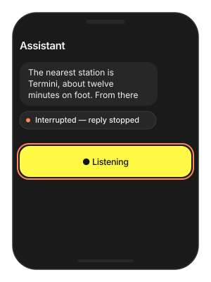

# Streaming

Every pipeline can deliver results while it is still working: LLM tokens
as they are generated, TTS audio sentence by sentence, ASR text while the
user is still talking. The perceived wait drops from seconds to
milliseconds, and it uses the same model packs as batch — nothing extra
to load.

This page is the one place that shows the three streams side by side and
how to chain them. Each pipeline's own page has the full API.

> **Main features**
>
> - **Same packs, no extra setup**: anything you load with `start_model`
>   already streams.
> - **Three streams, one shape**: LLM tokens, TTS audio chunks, ASR turns
>   — all consumed with `for await` / `listen`.
> - **Chainable**: LLM tokens feed straight into a TTS stream; the first
>   words play before the reply is finished.
> - **Cancellable**: stop any stream mid-generation when the user
>   interrupts or leaves.
> - **Tunable first chunk**: trade a shorter first audio chunk for a
>   faster start.

## In this page

Here we will cover the following topics:

- [Batch or stream?](#batch-or-stream): when each is right.
- [The three streams](#the-three-streams): LLM, TTS and ASR streaming — Swift and Flutter side by side.
- [Chunk reference](#chunk-reference): what each stream's chunk carries.
- [Usage Guides](#usage-guides): speak an LLM reply as it is written, cut latency to first audio, stop on interrupt.
- [Troubleshooting](#troubleshooting): symptom → cause → fix.

## Batch or stream?



|  | Batch (`infer`) | Stream (`infer_stream` / `open_stream`) |
|---|---|---|
| You get the result | all at once, at the end | piece by piece, as it is made |
| Use it for | short prompts, cached audio, tests | anything a person is waiting on |
| First output after | the whole job | tens of milliseconds |
| Code shape | one call, one value | a loop you must keep draining |

> [!TIP]
> **Start the consumer before you start producing.** The loop that reads
> chunks must be running before you send text or start generation.
> Attach it afterwards and the first chunks are gone — for TTS that
> means silence.

## The three streams

### LLM tokens

**Swift**

```swift
let llm = try await TSLLM(engines_path: "TheStageAI/Qwen3-0.6B")
var config = llm.generation_defaults
config.enable_thinking = false

for await chunk in llm.infer_stream(prompt: prompt, config: config) {
    if chunk.is_final { print(chunk.tokens_per_second ?? 0, "tok/s") }
    else              { bubble.text += chunk.text }
}
```

**Flutter**

```dart
await TheStageFlutterSDK.start_model(
  model_name: 'llm',
  engines_path: 'TheStageAI/Qwen3-0.6B',
);

await for (final chunk in TheStageFlutterSDK.infer_stream(
  model_name: 'llm', input_json: {'prompt': prompt})) {
  if (chunk['is_final'] == true) break;
  bubble.value += chunk['delta'] as String? ?? '';
}
```

Full API: [LLM](./llm.md).

### TTS audio

**Swift**

```swift
let tts = try await NeuTTSMultilingualPipeline(
    engines_path: "TheStageAI/neutts-nano-multilingual",
    voice_id: "dave",
    language: "english"
)

let player = AudioStreamPlayer(config: AudioStreamConfig(sample_rate: 24_000))
player.start()

let speech = tts.open_stream()
let consumer = Task {
    for await chunk in speech.output {
        if let pcm = chunk.audio { player.enqueue(pcm) }
    }
}
speech.send("A long paragraph to speak aloud.")
speech.close()
await consumer.value
await player.drain()
player.stop()
```

**Flutter**

```dart
await TheStageFlutterSDK.start_model(
  model_name: 'tts',
  engines_path: 'TheStageAI/neutts-nano-multilingual',
  config: {'voice_id': 'dave', 'language': 'english'},
);

final player = TSAudioPlayer(sampleRate: 24000);
await player.start();

final speech = await TTSStream.open(model_name: 'tts');
final consumer = speech.output.listen((chunk) {
  final audio = chunk['audio'] as Float32List?;
  if (audio != null) player.enqueue(audio);
});
await speech.send('A long paragraph to speak aloud.');
await speech.close();
await consumer.asFuture();
await player.drain();
await player.stop();
```

Full API: [TTS](./tts.md).

### ASR turns

**Swift**

```swift
let engine = ASREngine(config: TSAgentConfig(
    vad: "TheStageAI/silero-vad",
    stt: "TheStageAI/thewhisper-large-v3-turbo"))

let captions = Task {
    for await turn in engine.turns.recv() {
        committedLabel.text  = turn.committed
        hypothesisLabel.text = turn.end_of_turn ? "" : turn.hypothesis
    }
}
try await engine.start()
```

**Flutter**

```dart
final asr = TSASREngine();
asr.turns.listen((turn) {
  committed.value  = turn.committed;
  hypothesis.value = turn.end_of_turn ? '' : turn.hypothesis;
});
await asr.start(config: {
  'vad': 'TheStageAI/silero-vad',
  'stt': 'TheStageAI/thewhisper-large-v3-turbo',
});
```

Full API: [ASR](./asr.md).

### Important API

| Stream | Swift | Flutter |
|---|---|---|
| LLM | `llm.infer_stream(prompt:config:)` → `LLMStreamChunk` | `infer_stream(model_name:input_json:)` → `Map` |
| TTS | `tts.open_stream()` → `TTSStream` (`send` / `close` / `cancel`, `output`) | `TTSStream.open(model_name:)` → same |
| ASR | `ASREngine(config:)` → `turns` channel; or `open_stream` → `ASRStream` | `TSASREngine` → `turns`; or `ASRStream.open` |
| Player | `AudioStreamPlayer` | `TSAudioPlayer` |

## Chunk reference

| Stream | Swift type | Fields you use |
|---|---|---|
| LLM | `LLMStreamChunk` (Flutter: `kind: 'text'`) | `text` (Flutter `delta`), `is_final`; on the final chunk `tokens_per_second`, `stop_reason`, `time_to_first_token`. |
| LLM with tools | `LLMStreamEvent` (Flutter: `kind`) | `text_delta`, `tool_call` (`name`, `arguments`), `tool_result`, `thinking_delta`, `final`. Render only `text_delta`. |
| TTS | `InferenceStreamChunk` (Flutter: `kind: 'audio'`) | `audio` (mono float, nil on the final marker), `sample_rate`, `is_final`. |
| ASR | `ASRTurn` (Flutter: `TSASRTurn` / `kind: 'turn'`) | `committed`, `hypothesis`, `display`, `end_of_turn`. |

## Usage Guides

### Speak an LLM reply as it is written

> **Problem**
>
> **Building** — a voice assistant whose answers come from an on-device
> LLM.
>
> **Users want** — to hear the first sentence while the rest is still
> being written.
>
> **Hard part** — tokens arrive one at a time and sentences must be
> found before they can be spoken; a consumer that starts late loses
> audio.

**Solution — what to use**

- `tts.open_stream()` — a `TTSStream` that splits sentences itself.
- `llm.infer_stream(prompt:config:)` — `send` each token's text into
  the TTS stream.
- `AudioStreamPlayer` — start the consumer of `speech.output` before
  the first `send`.
- `speech.close()` at the end; `await player.drain()` before tearing
  down.


**Swift**

```swift
let llm = try await TSLLM(engines_path: "TheStageAI/Qwen3-0.6B")
let tts = try await NeuTTSMultilingualPipeline(
    engines_path: "TheStageAI/neutts-nano-multilingual",
    voice_id: "dave",
    language: "english"
)

let player = AudioStreamPlayer(config: AudioStreamConfig(sample_rate: 24_000))
player.start()

let speech = tts.open_stream()
// consumer first
let consumer = Task {
    for await chunk in speech.output {
        if let pcm = chunk.audio { player.enqueue(pcm) }
    }
}

var config = llm.generation_defaults
config.enable_thinking = false
// the user's question (typed, or an ASR transcript)
let question = "Where is the nearest station?"
for await token in llm.infer_stream(prompt: question, config: config) {
    if !token.is_final { speech.send(token.text) }
}
speech.close()
await consumer.value
await player.drain()
```

**Flutter**

```dart
await TheStageFlutterSDK.start_model(
  model_name: 'llm',
  engines_path: 'TheStageAI/Qwen3-0.6B',
);
await TheStageFlutterSDK.start_model(
  model_name: 'tts',
  engines_path: 'TheStageAI/neutts-nano-multilingual',
  config: {'voice_id': 'dave', 'language': 'english'},
);

final player = TSAudioPlayer(sampleRate: 24000);
await player.start();

final speech = await TTSStream.open(model_name: 'tts');
// consumer first
final consumer = speech.output.listen((chunk) {
  final audio = chunk['audio'] as Float32List?;
  if (audio != null) player.enqueue(audio);
});

// the user's question (typed, or an ASR transcript)
const question = 'Where is the nearest station?';
await for (final token in TheStageFlutterSDK.infer_stream(
  model_name: 'llm',
  input_json: {'prompt': question, 'enable_thinking': false})) {
  if (token['is_final'] == true) break;
  await speech.send(token['delta'] as String? ?? '');
}
await speech.close();
await consumer.asFuture();
await player.drain();
```

> [!TIP]
> - Send tokens, not sentences — sentence detection is inside TTS.
> - With tools on the LLM, send only `text_delta` events; never
>   `tool_result`.
> - The complete loop with a microphone, echo cancellation and barge-in
>   is the [Voice Agent](./voice_agent.md). Use it instead of wiring this
>   by hand.

### Cut the wait before the first audio

> **Problem**
>
> **Building** — an assistant that already streams.
>
> **Users want** — no visible pause before the first syllable.
>
> **Hard part** — the first chunk must be fully rendered before
> anything can play; making every chunk small costs quality.

**Solution — what to use**

- `TTSStreamConfig(first_frames_per_chunk: 8)` — only the first chunk
  is short (default 25).
- `overlap_frames` 2–3 if joins click; `frames_per_chunk` 40 if
  callbacks are too frequent.
- Warm the pipeline once at launch.

**Swift**

```swift
let tts = try await NeuTTSMultilingualPipeline(
    engines_path: "TheStageAI/neutts-nano-multilingual",
    voice_id: "dave",
    language: "english"
)

let speech = tts.open_stream(
    // default 25
    config: TTSStreamConfig(first_frames_per_chunk: 8)
)
```

**Flutter**

```dart
await TheStageFlutterSDK.start_model(
  model_name: 'tts',
  engines_path: 'TheStageAI/neutts-nano-multilingual',
  config: {'voice_id': 'dave', 'language': 'english'},
);

final speech = await TTSStream.open(
  model_name: 'tts',
  stream_config: const TTSStreamConfig(first_frames_per_chunk: 8),
);
```

| Goal | Change | Trade-off |
|---|---|---|
| Faster first audio | `first_frames_per_chunk` 25 → 8–12 | Shorter first segment |
| Smoother sentence joins | `overlap_frames` 1 → 2–3 | Slightly more latency per chunk |
| Fewer callbacks | `frames_per_chunk` 25 → 40 | More latency per chunk |

> [!TIP]
> - Below `6` the first chunk starts to sound clipped.
> - Warm the pipeline once at launch; the first synthesis after load is
>   always the slowest.

### Stop a stream when the user interrupts

> **Problem**
>
> **Building** — an assistant with barge-in, a Stop button, or a back
> gesture.
>
> **Users want** — silence *now* when they tap or start talking — not
> after the sentence finishes.
>
> **Hard part** — three things are generating at once (LLM, TTS,
> playback) and each has its own way to stop; a stream that was
> cancelled cannot be reused.

**Solution — what to use**

- `speech.cancel()` + `player.stop()` — TTS and playback together.
- `replyTask.cancel()` — cancelling the consuming `Task` ends LLM
  generation.
- `stream.cancel()` on an `ASRStream` you own.
- Open a **new** stream for the next utterance — streams are single-use.
- `close()` instead of `cancel()` when the text simply finished.



**Swift**

```swift
let player = AudioStreamPlayer(config: AudioStreamConfig(sample_rate: 24_000))
player.start()
let tts = try await NeuTTSMultilingualPipeline(
    engines_path: "TheStageAI/neutts-nano-multilingual",
    voice_id: "dave",
    language: "english"
)
let speech = tts.open_stream()
let stt = try await WhisperPipeline(
    engines_path: "TheStageAI/thewhisper-large-v3-turbo"
)
let silero = try SileroVAD(engines_path: "TheStageAI/silero-vad")
let engine = ASREngine(pipeline: stt, vad: silero)
let stream = try await engine.open_stream(
    ASRGenerationConfig(language: "en", timestamps: .WORD)
)

// TTS
speech.cancel()
player.stop()

// LLM: stop consuming — cancelling the Task that runs
// llm.infer_stream (see the first guide) ends generation
replyTask.cancel()

// ASR push stream
stream.cancel()
```

**Flutter**

```dart
final player = TSAudioPlayer(sampleRate: 24000);
await player.start();
await TheStageFlutterSDK.start_model(
  model_name: 'tts',
  engines_path: 'TheStageAI/neutts-nano-multilingual',
  config: {'voice_id': 'dave', 'language': 'english'},
);
final speech = await TTSStream.open(model_name: 'tts');

// TTS
await speech.cancel();
await player.stop();

// LLM: cancel the StreamSubscription returned by
// infer_stream(...).listen (see the first guide)
await replySub.cancel();

// ASR push stream (ASRStream.open, see the ASR page)
final stream = await ASRStream.open(
  model_name: 'stt',
  vad_model_name: 'vad',
);
await stream.cancel();
```

> [!TIP]
> - `cancel()` discards pending audio; `close()` lets it drain. Use
>   `close()` when the text is simply finished.
> - After a cancel, open a **new** stream for the next utterance —
>   streams are single-use.

## Troubleshooting

| Symptom | Cause | Fix |
|---|---|---|
| No audio during streaming | Consumer attached after the first `send`. | Start the read loop first. |
| Audio starts, then silence | `cancel()` where `close()` was meant. | `close()` to finish; `cancel()` only to abort. |
| Choppy audio between sentences | Chunk seams; or the player was created per chunk. | `overlap_frames: 2`–`3`; one player for the session. |
| Long pause before first audio | Batch call, or a large first chunk, or a cold pipeline. | Stream; `first_frames_per_chunk: 8`; warm at launch. |
| Stream never ends | Producer never called `close()`. | Always `close()` (or `cancel()`) the stream you opened. |
| Wrong speed | Player rate ≠ chunk `sample_rate`. | Read the rate off the chunk. |
