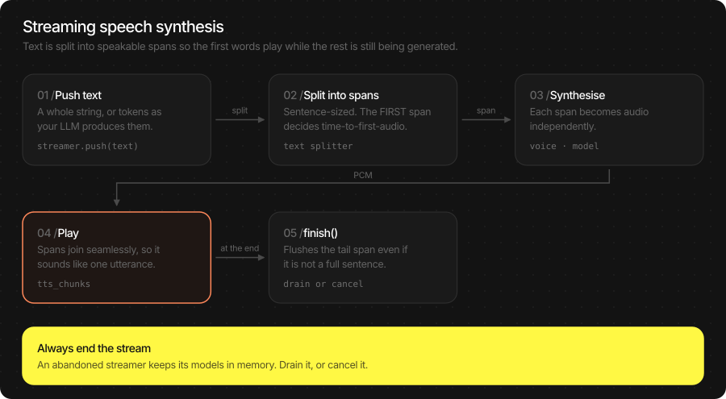
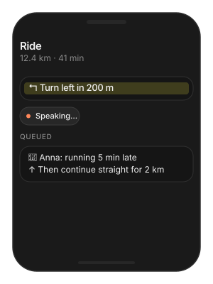
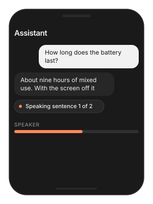
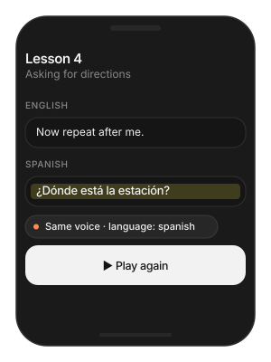

# TTS (Text-to-Speech)

On-device neural speech. Two model families — **NeuTTS** and
**Qwen3-TTS** — behind one API, producing 24 kHz mono float PCM you can
play, save, or stream. Voices swap at runtime without reloading the
model, and your own speaker can ship as a small voice pack.

Use it two ways: synthesise a string and get audio back, or open a
stream and hear the first words while the rest is still being made.

> **Main features**
>
> - **Two families, one API**: `NeuTTSMultilingualPipeline` and
>   `Qwen3TTSPipeline` share `infer` / `open_stream` / `set_voice`.
> - **Streaming**: push text in — whole sentences or LLM tokens — and
>   drain audio as it is synthesised. First audio in tens of
>   milliseconds.
> - **Voice hot-swap**: `set_voice(voice_id:)` changes speaker or
>   language on a live pipeline, no engine reload.
> - **Your own voice**: encode a 3-second reference clip into a voice
>   pack and ship it with the app.
> - **Nine languages, one speaker** (NeuTTS): english, french, german,
>   spanish, portuguese, japanese, korean, chinese, urdu.
> - **Any output rate**: 24 kHz native, resampled once to 16 / 48 kHz
>   if your audio session needs it.
> - **A player is included**: `AudioStreamPlayer` / `TSAudioPlayer`
>   accept exactly this PCM.

## In this page

Here we will cover the following topics:

- [Supported models](#supported-models): the two families, their voices and languages, and how to pick.
- [Quick start](#quick-start): speak a string, or stream it — Swift and Flutter side by side.
- [Synthesise speech](#synthesise-speech): the batch call, output format, and the sampling knobs.
- [Stream speech](#stream-speech): push text, drain audio, and the chunking knobs.
- [Voices and languages](#voices-and-languages): bundle voices, language override, your own voice pack.
- [Result object](#result-object): `TTSResult` and stream chunk fields.
- [Usage Guides](#usage-guides): read notifications aloud, speak an LLM reply, a multilingual tutor, a brand voice, wrong playback speed, slow first audio.
- [Troubleshooting](#troubleshooting): symptom → cause → fix.
- [Load Progress / Prefetch / Cleanup](#load-progress-prefetch-cleanup): first-run download, warming the cache, releasing models.

## Supported models

Two families. Both produce 24 kHz mono float and accept the same calls;
they differ in size, languages and voice character.

| Model | HF repo | Family | Device | Fleet pin |
|---|---|---|---|---|
| NeuTTS nano multilingual | `TheStageAI/neutts-nano-multilingual` | NeuTTS | NPU | v1.1 |
| Qwen3-TTS 12 Hz 0.6B | `TheStageAI/Qwen3-TTS-12Hz-0.6B-Base` | Qwen3 | NPU | v1.1 |

| Feature | NeuTTS nano | Qwen3-TTS |
|---|---|---|
| Bundle voices | `paul`, `dave`, `jo` | `b_ref` |
| Languages | english, french, german, spanish, portuguese, japanese, korean, chinese, urdu — one speaker across all | follows the voice pack |
| Own voice from a clip | yes (3–10 s reference) | yes (2–4 s reference) |
| Streaming | yes | yes |
| Voice Agent TTS | yes | yes |

**Which one?**

| You need… | Pick | Why |
|---|---|---|
| Lowest latency and footprint | **NeuTTS nano** | Smallest model; fastest first audio. |
| The same speaker in several languages | **NeuTTS nano** | `set_voice(language:)` keeps the speaker and switches phonemes. |
| Most natural prosody for long narration | **Qwen3-TTS** | Larger talker model; better on long sentences. |
| A voice cloned from a very short clip | **Qwen3-TTS** | Clones from ~3 s of reference audio. |

## Quick start

Two ways to get audio. Batch when you already have the whole string and
a second of latency is fine; stream when the user is waiting to hear it.

| You want | Latency | Use |
|---|---|---|
| Audio for a string you already have | the whole clip at once | `infer(text:)` |
| Audio that starts before the text is finished | first chunk in milliseconds | `open_stream` / `TTSStream.open` |

### Speak a string

**Swift**

```swift
import TheStageSDK

try await TheStageAI.shared.initialize(api_token: "your-api-token")

let tts = try await NeuTTSMultilingualPipeline(
    engines_path: "TheStageAI/neutts-nano-multilingual",
    voice_id: "dave",
    language: "english"
)

let result = tts.infer(text: "Hello from TheStage.")
// result.samples: [Float] mono in [-1, 1], result.sample_rate == 24000

let player = AudioStreamPlayer(
    config: AudioStreamConfig(sample_rate: Double(result.sample_rate))
)
player.start()
player.enqueue(result.samples)
await player.drain()
player.stop()
```

**Flutter**

```dart
import 'package:thestage_apple_sdk/thestage_apple_sdk.dart';

await TheStageFlutterSDK.initialize(api_token: 'your-api-token');
await TheStageFlutterSDK.start_model(
  model_name: 'tts',
  engines_path: 'TheStageAI/neutts-nano-multilingual',
  config: {'voice_id': 'dave', 'language': 'english'},
);

final rows = await TheStageFlutterSDK.infer(
  model_name: 'tts',
  input_json: {'text': 'Hello from TheStage.'},
);
final audio = rows[0]['audio'] as Float32List;
// 24000
final rate  = rows[0]['sample_rate'] as int;

final player = TSAudioPlayer(sampleRate: rate);
await player.start();
player.enqueue(audio);
await player.drain();
await player.stop();
```

### Stream it

**Swift**

```swift
let tts = try await NeuTTSMultilingualPipeline(
    engines_path: "TheStageAI/neutts-nano-multilingual",
    voice_id: "dave",
    language: "english"
)

let player = AudioStreamPlayer(config: AudioStreamConfig(sample_rate: 24_000))
player.start()

let speech = tts.open_stream()
// drain BEFORE you send
let consumer = Task {
    for await chunk in speech.output {
        if let pcm = chunk.audio { player.enqueue(pcm) }
    }
}

speech.send("Hello from TheStage. ")
speech.send("This plays while the rest is still being made.")
// no more text
speech.close()
await consumer.value
await player.drain()
player.stop()
```

**Flutter**

```dart
await TheStageFlutterSDK.start_model(
  model_name: 'tts',
  engines_path: 'TheStageAI/neutts-nano-multilingual',
  config: {'voice_id': 'dave', 'language': 'english'},
);

final player = TSAudioPlayer(sampleRate: 24000);
await player.start();

final speech = await TTSStream.open(model_name: 'tts');
// listen BEFORE you send
final consumer = speech.output.listen((chunk) {
  final audio = chunk['audio'] as Float32List?;
  if (audio != null) player.enqueue(audio);
});

await speech.send('Hello from TheStage. ');
await speech.send('This plays while the rest is still being made.');
// no more text
await speech.close();
await consumer.asFuture();
await player.drain();
await player.stop();
```

### Important API

| Purpose | Swift | Flutter |
|---|---|---|
| Load a model | `try await NeuTTSMultilingualPipeline(engines_path:voice_id:language:device:)` / `Qwen3TTSPipeline(engines_path:voice_id:device:)` | `start_model(model_name: 'tts', engines_path:, config: {voice_id, language})` |
| Speak a string | `tts.infer(text:config:)` → `TTSResult` | `infer(model_name: 'tts', input_json: {'text'})` → `rows[0]` |
| Stream | `tts.open_stream()` → `TTSStream`: `send` / `flush` / `close` / `cancel`, `output` | `TTSStream.open(model_name:)`: same methods, `output` |
| Change voice | `try tts.set_voice(voice_id:language:voice_dir:)` | `stop_model` + `start_model` with a new `config` |
| Play audio | `AudioStreamPlayer`: `start` / `enqueue` / `drain` / `stop` | `TSAudioPlayer`: same |
| Release | drop the pipeline | `stop_model(model_name: 'tts')` |

## Synthesise speech

One string in, one clip out. Use it for notifications, short prompts,
and anything you will play more than once — the result is plain PCM you
can cache or write to a file.

**Swift**

```swift
let tts = try await NeuTTSMultilingualPipeline(
    engines_path: "TheStageAI/neutts-nano-multilingual",
    voice_id: "dave",
    language: "english"
)

var config = TTSGenerationConfig()
// match your audio session (optional)
config.sample_rate_out = 48_000
// calmer; omit for the pack default
config.temperature = 0.8

let result = tts.infer(text: "Your order has shipped.", config: config)

// Play, or keep it
try AudioIO.write_wav(
    samples: result.samples,
    sample_rate: result.sample_rate,
    path: cacheURL.appendingPathComponent("shipped.wav").path
)
print(result.duration, "s of audio in", result.rtf, "× real time")
```

**Flutter**

```dart
await TheStageFlutterSDK.start_model(
  model_name: 'tts',
  engines_path: 'TheStageAI/neutts-nano-multilingual',
  config: {'voice_id': 'dave', 'language': 'english'},
);

final rows = await TheStageFlutterSDK.infer(
  model_name: 'tts',
  input_json: {
    'text': 'Your order has shipped.',
    // match your audio session (optional)
    'sample_rate_out': 48000,
    // calmer; omit for the pack default
    'temperature': 0.8,
  },
);
final audio = rows[0]['audio'] as Float32List;
// 48000
final rate  = rows[0]['sample_rate'] as int;
// Play with TSAudioPlayer(sampleRate: rate), or persist the samples.
```

**Output contract** — mono float PCM in `[-1, 1]`. The codec is native
24 kHz; `sample_rate_out` resamples once on the way out. Whatever
`result.sample_rate` says is the rate your player must run at.

**Sampling options** — `TTSGenerationConfig`. Omit everything for the
pack's tuned voice; reach for these with a specific goal.

| Field | Default | Change it when |
|---|---|---|
| `temperature` | pack (≈ 0.9) | Lower to `0.7` for long narration with fewer artefacts; raise to `1.1` for an expressive character voice. |
| `top_k` | pack (≈ 50) | Lower to `25` with a low temperature for maximum stability. |
| `sample_rate_out` | 24 000 | Your `AVAudioSession` runs at 48 kHz, or the audio feeds ASR at 16 kHz. Saves a resample in your code. |
| `seed` | random | Golden-file tests. Same seed + same device + same pack → same PCM. |
| `return_debug_info` | false | Diagnosing an empty result. |

## Stream speech



A stream takes text in any size — whole paragraphs or one LLM token at
a time — splits it into sentences internally, and emits audio chunks as
each span is synthesised. The user hears the first words while the
model is still working on the rest.

**Swift**

```swift
let llm = try await TSLLM(engines_path: "TheStageAI/Qwen3-0.6B")
let tts = try await NeuTTSMultilingualPipeline(
    engines_path: "TheStageAI/neutts-nano-multilingual",
    voice_id: "dave",
    language: "english"
)
let player = AudioStreamPlayer(config: AudioStreamConfig(sample_rate: 24_000))
player.start()
var llmConfig = llm.generation_defaults
llmConfig.enable_thinking = false

let speech = tts.open_stream(
    TTSGenerationConfig(),
    // faster first audio
    config: TTSStreamConfig(first_frames_per_chunk: 12)
)
let consumer = Task {
    for await chunk in speech.output {
        if let pcm = chunk.audio { player.enqueue(pcm) }
        if chunk.is_final { break }
    }
}

for await token in llm.infer_stream(prompt: question, config: llmConfig) {
    // tokens, not sentences
    if !token.is_final { speech.send(token.text) }
}
speech.close()
await consumer.value
```

**Flutter**

```dart
await TheStageFlutterSDK.start_model(
  model_name: 'llm',
  engines_path: 'TheStageAI/Qwen3-0.6B',
);
await TheStageFlutterSDK.start_model(
  model_name: 'tts',
  engines_path: 'TheStageAI/neutts-nano-multilingual',
  config: {'voice_id': 'dave', 'language': 'english'},
);
final player = TSAudioPlayer(sampleRate: 24000);
await player.start();

final speech = await TTSStream.open(
  model_name: 'tts',
  stream_config: const TTSStreamConfig(first_frames_per_chunk: 12),
);
final consumer = speech.output.listen((chunk) {
  final audio = chunk['audio'] as Float32List?;
  if (audio != null) player.enqueue(audio);
});

await for (final token in TheStageFlutterSDK.infer_stream(
  model_name: 'llm', input_json: {'prompt': question})) {
  if (token['is_final'] == true) break;
  // tokens, not sentences
  await speech.send(token['delta'] as String? ?? '');
}
await speech.close();
await consumer.asFuture();
```

> [!TIP]
> Start draining `output` **before** the first `send`. If you send
> all the text first and read afterwards, the buffer fills and nothing
> plays.

**Stream calls** — `TTSStream` (Swift and Flutter):

| Call | Use it to |
|---|---|
| `send(_:)` | Push text. Any size; sentence splitting is internal. |
| `flush()` | Speak what is buffered now, even a fragment without a full stop. |
| `close()` | No more text. `output` ends after the last chunk drains. |
| `cancel()` | Stop immediately — the user interrupted. |

**Chunking options** — `TTSStreamConfig`. The defaults suit a
voice assistant; touch these only for latency or seam quality.

| Field | Default | Change it when |
|---|---|---|
| `first_frames_per_chunk` | 25 | Lower to `6`–`12` for faster first audio; the first chunk is shorter, later ones are normal. |
| `frames_per_chunk` | 25 | Raise if individual chunks sound thin. |
| `overlap_frames` | 1 | Raise to `2`–`3` if you hear clicks at chunk seams. |
| `lookforward` / `lookback` | 5 / 50 | Leave alone. |

## Voices and languages

Three knobs compose, and they have the same names on the constructor and
on `set_voice`: **`voice_id`** picks a speaker that ships in the
pack; **`voice_dir`** points at an external voice pack (yours, or a
downloaded one) and wins over `voice_id`; **`language`** switches
phonemisation on NeuTTS while keeping the speaker.

**Swift**

```swift
// At load
let tts = try await NeuTTSMultilingualPipeline(
    engines_path: "TheStageAI/neutts-nano-multilingual",
    voice_id: "paul",
    language: "english"
)
// ["dave", "jo", "paul"]
print(tts.available_voices)

// At runtime — no engine reload
try tts.set_voice(voice_id: "dave")
try tts.set_voice(voice_id: "dave", language: "french")
// your own voice pack
try tts.set_voice(voice_dir: packURL.path)
// back to the bundle voice
try tts.set_voice(voice_dir: "")
```

**Flutter**

```dart
// Voice is fixed at load. To change it, stop and start again.
await TheStageFlutterSDK.stop_model(model_name: 'tts');
await TheStageFlutterSDK.start_model(
  model_name: 'tts',
  engines_path: 'TheStageAI/neutts-nano-multilingual',
  config: {
    'voice_id': 'dave',
    'language': 'french',
    // 'voice_dir': '/path/to/your/voice_pack',   // wins over voice_id
  },
);
```

**Your own voice.** A voice pack is a folder with one `voice.json`,
produced from a short reference clip and its transcript with the public
tools in the AppleSDK repo — see
[Ship a brand voice](#ship-a-brand-voice-with-the-app) below.

> [!NOTE]
> Inside the Voice Agent the same knobs are `tts_voice`,
> `tts_voice_dir` and `tts_language` on `TSAgentConfig`, and
> `agent.set_voice(...)` on Flutter — see [Voice Agent](./voice_agent.md).

## Result object

`TTSResult` is what `infer` returns; stream chunks carry the audio
fields only.

**Swift**

```swift
let tts = try await NeuTTSMultilingualPipeline(
    engines_path: "TheStageAI/neutts-nano-multilingual",
    voice_id: "dave",
    language: "english"
)
let speech = tts.open_stream()
var config = TTSGenerationConfig()

let result = tts.infer(text: text, config: config)
// [Float], mono, [-1, 1]
result.samples
// 24000, or sample_rate_out
result.sample_rate
// seconds of audio
result.duration
// audio seconds per wall second
result.rtf

for await chunk in speech.output {
    // [Float]? — nil on the final marker
    chunk.audio
    // Int?
    chunk.sample_rate
    chunk.is_final
}
```

**Flutter**

```dart
await TheStageFlutterSDK.start_model(
  model_name: 'tts',
  engines_path: 'TheStageAI/neutts-nano-multilingual',
  config: {'voice_id': 'dave', 'language': 'english'},
);
final speech = await TTSStream.open(model_name: 'tts');

final r = rows[0];
// Float32List
r['audio'];
// 24000, or sample_rate_out
r['sample_rate'];
r['duration'];
r['rtf'];

speech.output.listen((chunk) {
  // Float32List? — null on the final marker
  chunk['audio'];
  chunk['sample_rate'];
  chunk['is_final'];
});
```

| Swift | Flutter JSON | Meaning |
|---|---|---|
| `samples` | `audio` | The PCM. |
| `sample_rate` | `sample_rate` | Hz. Run the player at exactly this. |
| `duration` | `duration` | Seconds of audio produced. |
| `rtf` | `rtf` | Audio seconds per wall second. `2.5` means a 5 s clip took 2 s. |
| `prefill_seconds` / `decode_seconds` / `codec_seconds` | same | Where the time went. |

## Usage Guides

Each guide is one production question: what you are building, what to
use, the code, and what not to forget.

### Read notifications aloud

> **Problem**
>
> **Building** — a cycling app that reads turn-by-turn directions and
> incoming messages while the phone is in a pocket.
>
> **Users want** — each phrase spoken clearly, in order, never cut off
> by the next one, and at the volume and rate the rest of the app
> already uses.
>
> **Hard part** — phrases arrive faster than they can be spoken, the
> audio session runs at 48 kHz, and re-creating a player per phrase
> adds a click and a delay.

**Solution — what to use**

- `NeuTTSMultilingualPipeline` — loaded once and kept.
- `tts.infer(text:config:)` — one batch call per phrase; short phrases
  synthesise well under a second.
- `TTSGenerationConfig.sample_rate_out = 48_000` — match the session
  so nothing is resampled twice.
- One `AudioStreamPlayer` for the app's lifetime; `enqueue` then
  `drain()` so phrases never overlap.
- Flutter: `TSAudioPlayer(sampleRate:)` with the same enqueue / drain
  pattern.



**Swift**

```swift
final class Announcer {
    private let tts: NeuTTSMultilingualPipeline
    private let player = AudioStreamPlayer(
        config: AudioStreamConfig(sample_rate: 48_000))
    private var config = TTSGenerationConfig()

    init(tts: NeuTTSMultilingualPipeline) {
        self.tts = tts
        // the session rate
        config.sample_rate_out = 48_000
        player.start()
    }

    func say(_ phrase: String) async {
        let clip = tts.infer(text: phrase, config: config)
        // queued after whatever is playing
        player.enqueue(clip.samples)
        // wait so phrases never overlap
        await player.drain()
    }
}
```

**Flutter**

```dart
await TheStageFlutterSDK.start_model(
  model_name: 'tts',
  engines_path: 'TheStageAI/neutts-nano-multilingual',
  config: {'voice_id': 'dave', 'language': 'english'},
);

class Announcer {
  final player = TSAudioPlayer(sampleRate: 48000);
  Future<void> init() => player.start();

  Future<void> say(String phrase) async {
    final rows = await TheStageFlutterSDK.infer(
      model_name: 'tts',
      input_json: {'text': phrase, 'sample_rate_out': 48000},
    );
    player.enqueue(rows[0]['audio'] as Float32List);
    // phrases never overlap
    await player.drain();
  }
}
```

> [!TIP]
> - One player for the app's lifetime. Creating one per phrase adds a
>   start-up click and latency.
> - Cache clips for phrases you repeat ("Turn left") — `samples` is a
>   plain array; write it once with `AudioIO.write_wav`.
> - Keep the pipeline loaded between phrases; loading is the slow part,
>   synthesis of a short phrase is well under a second.

### Speak an LLM reply as it is generated

> **Problem**
>
> **Building** — a voice assistant whose answers come from an on-device
> LLM.
>
> **Users want** — to hear the first sentence while the rest is still
> being written — not a two-second pause and then the whole answer.
>
> **Hard part** — tokens arrive one at a time, sentences must be found
> before they can be spoken, and tool or reasoning output must never be
> read aloud.

**Solution — what to use**

- `tts.open_stream()` — a `TTSStream` that finds sentence boundaries
  itself; you feed it tokens.
- `LLMChatEngine.chat_session` + `infer_stream` — send only
  `.text_delta` into the stream.
- Start the consumer of `speech.output` **before** the first `send`.
- `speech.close()` when the reply ends; `speech.cancel()` plus
  `player.stop()` on barge-in.
- `enable_thinking = false` on the LLM.



**Swift**

```swift
let tts = try await NeuTTSMultilingualPipeline(
    engines_path: "TheStageAI/neutts-nano-multilingual",
    voice_id: "dave",
    language: "english"
)
let player = AudioStreamPlayer(config: AudioStreamConfig(sample_rate: 24_000))
player.start()
let llm = try await TSLLM(engines_path: "TheStageAI/Qwen3-0.6B")
let session = LLMChatEngine(
    llm: llm).chat_session(system_prompt: "You are a helpful assistant.",
    memory: .SLIDING(max_turns: 10)
)
var llmConfig = llm.generation_defaults
llmConfig.enable_thinking = false
// the user's question (typed, or an ASR transcript)
let question = "How long does the battery last?"

let speech = tts.open_stream()
let consumer = Task {
    for await chunk in speech.output {
        if let pcm = chunk.audio { player.enqueue(pcm) }
    }
}

for await event in try session.infer_stream(
    user_request: question, config: llmConfig
) {
    // only text_delta
    if case .text_delta(let t) = event { speech.send(t) }
}
speech.close()
await consumer.value
```

**Flutter**

```dart
await TheStageFlutterSDK.start_model(
  model_name: 'llm',
  engines_path: 'TheStageAI/Qwen3-0.6B',
);
await TheStageFlutterSDK.start_model(
  model_name: 'tts',
  engines_path: 'TheStageAI/neutts-nano-multilingual',
  config: {'voice_id': 'dave', 'language': 'english'},
);
final player = TSAudioPlayer(sampleRate: 24000);
await player.start();

// the user's question (typed, or an ASR transcript)
const question = 'How long does the battery last?';

final speech = await TTSStream.open(model_name: 'tts');
final consumer = speech.output.listen((chunk) {
  final audio = chunk['audio'] as Float32List?;
  if (audio != null) player.enqueue(audio);
});

await for (final chunk in TheStageFlutterSDK.infer_stream(
  model_name: 'llm', input_json: {'prompt': question, 'enable_thinking': false})) {
  if (chunk['is_final'] == true) break;
  if (chunk['kind'] == 'text' || chunk['kind'] == 'text_delta') {
    await speech.send(chunk['delta'] as String? ?? '');
  }
}
await speech.close();
await consumer.asFuture();
```

> [!TIP]
> - Send only `text_delta`. Never send `tool_result` or
>   `thinking_delta` — you would hear JSON.
> - Set `enable_thinking = false` on the LLM or the speaker waits
>   through the reasoning.
> - Barge-in: `speech.cancel()` and `player.stop()` together, then
>   open a fresh stream. The full loop with echo cancellation is the
>   [Voice Agent](./voice_agent.md).

### One tutor voice, several languages

> **Problem**
>
> **Building** — a language-learning app that explains in English and
> then says the phrase in Spanish.
>
> **Users want** — the same teacher's voice in both languages, and no
> pause when it switches.
>
> **Hard part** — most engines change speaker when they change
> language; reloading a pipeline per language costs seconds.

**Solution — what to use**

- `NeuTTSMultilingualPipeline` — keeps the speaker across languages.
- `tts.set_voice(voice_id:language:)` between sentences — no reload.
- Language names are lowercase words: `"spanish"`, not `"es"`.
- Flutter fixes the voice at load: run two handles (`tts_en`,
  `tts_es`) that share one cached engine.



**Swift**

```swift
let tts = try await NeuTTSMultilingualPipeline(
    engines_path: "TheStageAI/neutts-nano-multilingual",
    voice_id: "dave",
    language: "english"
)
let player = AudioStreamPlayer(config: AudioStreamConfig(sample_rate: 24_000))
player.start()

try tts.set_voice(voice_id: "paul", language: "english")
player.enqueue(tts.infer(text: "Now repeat after me.").samples)

try tts.set_voice(voice_id: "paul", language: "spanish")
player.enqueue(tts.infer(text: "¿Dónde está la estación?").samples)

await player.drain()
```

**Flutter**

```dart
// Flutter fixes the voice at load: run two handles, one per language.
await TheStageFlutterSDK.start_model(
  model_name: 'tts_en',
  engines_path: 'TheStageAI/neutts-nano-multilingual',
  config: {'voice_id': 'paul', 'language': 'english'},
);
await TheStageFlutterSDK.start_model(
  model_name: 'tts_es',
  engines_path: 'TheStageAI/neutts-nano-multilingual',
  config: {'voice_id': 'paul', 'language': 'spanish'},
);
// Both share one cached engine on disk; only the voice differs.
```

> [!TIP]
> - Language names are lowercase words — `"spanish"`, not `"es"`.
> - A sentence in the wrong language sounds *phonetically* wrong, not
>   broken. If Spanish sounds like an English speaker reading it, the
>   `language` did not switch.
> - The end-to-end pattern with tagged scripts and gapless playback:
>   [apple_sdk_tts_language_switching](https://docs.thestage.ai/tutorials/source/apple_sdk_tts_language_switching.html).

### Ship a brand voice with the app

> **Problem**
>
> **Building** — an app whose every prompt is spoken by the company's
> voice actor.
>
> **Users want** — one recognisable voice everywhere in the product,
> without a custom model and without a download on first launch.
>
> **Hard part** — the reference clip has to be encoded once into
> something the pipeline loads in milliseconds, and it has to survive
> app updates.

**Solution — what to use**

- `prepare_neutts_voice_pack.py` (in the AppleSDK repo) — turns a 3–10
  s reference clip into a **voice pack** folder.
- Bundle the folder;
  `NeuTTSMultilingualPipeline(engines_path:voice_dir:)` —
  `voice_dir` wins over `voice_id`.
- `tts.available_voices` — list bundle voices next to yours in a
  picker.
- Flutter: copy the pack out of assets to a real path, then ``config:
  {'voice_dir': …}``.


**Prepare (once)**

```bash
# From github.com/TheStageAI/AppleSDK — PyPI + Hugging Face only
cd examples/tools/prepare_voice_packs
python3 -m venv .venv && source .venv/bin/activate

pip install -r requirements-neutts.txt
python prepare_neutts_voice_pack.py \
  --ref-audio ./brand_voice.wav \
  --ref-text  "Welcome to Acme. How can I help you today?" \
  --language english \
  --name acme \
  --out-dir ./VoicePacks/acme

# Qwen3-TTS: requirements-qwen3.txt + prepare_qwen3_voice_pack.py
```

**Swift**

```swift
let packURL = Bundle.main.url(forResource: "acme", withExtension: nil,
                              subdirectory: "VoicePacks")!
let tts = try await NeuTTSMultilingualPipeline(
    engines_path: "TheStageAI/neutts-nano-multilingual",
    // wins over voice_id
    voice_dir: packURL.path,
)
```

**Flutter**

```dart
// Copy the pack out of Flutter assets to a real path first —
// the native side needs a filesystem folder.
final packDir = await copyAssetFolder('VoicePacks/acme');
await TheStageFlutterSDK.start_model(
  model_name: 'tts',
  engines_path: 'TheStageAI/neutts-nano-multilingual',
  config: {'voice_dir': packDir.path},
);
```

> [!TIP]
> - Reference clip: NeuTTS 3–10 s, Qwen3 2–4 s. Close mic, no music,
>   one speaker, no clipping. `--ref-text` must match the audio
>   exactly.
> - The pack is one `voice.json`; it loads in milliseconds and is
>   validated at load — a bad file throws before the first `infer`.
> - Record one clip per language with the same mic setup if the brand
>   voice must speak several languages.

### Audio plays too fast, too slow, or clicks

> **Problem**
>
> **Building** — any app that plays what TTS returns.
>
> **Users want** — natural speech at the right pitch on every device,
> no tick between sentences.
>
> **Hard part** — the speed bug is invisible in code — a player opened
> at 44.1 kHz happily plays a 24 kHz clip, slow and deep — and seam
> clicks only show up while streaming.

**Solution — what to use**

- `result.sample_rate` — open the player at that rate, every time;
  never a hard-coded number.
- `TTSStreamConfig(overlap_frames: 3)` — smooths chunk seams while
  streaming.
- Inside the Voice Agent set the speaker rate with the agent's
  `sample_rate_out`, not on the TTS config.

**Swift**

```swift
let tts = try await NeuTTSMultilingualPipeline(
    engines_path: "TheStageAI/neutts-nano-multilingual",
    voice_id: "dave",
    language: "english"
)
var config = TTSGenerationConfig()

// ✅ player follows the result
let result = tts.infer(text: text, config: config)
let player = AudioStreamPlayer(
    config: AudioStreamConfig(sample_rate: Double(result.sample_rate)))

// ❌ hard-coded 44_100 while the clip is 24 kHz → slow and deep
// let player = AudioStreamPlayer(config: AudioStreamConfig(sample_rate: 44_100))

// Clicks at seams while streaming:
let speech = tts.open_stream(config: TTSStreamConfig(overlap_frames: 3))
```

**Flutter**

```dart
await TheStageFlutterSDK.start_model(
  model_name: 'tts',
  engines_path: 'TheStageAI/neutts-nano-multilingual',
  config: {'voice_id': 'dave', 'language': 'english'},
);

// ✅ player follows the result
final rate = rows[0]['sample_rate'] as int;
final player = TSAudioPlayer(sampleRate: rate);

// ❌ TSAudioPlayer(sampleRate: 44100) for a 24 kHz clip → slow and deep

// Clicks at seams while streaming:
final speech = await TTSStream.open(
  model_name: 'tts',
  stream_config: const TTSStreamConfig(overlap_frames: 3),
);
```

> [!TIP]
> - Read `sample_rate` off the result every time; never assume 24 000
>   once `sample_rate_out` is in play.
> - Inside the Voice Agent the speaker rate is the agent's
>   `sample_rate_out` — set it there, not on the TTS config.

### First audio takes too long

> **Problem**
>
> **Building** — an assistant that answers short questions.
>
> **Users want** — the first syllable almost immediately, even for a
> one-line reply.
>
> **Hard part** — the very first synthesis after load is the slowest,
> and a full first chunk has to be rendered before anything can play.

**Solution — what to use**

- `tts.open_stream(config:)` instead of batch `infer`.
- `TTSStreamConfig(first_frames_per_chunk: 8)` — a short first chunk;
  later chunks stay full size.
- Warm the pipeline once at launch (`tts.infer(text: "Ready.")`) off
  the main path.
- `prefetch_engines` on a splash screen so the first *load* is local.

**Swift**

```swift
let tts = try await NeuTTSMultilingualPipeline(
    engines_path: "TheStageAI/neutts-nano-multilingual",
    voice_id: "dave",
    language: "english"
)

// 1. Stream, don't batch
let speech = tts.open_stream(
    // 2. A short first chunk — later chunks stay full size
    config: TTSStreamConfig(first_frames_per_chunk: 8)
)

// 3. Warm once at launch, off the main path
Task.detached { _ = tts.infer(text: "Ready.") }
```

**Flutter**

```dart
await TheStageFlutterSDK.start_model(
  model_name: 'tts',
  engines_path: 'TheStageAI/neutts-nano-multilingual',
  config: {'voice_id': 'dave', 'language': 'english'},
);

// 1 + 2
final speech = await TTSStream.open(
  model_name: 'tts',
  stream_config: const TTSStreamConfig(first_frames_per_chunk: 8),
);

// 3. Warm once at launch
unawaited(TheStageFlutterSDK.infer(
  model_name: 'tts', input_json: {'text': 'Ready.'}));
```

> [!TIP]
> - `first_frames_per_chunk` below `6` starts to sound clipped;
>   `8`–`12` is the sweet spot.
> - The very first synthesis after load is slower than every later one.
>   Warm it during onboarding, not when the user taps the mic.
> - Prefetch the pack on a splash screen so first *load* is local too.

## Troubleshooting

| Symptom | Cause | Fix |
|---|---|---|
| Empty `samples` | Empty or whitespace text; unknown `voice_id`; called before load finished. | Check the text; `available_voices`; await the constructor. |
| Nothing plays while streaming | Consumer attached after `send`. | Drain `output` first. |
| Too fast / too slow | Player rate ≠ `sample_rate`. | Read the rate off the result. |
| Clicks between sentences | Chunk seams. | `overlap_frames: 2`–`3`. |
| Wrong pronunciation | `language` does not match the text (NeuTTS). | `set_voice(language:)`. |
| Slow first audio | Batch call, or large first chunk, or cold pipeline. | Stream; `first_frames_per_chunk: 8`; warm at launch. |
| Voice sounds like the default, not the pack | `voice_dir` path wrong or empty. | Pass an absolute folder path containing `voice.json`. |
| Flutter: voice did not change | Voice is fixed at `start_model`. | `stop_model` then `start_model` with the new config. |

## Load Progress / Prefetch / Cleanup

First run downloads and prepares the pack; later runs hit the cache.
Show progress the first time, warm the cache on a splash screen, and
release models you are done with.

**Swift**

```swift
let ai = TheStageAI.shared

// Progress
let tts = try await NeuTTSMultilingualPipeline(
    engines_path: "TheStageAI/neutts-nano-multilingual",
    voice_id: "dave",
    on_load_progress: { p in
        print("[\(p.model)] \(p.phase) \(Int(p.fraction * 100))%")
    }
)

// Prefetch on a splash screen, construct later
let engines_dir = try await ai.prefetch_engines(
    repo_id: "TheStageAI/neutts-nano-multilingual")
let tts = try await NeuTTSMultilingualPipeline(
    engines_path: engines_dir, voice_id: "dave")

// Cleanup: drop the reference, or
_ = try ai.stop_model(model_name: "tts")
```

**Flutter**

```dart
// Progress
TheStageFlutterSDK.on_progress.listen((event) {
  if (event['model_name'] != 'tts') return;
  print('[tts] ${event['phase']} ${((event['progress'] ?? 0) * 100).round()}%');
});

await TheStageFlutterSDK.start_model(
  model_name: 'tts',
  engines_path: 'TheStageAI/neutts-nano-multilingual',
  config: {'voice_id': 'dave', 'language': 'english'},
);

// Cleanup
await TheStageFlutterSDK.stop_model(model_name: 'tts');
```

Phases: `downloading` → `extracting` → `loading` → `ready`. Cache
hits skip the first two. Full contract: [Get started](./README.md)
(**Load Progress**).
