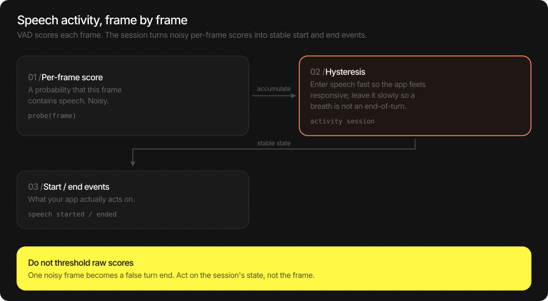
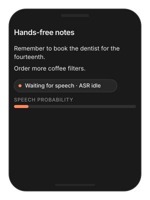
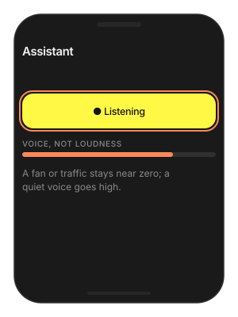
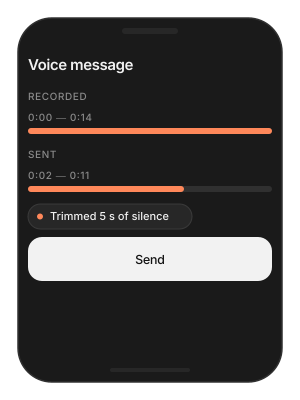

# VAD (Voice Activity Detection)

Tells you whether a slice of audio contains speech. Use it to gate a
microphone so ASR only runs on words, to find the spoken parts of a
recording, or to drive a "listening" indicator. It is small, fast, and
runs on every 32 ms frame.

Most apps never call it directly: the Voice Agent and
`ASREngine(config:)` already run VAD internally. Reach for it when you
own the audio pipeline yourself.

> **Main features**
>
> - **Per-frame speech probability**: one number in `[0, 1]` for every
>   512-sample frame at 16 kHz.
> - **Stable start / end decisions**: `VADActivitySession` turns noisy
>   frame scores into clean speech-started / speech-ended states.
> - **Batch segmentation**: pass a whole recording and get speech
>   regions back as sample ranges.
> - **Tunable sensitivity**: one threshold, plus padding and minimum
>   silence.
> - **Same output on Swift and Flutter** through the JSON path.

## In this page

Here we will cover the following topics:

- [Supported models](#supported-models): Silero VAD.
- [Quick start](#quick-start): score a frame, or segment a recording — Swift and Flutter side by side.
- [Detect speech live](#detect-speech-live): frame scoring, the activity session, and the sensitivity knobs.
- [Segment a recording](#segment-a-recording): batch mode and its options.
- [Result object](#result-object): what comes back in each mode.
- [Usage Guides](#usage-guides): gate the mic before ASR, a listening indicator, trim silence from voice notes, false triggers in noise.
- [Troubleshooting](#troubleshooting): symptom → cause → fix.
- [Cleanup](#cleanup): releasing the model.

## Supported models

| Model | HF repo | Notes |
|---|---|---|
| Silero VAD | `TheStageAI/silero-vad` | 16 kHz, 512-sample frames (32 ms). Keeps state across frames. |

## Quick start

Two modes. Live: feed frames as they arrive and read a probability per
frame. Batch: hand over a whole clip and get the speech regions.

| You want | Input | Use |
|---|---|---|
| Is the user speaking right now? | one 512-sample frame at a time | `probe` / `infer` with `audio` |
| Where is the speech in this recording? | the whole clip | `extract_segments` |

### Score a frame

**Swift**

```swift
import TheStageSDK

try await TheStageAI.shared.initialize(api_token: "your-api-token")

let vad = try SileroVAD(
    engines_path: "TheStageAI/silero-vad"
)

// SDK microphone: 512-sample frames (32 ms) at 16 kHz
let mic = MicAudioSource(sample_rate: 16_000)
try mic.start()

// [Float], exactly 512 samples, 16 kHz
for await frame in mic.stream {
    // 0…1
    let p = vad.probe(frame)
    if p > 0.5 { print("speech") }
}
```

**Flutter**

```dart
import 'package:thestage_apple_sdk/thestage_apple_sdk.dart';

await TheStageFlutterSDK.initialize(api_token: 'your-api-token');
await TheStageFlutterSDK.start_model(
  model_name: 'vad',
  engines_path: 'TheStageAI/silero-vad',
);

// Your 16 kHz mono source in 512-sample frames. For a live microphone on Flutter
// use TSASREngine — it runs VAD for you. The JSON path is for audio you already
// have; here a headerless 16 kHz float32 file.
final bytes = await File('/path/to/clip_16k.pcm').readAsBytes();
final pcm = Float32List.view(bytes.buffer);
Iterable<Float32List> frames() sync* {
  for (var i = 0; i + 512 <= pcm.length; i += 512) yield pcm.sublist(
    i,
    i + 512,
  );
}

for (final frame in frames()) {
  final rows = await TheStageFlutterSDK.infer(
    model_name: 'vad',
    input_json: {'audio': frame},
  );
  // 0…1
  final p = rows[0]['probability'] as double;
  if (p > 0.5) print('speech');
}
```

### Segment a recording

**Swift**

```swift
let vad = try SileroVAD(engines_path: "TheStageAI/silero-vad")

let recording = try AudioIO.load_wav(
    path: "/path/to/recording.wav",
    target_sample_rate: 16_000
)
let regions = vad.extract_segments(audio: recording)
for r in regions {
    let clip = Array(recording[r.start..<r.end])
    print("\(Double(r.start) / 16_000)s – \(Double(r.end) / 16_000)s")
}
```

**Flutter**

```dart
await TheStageFlutterSDK.start_model(
  model_name: 'vad',
  engines_path: 'TheStageAI/silero-vad',
);

final rows = await TheStageFlutterSDK.infer(
  model_name: 'vad',
  input_json: {
    // Float32List, 16 kHz mono
    'audio': recording,
    'extract_segments': true,
  },
);
for (final r in rows) {
  // sample indices
  final start = r['start'] as int, end = r['end'] as int;
  print('${start / 16000}s – ${end / 16000}s');
}
```

### Important API

| Purpose | Swift | Flutter |
|---|---|---|
| Load | `try SileroVAD(engines_path:)` | `start_model(model_name: 'vad', engines_path:)` |
| Score a frame | `vad.probe(frame)` → `Double` | `infer(…, {'audio': frame})` → `rows[0]['probability']` |
| Stable start / end | `VADActivitySession.process(samples:probability:sample_rate:)` | threshold + hold in your code |
| Segment a clip | `vad.extract_segments(audio:)` → `[(start, end)]` | `infer(…, {'audio', 'extract_segments': true})` → rows |
| New clip | `vad.reset_state()` | `'reset_state': true` on the first frame |
| Release | drop the object | `stop_model(model_name: 'vad')` |

## Detect speech live



A raw per-frame probability is noisy: one loud breath scores high, one
soft syllable scores low. Acting on single frames gives you turns that
start on a door click and end mid-word. `VADActivitySession` applies
hysteresis — enter speech quickly, leave it slowly — and gives you a
state you can act on.

**Swift**

```swift
let vad = try SileroVAD(engines_path: "TheStageAI/silero-vad")

var session = VADActivitySession(config: VADConfig(threshold: 0.5))

// SDK microphone: 512-sample frames (32 ms) at 16 kHz
let mic = MicAudioSource(sample_rate: 16_000)
try mic.start()

for await frame in mic.stream {
    let p = vad.probe(frame)
    _ = session.process(
        samples: frame,
        probability: p,
        sample_rate: 16_000
    )

    switch session.state {
    case .SPEECH:                          buffer.append(contentsOf: frame)
    case .SILENCE where !buffer.isEmpty:   handOff(buffer); buffer.removeAll()
    // pending states
    default:                               break
    }
}
```

**Flutter**

```dart
await TheStageFlutterSDK.start_model(
  model_name: 'vad',
  engines_path: 'TheStageAI/silero-vad',
);

// No session object on Flutter: hold the decision for a few frames.
// 8 × 32 ms ≈ 250 ms
const threshold = 0.5, holdFrames = 8;
var speaking = false, quiet = 0;

// Your 16 kHz mono source in 512-sample frames. For a live microphone on Flutter
// use TSASREngine — it runs VAD for you. The JSON path is for audio you already
// have; here a headerless 16 kHz float32 file.
final bytes = await File('/path/to/clip_16k.pcm').readAsBytes();
final pcm = Float32List.view(bytes.buffer);
Iterable<Float32List> frames() sync* {
  for (var i = 0; i + 512 <= pcm.length; i += 512) yield pcm.sublist(
    i,
    i + 512,
  );
}

for (final frame in frames()) {
  final rows = await TheStageFlutterSDK.infer(
    model_name: 'vad', input_json: {'audio': frame});
  final p = rows[0]['probability'] as double;

  if (p > threshold) {
    speaking = true;
    quiet = 0;
    buffer.addAll(frame);
  }
  else if (speaking && ++quiet >= holdFrames) {
    speaking = false;
    handOff(buffer);
    buffer.clear();
  }
}
```

**Sensitivity** — `VADConfig`:

| Field | Default | Change it when |
|---|---|---|
| `threshold` | 0.5 | Raise to `0.7` in a café or car; lower to `0.3` for distant or soft speakers, or push-to-talk where intent is known. |
| `min_silence_s` | 0.20 | How much quiet ends speech. Raise for speakers who pause mid-sentence. |
| `pre_roll_s` | 0.35 | Audio kept from *before* speech was confirmed, so the first syllable is not lost. Rarely changed. |
| `speech_pad_ms` | 50 | Padding around segments in batch mode. |

> [!NOTE]
> Frames must be **exactly 512 samples** of 16 kHz mono float. Smaller
> frames are zero-padded (worse accuracy); larger ones are rejected. Set
> your capture buffer to 512, or re-block through a ring buffer.

## Segment a recording

Batch mode runs the same detector over a whole clip and merges frames
into regions. Use it to skip silence before transcription, to show
where speech is on a waveform, or to trim a voice note.

**Swift**

```swift
let vad = try SileroVAD(engines_path: "TheStageAI/silero-vad")
var config = TSAgentConfig(
    vad: "TheStageAI/silero-vad",
    stt: "TheStageAI/thewhisper-large-v3-turbo"
)

// batch options live on config
vad.config.threshold = 0.6
vad.config.speech_pad_ms = 40
vad.config.min_silence_s = 0.3

let recording = try AudioIO.load_wav(
    path: "/path/to/recording.wav",
    target_sample_rate: 16_000
)
let regions = vad.extract_segments(audio: recording)
let speechOnly = regions.flatMap { Array(recording[$0.start..<$0.end]) }
```

**Flutter**

```dart
await TheStageFlutterSDK.start_model(
  model_name: 'vad',
  engines_path: 'TheStageAI/silero-vad',
);

final rows = await TheStageFlutterSDK.infer(
  model_name: 'vad',
  input_json: {
    // Float32List, 16 kHz mono
    'audio': recording,
    'extract_segments': true,
    'threshold': 0.6,
    'speech_pad_ms': 40,
    'min_silence_duration_ms': 300,
  },
);
```

| JSON option | Meaning |
|---|---|
| `threshold` | Probability that starts a region. |
| `neg_threshold` | Probability that ends one. Defaults to `threshold − 0.15` so a region does not flicker. |
| `min_silence_duration_ms` | Quiet needed to split two regions. |
| `speech_pad_ms` | Padding added to both ends of each region. |

## Result object

| Mode | Swift | Flutter JSON |
|---|---|---|
| Frame | `Double` from `probe` | `rows[0]['probability']` |
| Segments | `[(start: Int, end: Int)]` | one row per region: `{'start', 'end'}`, sample indices at 16 kHz |

## Usage Guides

Each guide is one production question: what you are building, what to
use, the code, and what not to forget.

### Gate the microphone before ASR

> **Problem**
>
> **Building** — a hands-free notes app that keeps the microphone open.
>
> **Users want** — notes appear only for things they actually said;
> battery lasts the day; background chatter does not become text.
>
> **Hard part** — ASR on every frame burns battery and transcribes the
> room; the app needs to know where speech starts and stops before it
> transcribes.

**Solution — what to use**

- `MicAudioSource(sample_rate: 16_000)` — 512-sample frames.
- `SileroVAD.probe(frame)` — one probability per frame.
- `VADActivitySession.process(...)` — turns probabilities into
  `SPEECH` / `SILENCE` states with hysteresis.
- Buffer while `.SPEECH`; `WhisperPipeline.infer` once on the buffer
  when the state returns to `.SILENCE`.
- Flutter: `TSASREngine` already does this — VAD and turns built in.



**Swift**

```swift
let stt = try await WhisperPipeline(
    engines_path: "TheStageAI/thewhisper-large-v3-turbo"
)
let vad = try SileroVAD(engines_path: "TheStageAI/silero-vad")

var session = VADActivitySession(config: VADConfig(threshold: 0.5))
var utterance: [Float] = []

// SDK microphone: 512-sample frames (32 ms) at 16 kHz
let mic = MicAudioSource(sample_rate: 16_000)
try mic.start()

for await frame in mic.stream {
    _ = session.process(samples: frame, probability: vad.probe(frame),
                        sample_rate: 16_000)
    if session.state == .SPEECH { utterance.append(contentsOf: frame) }
    // > 200 ms
    if session.state == .SILENCE, utterance.count > 16_000 / 5 {
        let text = try stt.infer(audio: utterance,
                                 config: ASRGenerationConfig(language: "en")).text
        notes.append(text)
        utterance.removeAll()
    }
}
```

**Flutter**

```dart
// Simplest correct answer on Flutter: let the SDK do this.
// VAD + turns built in
final asr = TSASREngine();
asr.transcripts.listen(notes.add);
await asr.start(config: {
  'vad': 'TheStageAI/silero-vad',
  'stt': 'TheStageAI/thewhisper-large-v3-turbo',
});
```

> [!TIP]
> - Ignore utterances under ~200 ms; they are almost always a click or
>   a cough.
> - If you are on Swift and do not need custom audio, `ASREngine(config:)`
>   already does exactly this — see [ASR](./asr.md).
> - Do not run a second VAD in front of `ASREngine` or the Voice
>   Agent; they have one.

### A "listening" indicator

> **Problem**
>
> **Building** — any voice UI.
>
> **Users want** — to see that the app hears *them* — a mic icon that
> reacts to their voice and not to the fridge.
>
> **Hard part** — loudness meters react to fans and traffic; per-frame
> probabilities flicker at 30 Hz.

**Solution — what to use**

- `SileroVAD.probe(frame)` on `MicAudioSource` frames — probability,
  not level.
- Smooth it (`0.8 * level + 0.2 * p`, ~150 ms) before driving the
  icon.
- Flutter / SDK-owned engine: `asr.vad_probabilities` is free.



**Swift**

```swift
let vad = try SileroVAD(engines_path: "TheStageAI/silero-vad")

var level = 0.0
// SDK microphone: 512-sample frames (32 ms) at 16 kHz
let mic = MicAudioSource(sample_rate: 16_000)
try mic.start()

for await frame in mic.stream {
    let p = vad.probe(frame)
    // smooth, ~150 ms
    level = 0.8 * level + 0.2 * p
    micIcon.opacity = 0.3 + 0.7 * level
}
```

**Flutter**

```dart
// started with asr.start(config:) as in Quick start
final asr = TSASREngine();

// With the SDK-owned engine this stream is free:
asr.vad_probabilities.listen((p) {
  level.value = 0.8 * level.value + 0.2 * p;
});
```

> [!TIP]
> - Smooth it. Raw per-frame values flicker at 30 Hz.
> - VAD probability ≠ loudness. A loud fan scores near zero; a quiet
>   voice scores high. That is the point.

### Trim silence from a voice note

> **Problem**
>
> **Building** — a messenger with voice messages.
>
> **Users want** — messages that start when they start talking — not
> two seconds of fumbling and the hunt for the stop button.
>
> **Hard part** — internal pauses carry meaning and must stay; cutting
> too tight clips consonants.

**Solution — what to use**

- `AudioIO.load_wav(path:target_sample_rate: 16_000)` — the note as
  `[Float]`.
- `vad.config.speech_pad_ms = 80` — breaths sound natural.
- `vad.extract_segments(audio:)` — keep from the first region's
  `start` to the last region's `end`; one cut, pauses preserved.
- Flutter: `'extract_segments': true` on the `vad` model.



**Swift**

```swift
let vad = try SileroVAD(engines_path: "TheStageAI/silero-vad")

// keep breaths natural
vad.config.speech_pad_ms = 80
// the recording the user just made
let noteURL: URL = recorder.fileURL
let note = try AudioIO.load_wav(
    path: noteURL.path,
    target_sample_rate: 16_000
)
let regions = vad.extract_segments(audio: note)
guard let first = regions.first, let last = regions.last else { return }
// one cut, keeps mid pauses
let trimmed = Array(note[first.start..<last.end])
```

**Flutter**

```dart
await TheStageFlutterSDK.start_model(
  model_name: 'vad',
  engines_path: 'TheStageAI/silero-vad',
);

// the recording the user just made, decoded to Float32List at 16 kHz
final note = await recorder.samples16k();

final rows = await TheStageFlutterSDK.infer(
  model_name: 'vad',
  input_json: {
    // Float32List, 16 kHz mono
    'audio': note,
    'extract_segments': true,
    'speech_pad_ms': 80,
  },
);
if (rows.isEmpty) return;
final trimmed = note.sublist(
  rows.first['start'] as int,
  rows.last['end'] as int,
);
```

> [!TIP]
> - Trim the ends; do not delete internal pauses — they carry meaning.
> - Padding of 60–100 ms sounds natural; 30 ms clips consonants.

### False triggers in a noisy place

> **Problem**
>
> **Building** — an assistant used in cafés and cars.
>
> **Users want** — it wakes for them, not for plates and the next
> table.
>
> **Hard part** — other people's speech *is* speech to a VAD; distance
> and level cannot be told apart.

**Solution — what to use**

- `VADConfig(threshold: 0.75)` — quiet room 0.5; café or car 0.7–0.8;
  distant speakers 0.3–0.4.
- `min_silence_s` and a minimum speech duration before acting.
- Push-to-talk or a wake word when other voices must be excluded.

**Swift**

```swift
var session = VADActivitySession(config: VADConfig(
    // default 0.5
    threshold: 0.75,
    min_silence_s: 0.3
))
```

**Flutter**

```dart
// default 0.5
const threshold = 0.75;
// ~250 ms before acting
const minSpeechFrames = 8;
```

> [!TIP]
> - Guidance: quiet room 0.5; café or car 0.7–0.8; distant speakers
>   0.3–0.4; push-to-talk 0.3.
> - Other people's speech *is* speech to VAD. Distance and level cannot
>   be told apart by this model; use a wake word or push-to-talk when
>   that matters.

## Troubleshooting

| Symptom | Cause | Fix |
|---|---|---|
| High probability on silence at the start of a new clip | State carried over from the previous clip. | `reset_state()` / `'reset_state': true` on the first frame. |
| Misses the first syllable | Acting on the first frame above threshold. | Use `VADActivitySession`; `pre_roll_s` keeps the onset. |
| "Wrong chunk size" error | Frame larger than 512 samples. | Re-block capture to exactly 512 samples at 16 kHz. |
| Triggers on noise | Threshold too low for the environment. | `0.7`–`0.8`; require ~200 ms of speech. |
| Transcripts of hush ("Thank you.") | VAD not in front of ASR. | Gate as in the first guide, or use `ASREngine(config:)`. |

## Cleanup

**Swift**

```swift
let ai = TheStageAI.shared

// drop the SileroVAD reference, or via the singleton:
_ = try ai.stop_model(model_name: "vad")
```

**Flutter**

```dart
await TheStageFlutterSDK.start_model(
  model_name: 'vad',
  engines_path: 'TheStageAI/silero-vad',
);

await TheStageFlutterSDK.stop_model(model_name: 'vad');
```
