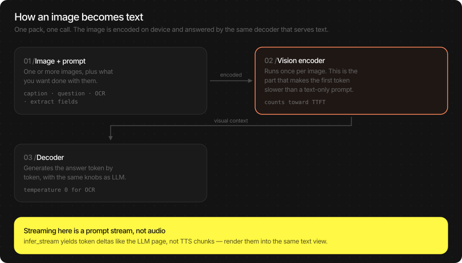
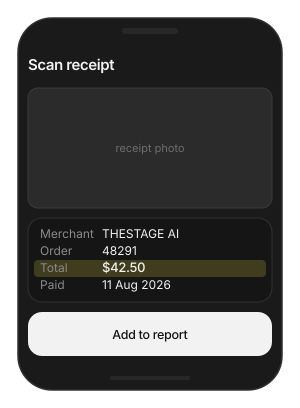
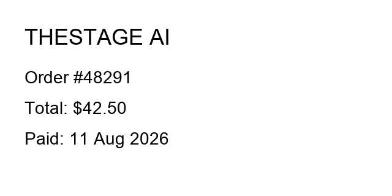
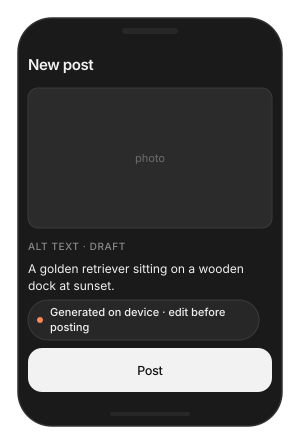
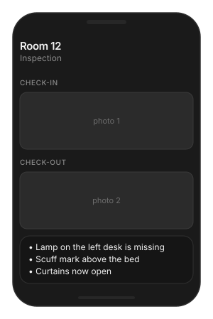
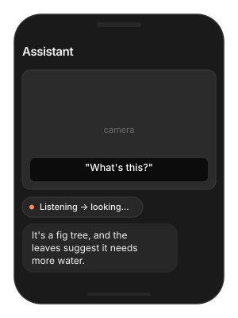

# VLM (Vision-Language Model)

On-device vision. Give the model a photo and a question, and it answers
in text — a caption, an OCR transcription, a comparison of two frames,
or fields extracted as JSON. The image never leaves the device.

Use it like the LLM: one call, one answer, or a streamed reply. The only
new input is the image.

> **Main features**
>
> - **One pack, four jobs**: captions, visual Q&A, OCR / document text,
>   and structured field extraction from a single `TSVLM`.
> - **Several images at once**: compare, spot the difference, or add up
>   receipts across frames.
> - **Streaming replies**: the same token deltas as the LLM page, so a
>   caption fills in as it is written.
> - **Deterministic OCR**: `temperature = 0` gives repeatable text.
> - **Same knobs as LLM**: `LLMGenerationConfig` carries over; nothing
>   new to learn.
> - **Nothing to preprocess**: pass a `CGImage` or a file path. No
>   resizing, no normalisation.

## In this page

Here we will cover the following topics:

- [Supported models](#supported-models): LFM2.5-VL-450M and what it does well.
- [Quick start](#quick-start): caption a photo — Swift and Flutter side by side.
- [Ask about an image](#ask-about-an-image): the call, how to pass images, and the generation knobs.
- [Result object](#result-object): `LLMResult` and the latency breakdown.
- [Usage Guides](#usage-guides): receipts to JSON, accessibility captions, before/after comparison, a slow first token, VLM inside a voice app.
- [Troubleshooting](#troubleshooting): symptom → cause → fix.
- [Load Progress / Prefetch / Cleanup](#load-progress-prefetch-cleanup): first-run download, warming the cache, releasing models.

## Supported models

| Model | HF repo | Size | Device | Fleet pin |
|---|---|---|---|---|
| LFM2.5-VL-450M | `TheStageAI/LFM2.5-VL-450M` | 450M | NPU | v1.2 |

| Feature | LFM2.5-VL-450M |
|---|---|
| Captions / visual Q&A | yes |
| OCR / document text | yes |
| Structured field extraction | yes |
| Multiple images per call | yes, 2–4 recommended |
| Streaming | yes, Swift and Flutter |

Image tokens and text share one context window. Dense pages and long
prompts compete for it — crop to the region you care about.

## Quick start

**Swift**

```swift
import TheStageSDK

try await TheStageAI.shared.initialize(api_token: "your-api-token")

let vlm = try await TSVLM(
    engines_path: "TheStageAI/LFM2.5-VL-450M"
)

let image = try ImageIOHelpers.load_cgimage(path: "/path/to/photo.jpg")

var config = vlm.generation_defaults
config.max_new_tokens = 96
// repeatable captions
config.temperature = 0

let result = try vlm.infer(
    images: [image],
    prompt: "Describe this image in one sentence.",
    config: config
)
print(result.text)
```

**Flutter**

```dart
import 'package:thestage_apple_sdk/thestage_apple_sdk.dart';

await TheStageFlutterSDK.initialize(api_token: 'your-api-token');
await TheStageFlutterSDK.start_model(
  model_name: 'vlm',
  engines_path: 'TheStageAI/LFM2.5-VL-450M',
);

final rows = await TheStageFlutterSDK.infer(
  model_name: 'vlm',
  input_json: {
    // or 'image_base64'
    'image': '/absolute/path/to/photo.jpg',
    'prompt': 'Describe this image in one sentence.',
    'max_new_tokens': 96,
    // repeatable captions
    'temperature': 0,
  },
);
print(rows[0]['text']);
```

### Important API

| Purpose | Swift | Flutter |
|---|---|---|
| Load a model | `try await TSVLM(engines_path:)` | `start_model(model_name: 'vlm', engines_path:)` |
| Load an image | `ImageIOHelpers.load_cgimage(path:)` / `(data:)` | `'image': path` or `'image_base64': …` |
| One answer | `try vlm.infer(images:prompt:config:)` → `LLMResult` | `infer(model_name: 'vlm', input_json:)` → `rows[0]` |
| Streamed answer | `try vlm.infer_stream(images:prompt:config:)` → `LLMStreamChunk` | `infer_stream(model_name: 'vlm', input_json:)` → `chunk['delta']` |
| Release | drop the object | `stop_model(model_name: 'vlm')` |

## Ask about an image



One or more images plus a prompt. The prompt decides the job: "describe"
gives a caption, "how many" gives an answer, "transcribe exactly" gives
OCR, "extract as JSON" gives fields. Streaming works the same as the LLM
— the first token just arrives after the image is encoded.

**Swift**

```swift
let vlm = try await TSVLM(engines_path: "TheStageAI/LFM2.5-VL-450M")

// From disk, from bytes, or straight from the camera
let a = try ImageIOHelpers.load_cgimage(path: "/tmp/before.jpg")
// Data from a download
let b = try ImageIOHelpers.load_cgimage(data: jpegData)
// UIImage from the camera
let c: CGImage = capturedImage.cgImage!

var config = vlm.generation_defaults
config.max_new_tokens = 192
config.temperature = 0

// Batch, two images
let result = try vlm.infer(
    images: [a, b],
    prompt: "The first image is BEFORE, the second is AFTER. List the differences.",
    config: config
)

// Streaming, one image
for await chunk in try vlm.infer_stream(
    images: [c], prompt: "Describe this photo.", config: config
) {
    if !chunk.is_final { caption.text += chunk.text }
}
```

**Flutter**

```dart
await TheStageFlutterSDK.start_model(
  model_name: 'vlm',
  engines_path: 'TheStageAI/LFM2.5-VL-450M',
);

// Batch, two images: numbered keys, contiguous from 0
final rows = await TheStageFlutterSDK.infer(
  model_name: 'vlm',
  input_json: {
    'image_0': '/tmp/before.jpg',
    // or 'image_base64_1'
    'image_1': '/tmp/after.jpg',
    'prompt': 'The first image is BEFORE, the second is AFTER. List the differences.',
    'max_new_tokens': 192,
    'temperature': 0,
  },
);

// Streaming, one image
await for (final chunk in TheStageFlutterSDK.infer_stream(
  model_name: 'vlm',
  input_json: {
    'image_base64': base64Encode(await File('/path/to/photo.jpg').readAsBytes()),
    'prompt': 'Describe this photo.',
  },
)) {
  if (chunk['is_final'] == true) break;
  caption.value += chunk['delta'] as String? ?? '';
}
```

**Passing images**

| Field | Where | Accepts |
|---|---|---|
| `images` | Swift | `[CGImage]` — any count; 2–4 is the practical limit. |
| `image` / `image_N` | Flutter | Absolute file path (JPEG, PNG, BMP). `image_0`, `image_1`, … for several. |
| `image_base64` / `image_base64_N` | Flutter | Base64-encoded image bytes, when you have no file. |
| `prompt` | both | Required. |
| `system_prompt` | both | Optional. |

Formats: anything ImageIO decodes — JPEG, PNG, HEIC. Do **not** resize or
normalise; the encoder does that. Do rotate EXIF-sideways camera frames
upright first.

**Generation options** — the LLM's `LLMGenerationConfig`, with the
defaults that matter here:

| Field | Default | Change it when |
|---|---|---|
| `temperature` | pack | **`0` for OCR and extraction** — same image, same text every time. Leave the pack default for captions if you want variety. |
| `max_new_tokens` | pack | Dense OCR or long JSON stops early (`stop_reason == "max_new_tokens"`) — raise to `512`. |
| `system_prompt` | none | Fix the output format once ("Reply with JSON only") instead of repeating it in every prompt. |

## Result object

The same `LLMResult` as the LLM page, plus a vision-encode timing.
The first token waits for the encoder, so a spinner through
`encode_seconds` is honest UI.

**Swift**

```swift
let vlm = try await TSVLM(engines_path: "TheStageAI/LFM2.5-VL-450M")
var config = vlm.generation_defaults
config.temperature = 0

let result = try vlm.infer(images: [image], prompt: prompt, config: config)
// caption / answer / OCR text
result.text
// "eos" or "max_new_tokens"
result.stop_reason
// vision encoder — most of the first-token wait
result.encode_seconds
result.tokens_per_second
```

**Flutter**

```dart
final r = rows[0];
r['text'];
r['stop_reason'];
r['encode_seconds'];
r['tokens_per_second'];
```

| Field | Meaning |
|---|---|
| `text` | The answer. |
| `stop_reason` | `eos` finished; `max_new_tokens` cut off — raise the cap. |
| `encode_seconds` | Vision encoder time. Paid once per image, before the first token. |
| `prefill_seconds` / `decode_seconds` | Decoder phases. |
| `tokens_per_second` / `total_seconds` | Speed and wall time. |

## Usage Guides

Each guide is one production question: what you are building, what to
use, the code, and what not to forget.

### Turn a photographed receipt into fields

> **Problem**
>
> **Building** — an expense app: the user photographs a receipt.
>
> **Users want** — merchant, total and date filled in from the photo —
> on the phone, because receipts are private.
>
> **Hard part** — the answer must be JSON every time, from a photo
> taken at an angle under bad light, and the vision encoder is the slow
> part.

**Solution — what to use**

- `TSVLM` — loaded once per screen.
- `vlm.infer(images:prompt:system_prompt:config:)` — the system prompt
  asks for JSON only and names the fields.
- `ImageIOHelpers.load_cgimage(path:)` — crop to the receipt first.
- `temperature = 0` — same photo, same answer; failures are
  reproducible.
- Flutter: `'image'` path key, parse `rows[0]['text']`.





**Swift**

```swift
let vlm = try await TSVLM(engines_path: "TheStageAI/LFM2.5-VL-450M")

var config = vlm.generation_defaults
config.max_new_tokens = 256
config.temperature = 0

// the photo the user just took (URL from your camera / picker)
let receiptURL: URL = picker.selectedFileURL

let result = try vlm.infer(
    images: [try ImageIOHelpers.load_cgimage(path: receiptURL.path)],
    prompt: "Extract the fields.",
    system_prompt: #"Reply with JSON only, no markdown: "#
        + #"{"merchant":string,"order_id":string,"total":string,"paid_date":string}"#,
    config: config
)
let fields = try JSONDecoder(
    ).decode(Receipt.self,
    from: Data(result.text.utf8)
)
// {"merchant":"THESTAGE AI","order_id":"48291","total":"$42.50","paid_date":"11 Aug 2026"}
```

**Flutter**

```dart
await TheStageFlutterSDK.start_model(
  model_name: 'vlm',
  engines_path: 'TheStageAI/LFM2.5-VL-450M',
);

final rows = await TheStageFlutterSDK.infer(
  model_name: 'vlm',
  input_json: {
    'image': '/absolute/path/to/receipt.jpg',
    'prompt': 'Extract the fields.',
    'system_prompt':
      'Reply with JSON only, no markdown: '
      '{"merchant":string,"order_id":string,"total":string,"paid_date":string}',
    'max_new_tokens': 256,
    'temperature': 0,
  },
);
final fields = jsonDecode(rows[0]['text'] as String);
```

> [!TIP]
> - Crop to the receipt before sending. Table edges and background eat
>   image tokens and lower accuracy.
> - If the model wraps JSON in code fences, strip them before decoding
>   and tighten the system prompt.
> - Keep `temperature = 0`; a retry at 0 returns the same text, so
>   failures are reproducible and debuggable.
> - Measured on an M-series Mac for the sample above: encode 0.34 s,
>   prefill 0.06 s, decode 0.16 s.

### Describe photos for accessibility

> **Problem**
>
> **Building** — a social app that posts photos.
>
> **Users want** — alt text for every photo, ready before they hit
> Post, in one sentence a screen reader can speak.
>
> **Hard part** — generation must finish while the user is still on the
> screen, must stay short, and must be editable — it is a draft, not a
> fact.

**Solution — what to use**

- `vlm.infer_stream(images:prompt:config:)` — the field fills in as
  words arrive.
- Prompt: "one plain sentence"; `max_new_tokens = 48` — otherwise the
  model narrates.
- Show the result in an editable field.
- Flutter: `'image_base64'` when the bytes are already in memory.



**Swift**

```swift
let vlm = try await TSVLM(engines_path: "TheStageAI/LFM2.5-VL-450M")

var config = vlm.generation_defaults
config.max_new_tokens = 48

// the photo the user attached to the post
let photoURL: URL = picker.selectedFileURL

altText.text = ""
for await chunk in try vlm.infer_stream(
    images: [try ImageIOHelpers.load_cgimage(path: photoURL.path)],
    prompt: "Describe this image in one plain sentence for a screen reader.",
    config: config
) {
    if !chunk.is_final { altText.text += chunk.text }
}
```

**Flutter**

```dart
await TheStageFlutterSDK.start_model(
  model_name: 'vlm',
  engines_path: 'TheStageAI/LFM2.5-VL-450M',
);

// the photo the user attached to the post
final photoPath = picked.path;

altText.value = '';
await for (final chunk in TheStageFlutterSDK.infer_stream(
  model_name: 'vlm',
  input_json: {
    'image_base64': base64Encode(await File(photoPath).readAsBytes()),
    'prompt': 'Describe this image in one plain sentence for a screen reader.',
    'max_new_tokens': 48,
  },
)) {
  if (chunk['is_final'] == true) break;
  altText.value += chunk['delta'] as String? ?? '';
}
```

> [!TIP]
> - Say "one sentence" and cap `max_new_tokens` low; the model will
>   otherwise narrate.
> - Let the user edit the result. Ship it as a draft, not a fact.

### Compare two frames

> **Problem**
>
> **Building** — a property-inspection app that photographs a room at
> check-in and check-out.
>
> **Users want** — a short list of what changed, with "none" when
> nothing did.
>
> **Hard part** — the model must know which image is which, and too
> many images starve the reply of context.

**Solution — what to use**

- `vlm.infer(images: [checkIn, checkOut], …)` — both images in one
  call, in the order you name them in the prompt.
- Prompt: "The first image is CHECK-IN, the second is CHECK-OUT …".
- Two to four images per call.
- Flutter: numbered keys `image_0`, `image_1` — contiguous, from
  zero.



**Swift**

```swift
let vlm = try await TSVLM(engines_path: "TheStageAI/LFM2.5-VL-450M")
var config = vlm.generation_defaults
config.temperature = 0

// the two photos from the inspection record
let checkInURL: URL = inspection.checkInPhoto
let checkOutURL: URL = inspection.checkOutPhoto

let result = try vlm.infer(
    images: [try ImageIOHelpers.load_cgimage(path: checkInURL.path),
             try ImageIOHelpers.load_cgimage(path: checkOutURL.path)],
    prompt: "The first image is CHECK-IN, the second is CHECK-OUT. "
          + "List visible differences as short bullets. Say 'none' if identical.",
    config: config
)
```

**Flutter**

```dart
await TheStageFlutterSDK.start_model(
  model_name: 'vlm',
  engines_path: 'TheStageAI/LFM2.5-VL-450M',
);

final rows = await TheStageFlutterSDK.infer(
  model_name: 'vlm',
  input_json: {
    'image_0': '/absolute/path/to/check_in.jpg',
    'image_1': '/absolute/path/to/check_out.jpg',
    'prompt': 'The first image is CHECK-IN, the second is CHECK-OUT. '
              'List visible differences as short bullets. Say "none" if identical.',
    'max_new_tokens': 192,
    'temperature': 0,
  },
);
```

> [!TIP]
> - Name the images in the prompt. "First" and "second" follow the
>   order you pass.
> - Two to four images per call; more than that starves the reply of
>   context and the answer truncates.
> - Numbered Flutter keys must start at `image_0` and be contiguous.

### The first token is slow

> **Problem**
>
> **Building** — any screen that attaches a photo to a prompt.
>
> **Users want** — the same snappy reply they get from text-only
> prompts.
>
> **Hard part** — the vision encoder is paid once per image before any
> text, and it is slowest the very first time after load.

**Solution — what to use**

- Warm once at launch: one `infer` on a tiny bundled image, detached.
- `infer_stream` and a spinner until the first delta — the encode time
  becomes visible progress.
- `result.encode_seconds` — see exactly what you pay.
- Load the VLM for the task and release it; do not keep it resident next
  to ASR + LLM + TTS on a phone.

**Swift**

```swift
let vlm = try await TSVLM(engines_path: "TheStageAI/LFM2.5-VL-450M")
var config = vlm.generation_defaults
config.temperature = 0

// Warm once at launch, off the main path
Task.detached {
    let warmPath = Bundle.main.path(forResource: "warmup", ofType: "png")!
    let warm = try ImageIOHelpers.load_cgimage(path: warmPath)
    _ = try? vlm.infer(images: [warm], prompt: "hi", config: config)
}

// Show progress through encode; the first delta ends it
spinner.start()
// the photo the user picked, and their question
let photoURL: URL = picker.selectedFileURL
let prompt = "What is in this photo?"
let photo = try ImageIOHelpers.load_cgimage(path: photoURL.path)
for await chunk in try vlm.infer_stream(
    images: [photo], prompt: prompt, config: config
) {
    spinner.stop()
    if !chunk.is_final { caption.text += chunk.text }
}
```

**Flutter**

```dart
await TheStageFlutterSDK.start_model(
  model_name: 'vlm',
  engines_path: 'TheStageAI/LFM2.5-VL-450M',
);

// Warm once at launch
unawaited(TheStageFlutterSDK.infer(
  model_name: 'vlm',
  // any small bundled image
  input_json: {'image': warmupPngPath, 'prompt': 'hi'},
  ));

// the photo the user picked, and their question
final photoPath = picked.path;
const prompt = 'What is in this photo?';

// Spinner until the first delta
spinner.value = true;
await for (final chunk in TheStageFlutterSDK.infer_stream(
  model_name: 'vlm', input_json: {'image': photoPath, 'prompt': prompt})) {
  spinner.value = false;
  if (chunk['is_final'] == true) break;
  caption.value += chunk['delta'] as String? ?? '';
}
```

> [!TIP]
> - Read `encode_seconds` on the result to see exactly what you are
>   paying.
> - Do not keep VLM resident next to ASR + LLM + TTS on a phone; load it
>   for the task and release it — see the next guide.

### Add vision to a voice assistant

> **Problem**
>
> **Building** — a voice assistant with a camera button.
>
> **Users want** — point the camera, ask "what's this?", hear the
> answer — while the assistant keeps talking normally.
>
> **Hard part** — a 450M vision model loading while TTS streams causes
> audible stutter, and a phone cannot hold four models resident.

**Solution — what to use**

- `agent.state` — only run vision in `.listening` / `.idle`.
- `TSVLM` created for the question, ``vlm.infer(images: [frame],
  prompt:)``, then dropped — the pack is released.
- `agent.say(answer)` — the reply goes through the agent's speaker.
- Camera frame as `CGImage` from your `AVCaptureSession`.
- Flutter: `start_model` → `infer` → `stop_model` around the
  question.



**Swift**

```swift
var config = vlm.generation_defaults
config.temperature = 0

// your running agent — see the Voice Agent page
let agent: TSVoiceAgent = assistant.agent

// Only while the agent is not mid-reply
guard agent.state == .listening || agent.state == .idle else { return }

let vlm = try await TSVLM(engines_path: "TheStageAI/LFM2.5-VL-450M")
// from your AVCaptureSession
let frame: CGImage = camera.latestFrame
// the user's transcribed request, from agent.transcripts
let question = "What's this?"
let answer = try vlm.infer(images: [frame], prompt: question, config: config).text
agent.say(answer)
// drop `vlm` here — it releases the pack
```

**Flutter**

```dart
// agent as in Quick start; agentConfig is its model map
final agent = TSVoiceAgent();

// The custom-node pattern (VLMCaptionNode + ModelRoster) is in
// examples/voice_agent_custom_nodes in the AppleSDK repo.
// your running agent — see the Voice Agent page
final TSVoiceAgent agent = assistant.agent;
if (agent.state == TSAgentState.listening) {
  await TheStageFlutterSDK.start_model(
    model_name: 'vlm', engines_path: 'TheStageAI/LFM2.5-VL-450M');
  final rows = await TheStageFlutterSDK.infer(
    model_name: 'vlm',
    input_json: {
      // JPEG you saved from the camera
      'image': cameraFramePath,
      'prompt': question,
    });
  await agent.say(rows[0]['text'] as String);
  await TheStageFlutterSDK.stop_model(model_name: 'vlm');
}
```

> [!TIP]
> - Gate on agent state. Loading a 450M model while TTS is streaming
>   causes audible stutter.
> - Full wiring, including a node that receives camera frames:
>   [Voice Agent](./voice_agent.md).

## Troubleshooting

| Symptom | Cause | Fix |
|---|---|---|
| Empty caption | No image reached the model — bad path, empty base64, nil `CGImage`. | Log that the image loaded; on Flutter use an absolute container path or base64. |
| OCR misses small text | Whole page sent at once. | Crop to the text region; keep `temperature = 0`. |
| Answer cut off | `stop_reason == "max_new_tokens"`. | Raise the cap, or crop / shorten the prompt — vision tokens share the window. |
| Sideways or mirrored reading | Camera frame not EXIF-upright. | Rotate before encoding. |
| Slow first token | Vision encode, cold. | Warm at launch; stream; show a spinner until the first delta. |
| Flutter: `image_1` ignored | Keys not contiguous from `image_0`. | Number from 0. |
| Out of memory next to the agent | VLM resident with ASR + LLM + TTS. | Load for the task, release after. |

## Load Progress / Prefetch / Cleanup

First run downloads and prepares the pack; later runs hit the cache.
Show progress the first time, warm the cache on a splash screen, and
release models you are done with.

**Swift**

```swift
let ai = TheStageAI.shared

// Progress
let vlm = try await TSVLM(
    engines_path: "TheStageAI/LFM2.5-VL-450M",
    on_load_progress: { p in
        print("[\(p.model)] \(p.phase) \(Int(p.fraction * 100))%")
    }
)

// Prefetch on a splash screen, construct later
let engines_dir = try await ai.prefetch_engines(
    repo_id: "TheStageAI/LFM2.5-VL-450M"
)
let vlm = try await TSVLM(engines_path: engines_dir)

// Cleanup: drop the reference, or
_ = try ai.stop_model(model_name: "vlm")
```

**Flutter**

```dart
// Progress
TheStageFlutterSDK.on_progress.listen((event) {
  if (event['model_name'] != 'vlm') return;
  print('[vlm] ${event['phase']} ${((event['progress'] ?? 0) * 100).round()}%');
});

await TheStageFlutterSDK.start_model(
  model_name: 'vlm',
  engines_path: 'TheStageAI/LFM2.5-VL-450M',
);

// Cleanup
await TheStageFlutterSDK.stop_model(model_name: 'vlm');
```

Phases: `downloading` → `extracting` → `loading` → `ready`. Cache
hits skip the first two. Full contract: [Get started](./README.md)
(**Load Progress**).
