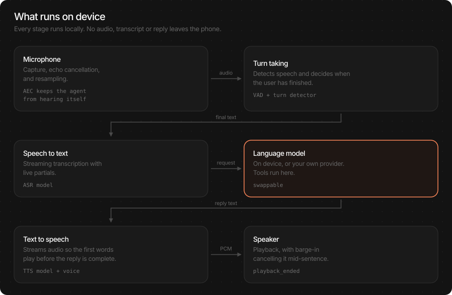
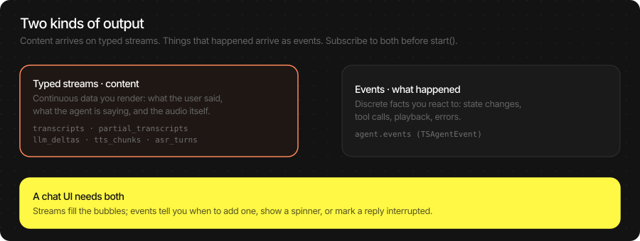
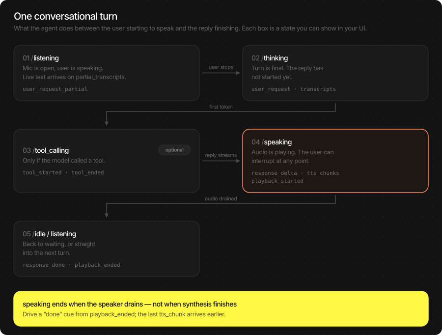
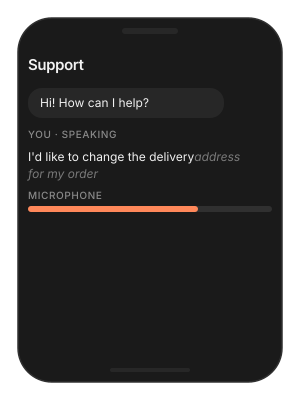
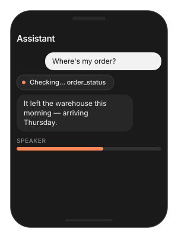
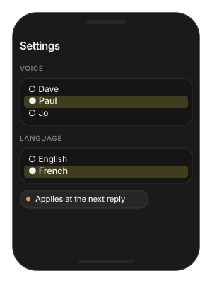
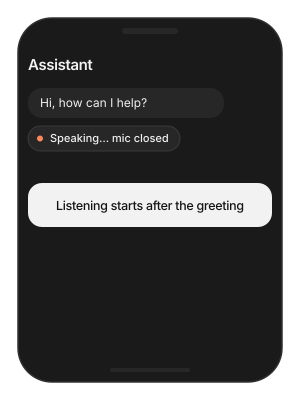

# Voice Agent

A full voice conversation on device, driven by one object. The agent
listens through the microphone, decides when the user has finished,
gets a reply from a language model, speaks it, and lets the user
interrupt at any point. Every stage runs locally — no audio, transcript
or reply leaves the phone.

You choose the language model: an on-device pack for a fully offline
assistant, or your own OpenAI-compatible endpoint. Everything else stays
the same.

> **Main features**
>
> - **Full duplex**: the user can interrupt mid-reply and the agent stops
>   speaking.
> - **Fully on device**: microphone, transcription, reply and speech all
>   run locally.
> - **Bring your own LLM**: on-device by default, or route replies to your
>   provider without changing the rest.
> - **Typed streams**: live captions, final transcripts, reply text and
>   speech level each on their own channel — a chat UI never parses a
>   blob.
> - **Tool calling**: the same `[Tool]` closures as the LLM page, run
>   between turns and surfaced as events.
> - **Streaming speech**: the first words play before the reply is
>   complete.
> - **Echo cancellation**: the agent does not hear itself, so barge-in
>   works on a speaker as well as headphones.



## In this page

Here we will cover the following topics:

- [Supported models](#supported-models): which packs the agent accepts for each stage, and the LLM choice.
- [Quick start](#quick-start): an offline assistant, or one on your own LLM — Swift and Flutter side by side.
- [Follow the conversation](#follow-the-conversation): states, streams and events, and which to use for what.
- [Configure the agent](#configure-the-agent): the knobs people change, with defaults, and which apply live.
- [Usage Guides](#usage-guides): offline assistant, chat UI with captions, barge-in, turn-taking, tools, voices, custom nodes.
- [Troubleshooting](#troubleshooting): symptom → cause → fix.
- [Load Progress / Prefetch](#load-progress-prefetch): first-run download of four packs, and warming them on a splash screen.

## Supported models

The agent is four stages; each accepts the packs from its own page.

| Stage | Packs | Notes |
|---|---|---|
| Voice detection | `TheStageAI/silero-vad` | Always on device. |
| Speech to text | `TheStageAI/thewhisper-large-v3-turbo`, `TheStageAI/Qwen3-ASR-0.6B` | TheWhisper for live captions; see [ASR](./asr.md). |
| Language model | `TheStageAI/Qwen3-0.6B`, `TheStageAI/LFM2.5-230M` / `350M`, `TheStageAI/gemma-3-1b-it` — or any OpenAI-compatible endpoint | Local packs run tools; Gemma3 does not. See [LLM](./llm.md). |
| Text to speech | `TheStageAI/neutts-nano-multilingual`, `TheStageAI/Qwen3-TTS-12Hz-0.6B-Base` | Voices and languages per [TTS](./tts.md). |
| Turn detection (optional) | `TheStageAI/smart-turn-v3` | Neural end-of-turn; tolerates mid-sentence pauses. |
| Speaker ID (optional) | `TheStageAI/redimnet2` | Respond only to an enrolled voice; see [Speaker embedding](./speaker_embedding.md). |

**Which LLM?**

| You need… | Pick | Why |
|---|---|---|
| Works with no network; private by design | **On-device** (`TSLocalLLMProvider`) | Qwen3-0.6B or LFM2.5-350M; tools included. |
| Best answer quality, network is fine | **Your endpoint** (`TSOpenAICompatibleProvider`) | Any OpenAI-compatible chat API. Tools are the provider's. |
| Lowest latency to first word | **On-device**, LFM2.5-230M | No round trip; first token in tens of milliseconds. |

## Quick start

Two ways to run the agent. They differ only in where the reply comes
from.

| You want | Network | LLM |
|---|---|---|
| A fully offline assistant | none after first download | `TSLocalLLMProvider` / `'llm_provider': 'local'` |
| Your own model behind an API | required | `TSOpenAICompatibleProvider` / `'llm_provider': 'openai_compatible'` |

### Fully offline

**Swift**

```swift
import TheStageSDK

try await TheStageAI.shared.initialize(api_token: "your-api-token")

// 1. Load the language model under a handle
try await TheStageAI.shared.start_model(
    model_name: "llm",
    engines_path: "TheStageAI/Qwen3-0.6B"
)

// 2. Point the agent at that handle
let llm = TSLocalLLMProvider(
    model_path: "llm",
    // weather, time, search — or []
    tools: DefaultTools.live,
    system_prompt: DefaultTools.voice_system_prompt
)
var config = TSAgentConfig(
    vad: "TheStageAI/silero-vad",
    stt: "TheStageAI/thewhisper-large-v3-turbo",
    tts: "TheStageAI/neutts-nano-multilingual",
    llm: llm
)
config.tts_voice = "dave"

// 3. Subscribe, then start
let agent = TSVoiceAgent(config: config)
Task {
    for await text in agent.transcripts.recv() { chat.addUser(text) }
}
Task {
    for await delta in agent.llm_deltas.recv() { chat.appendAssistant(delta) }
}

// listening from here
try await agent.start()
```

**Flutter**

```dart
import 'package:thestage_apple_sdk/thestage_apple_sdk.dart';

await TheStageFlutterSDK.initialize(api_token: 'your-api-token');

// 1. Load the language model under a handle
await TheStageFlutterSDK.start_model(
  model_name: 'llm',
  engines_path: 'TheStageAI/Qwen3-0.6B',
);

// 2 + 3. Subscribe, then start with the same handle
final agent = TSVoiceAgent();
agent.transcripts.listen(chat.addUser);
agent.llm_deltas.listen(chat.appendAssistant);

await agent.start(config: {
  'vad': 'TheStageAI/silero-vad',
  'stt': 'TheStageAI/thewhisper-large-v3-turbo',
  'tts': 'TheStageAI/neutts-nano-multilingual',
  'tts_voice': 'dave',
  'llm_provider': 'local',
  // the start_model handle
  'llm_model': 'llm',
  // none | voice | web | phone
  'llm_tools': 'voice',
// listening from here
});
```

### Your own LLM endpoint

**Swift**

```swift
let llm = TSOpenAICompatibleProvider(
    endpoint: "https://api.openai.com/v1/chat/completions",
    api_key: "sk-YOUR-KEY",
    model: "gpt-4o-mini"
)
var config = TSAgentConfig(
    vad: "TheStageAI/silero-vad",
    stt: "TheStageAI/thewhisper-large-v3-turbo",
    tts: "TheStageAI/neutts-nano-multilingual",
    llm: llm
)
config.system_prompt = "You are a concise voice assistant."

let agent = TSVoiceAgent(config: config)
try await agent.start()
```

**Flutter**

```dart
final agent = TSVoiceAgent();
await agent.start(config: {
  'vad': 'TheStageAI/silero-vad',
  'stt': 'TheStageAI/thewhisper-large-v3-turbo',
  'tts': 'TheStageAI/neutts-nano-multilingual',
  'llm_provider': 'openai_compatible',
  'llm_endpoint': 'https://api.openai.com/v1/chat/completions',
  'llm_api_key': 'sk-YOUR-KEY',
  'llm_model': 'gpt-4o-mini',
  'system_prompt': 'You are a concise voice assistant.',
});
```

> [!TIP]
> **Subscribe before** `start()`. Streams attached afterwards miss the
> first turn. And **one running agent per microphone** — call `stop()`
> before starting another.

### Important API

| Purpose | Swift | Flutter |
|---|---|---|
| Build | `TSAgentConfig(vad:stt:tts:llm:)` → `TSVoiceAgent(config:)` | `TSVoiceAgent()` + a config map on `start` |
| Run | `start()` / `stop()` | `start(config:)` / `stop()` |
| Mic on / off | `begin_listening()` / `pause_listening()` | `begin_listening()` |
| Text in, voice out | `send_request(_:)` (LLM → TTS), `say(_:)` (TTS only) | `send_request(text)`, `say(text)` |
| Cut playback | `interrupt()` | `interrupt()` |
| Voice | `set_voice(voice_id:voice_dir:language:)` | `set_voice(voice_id:, voice_dir:, language:)` |
| Memory | `history()` / `clear_history()` / `set_system_prompt(_:)` | `clear_history()` / `set_system_prompt(prompt)` |
| Live re-tune | `update_interrupt_config(…)` / `update_turn_config(…)` | `update_interrupt_config(…)` |

## Follow the conversation



The agent gives you **two kinds of output**. Streams carry content you
render — what the user said, what the assistant is saying. Events tell
you what happened — a state change, a tool call, playback ending, an
error. A chat UI needs both.

**Swift**

```swift
// "llm" is the handle you gave start_model in Quick start
let llm = TSLocalLLMProvider(
    model_path: "llm",
    tools: DefaultTools.live,
    system_prompt: DefaultTools.voice_system_prompt
)
var config = TSAgentConfig(
    vad: "TheStageAI/silero-vad",
    stt: "TheStageAI/thewhisper-large-v3-turbo",
    tts: "TheStageAI/neutts-nano-multilingual",
    llm: llm
)
let agent = TSVoiceAgent(config: config)

// Content
Task { for await p in agent.partial_transcripts.recv() { caption.text = p } }
Task { for await t in agent.transcripts.recv()         { chat.addUser(t) } }
Task {
    for await d in agent.llm_deltas.recv() { chat.appendAssistant(d) }
}
Task {
    for await level in agent.tts_levels.recv() { avatar.mouth = level }
}

// What happened
Task {
    for await event in agent.events {
        switch event.kind {
        case .state_changed:
            statusLabel.text = event.data["state"] as? String
        case .response_done:
            if event.data["interrupted"] as? Bool == true {
                chat.markInterrupted()
            }
        case .tool_started:
            chip.show(event.data["name"] as? String ?? "")
        case .error:
            banner.show(event.data["message"] as? String ?? "")
        default: break
        }
    }
}
```

**Flutter**

```dart
// agent as in Quick start; agentConfig is its model map
final agent = TSVoiceAgent();

// Content
agent.transcripts.listen(chat.addUser);
agent.llm_deltas.listen(chat.appendAssistant);
agent.tts_levels.listen((level) => avatar.mouth = level);

// What happened (live captions arrive here on Flutter)
agent.events.listen((e) {
  final data = (e['data'] as Map?)?.cast<String, dynamic>() ?? {};
  switch (e['kind']) {
    case 'user_request_partial': caption.value = data['text'] as String? ?? '';
    case 'state_changed':        status.value  = data['state'] as String? ?? '';
    case 'response_done':
      if (data['interrupted'] == true) chat.markInterrupted();
    case 'tool_started':         chip.show(data['name'] as String? ?? '');
    case 'error':                banner.show(data['message'] as String? ?? '');
  }
});
```

### Agent states



The agent is always in exactly one state; `state_changed` fires on
every move.

| State | Means | Typical UI |
|---|---|---|
| `idle` | Not listening | "Tap to talk" |
| `loading` | Packs are loading | Progress |
| `listening` | Mic open, capturing speech | Mic active, live caption |
| `thinking` | Turn committed, reply not started | Spinner |
| `tool_calling` | Running a tool | "Looking that up…" |
| `speaking` | Playing the reply | Waveform, tap to interrupt |
| `sleeping` | Waiting for a wake word | Dimmed mic |

> [!NOTE]
> `speaking` ends when the speaker has **drained**, not when synthesis
> finishes. A "done" cue driven by `playback_ended` is accurate; one
> driven by the last text delta fires early.

### Streams

| Carries | Swift | Flutter |
|---|---|---|
| Live user text while speaking | `partial_transcripts` | `events` → `user_request_partial` |
| Final user text | `transcripts` | `transcripts` |
| Assistant text, token by token | `llm_deltas` | `llm_deltas` |
| Speech level, for an avatar | `tts_levels` | `tts_levels` |
| Mic level, for a meter | `vad_probabilities` | `vad_probabilities` |
| Synthesised audio (PCM) | `tts_playback` | — |

### Events

All arrive on `events` with `kind` and a `data` payload.

| Kind | Payload | Fires when |
|---|---|---|
| `state_changed` | `state` | Any move between the states above. |
| `user_request_partial` | `text` | Live transcript while the user speaks. |
| `user_request` | `text`, `source` | The user's turn is final. |
| `response_delta` | `delta` | Each chunk of the reply (same as `llm_deltas`). |
| `response_done` | `text`, `reason`, `interrupted` | Reply finished — **check** `interrupted`. |
| `tool_started` / `tool_ended` | `name`, `arguments` / `name`, `content` | A tool call begins / returns. |
| `playback_started` / `playback_ended` | — / `reason` | First audio reaches the speaker / speaker drained or cut by barge-in. |
| `wake_word` | — | The wake word was heard (wake-word mode). |
| `error` | `message`, `code`, `recoverable` | A recoverable or terminal failure. |

> [!CAUTION]
> `response_done` and `playback_ended` fire on a clean finish **and**
> on a barge-in. `interrupted` / `reason` tell them apart. Logging a
> turn as complete without checking is the most common source of wrong
> analytics.

## Configure the agent

Everything lives on `TSAgentConfig` (Swift) or the `start` map
(Flutter). The defaults ship a working assistant; these are the fields
people change, grouped by what they affect. Unless marked **live**, a
change needs `stop()` then `start()`.

**Swift**

```swift
var config = TSAgentConfig(
    vad: vadRepo,
    stt: sttRepo,
    tts: ttsRepo,
    llm: llm
)

// Reply
config.system_prompt = "You are Acme's assistant. Be brief."
config.max_tokens = 256
config.chat_memory = AgentMessageSlidingWindowMemory(max_turns: 10)

// Voice
// or tts_voice_dir / tts_language
config.tts_voice = "dave"

// Turn taking
// hush that ends a turn (VAD mode)
config.silence_timeout_ms = 608
// neural end-of-turn instead
config.turn_end_mode = .dnn
config.turn_detector = "TheStageAI/smart-turn-v3"

// Barge-in
// iOS default; .none on Mac speakers
config.interrupt_mode = .vad
config.interrupt_min_speech_ms = 600

// Audio
config.audio.sample_rate_out = 48_000
config.audio.aec_method = .VPIO

// Start muted, open the mic later
config.auto_listen = false
```

**Flutter**

```dart
// agent as in Quick start; agentConfig is its model map
final agent = TSVoiceAgent();

await agent.start(config: {
  'vad': vadRepo, 'stt': sttRepo, 'tts': ttsRepo,
  'llm_provider': 'local', 'llm_model': 'llm',

  // Reply
  'system_prompt': "You are Acme's assistant. Be brief.",
  'max_tokens': 256,
  'chat_memory_max_turns': 10,

  // Voice
  // or tts_voice_dir / tts_language
  'tts_voice': 'dave',

  // Turn taking
  'silence_timeout_ms': 608,
  'turn_end_mode': 'dnn',
  'turn_detector': 'TheStageAI/smart-turn-v3',

  // Barge-in
  'interrupt_mode': 'vad',
  'interrupt_min_speech_ms': 600,

  // Audio
  'sample_rate_out': 48000,
  'aec_method': 'vpio',

  'auto_listen': false,
});
```

| Field | Default | Live? | Change it when |
|---|---|---|---|
| `system_prompt` | voice default | **yes** (`set_system_prompt`) | Persona, brand, scope. Keep it short — paid on every turn. |
| `max_tokens` | 256 | no | Replies get cut off — raise. Spoken replies rarely need more. |
| `chat_memory` / `chat_memory_max_turns` | sliding window | no | Long sessions on small packs run out of context — lower. |
| `tts_voice` / `tts_voice_dir` / `tts_language` | pack default | **yes** (`set_voice`) | See [TTS](./tts.md) for voices and packs. |
| `silence_timeout_ms` | 608 | no | Cuts users off mid-thought — raise to 1 000–1 500. Feels slow — lower. |
| `turn_end_mode` / `turn_detector` | `.vad` | no | Users pause mid-sentence — `.dnn` with `smart-turn-v3`. |
| `turn_eot_threshold` | 0.85 | **yes** (`update_turn_config`) | DNN mode: lower to commit sooner, raise to wait longer. |
| `interrupt_mode` | iOS `.vad` · macOS `.none` | **yes** (`update_interrupt_config`) | `.none` to disable barge-in; `.vad_speaker_id` to accept only the enrolled voice; `.vad_wake_word` to require the wake word. |
| `interrupt_min_speech_ms` | 600 | **yes** | Snappier barge-in — lower (more false triggers); twitchy — raise. |
| `vad_threshold` | 0.7 | no | Starts on background noise — raise; misses quiet users — lower. |
| `auto_listen` | true | no | Start muted and open the mic with `begin_listening()` after a welcome message. |
| `audio.*` | see [Audio Nodes](./audio_nodes.md) | no | Speaker rate, echo cancellation, custom audio source. |

## Usage Guides

Each guide is one production question: what you are building, what to
use, the code, and what not to forget.

### A chat screen with live captions

> **Problem**
>
> **Building** — a support app that shows the conversation as bubbles.
>
> **Users want** — to see their words while they speak, watch them
> settle when they finish, and see the reply stream in — with a mic
> meter and a speaking avatar.
>
> **Hard part** — five things update at once and each comes from a
> different stream; subscribing late loses the first events.

**Solution — what to use**

- `agent.partial_transcripts` — the growing caption;
  `agent.transcripts` — the settled user bubble.
- `agent.llm_deltas` — the assistant bubble, appended.
- `agent.vad_probabilities` — mic meter; `agent.tts_levels` —
  avatar.
- `agent.events` `.response_done` — mark `interrupted`.
- Subscribe to all of them **before** `agent.start()`.



**Swift**

```swift
// "llm" is the handle you gave start_model in Quick start
let llm = TSLocalLLMProvider(
    model_path: "llm",
    tools: DefaultTools.live,
    system_prompt: DefaultTools.voice_system_prompt
)
var config = TSAgentConfig(
    vad: "TheStageAI/silero-vad",
    stt: "TheStageAI/thewhisper-large-v3-turbo",
    tts: "TheStageAI/neutts-nano-multilingual",
    llm: llm
)

let agent = TSVoiceAgent(config: config)

// grows while the user speaks
Task {
    for await p in agent.partial_transcripts.recv() { caption.text = p }
}
Task {
    for await t in agent.transcripts.recv() {
        chat.append(.user(t)); caption.text = ""
    }
}
Task {
    for await d in agent.llm_deltas.recv() { chat.appendToLastAssistant(d) }
}
Task {
    for await p in agent.vad_probabilities.recv() { micMeter.level = p }
}
Task {
    for await l in agent.tts_levels.recv() { avatar.mouth = l }
}
Task {
    for await e in agent.events where e.kind == .response_done {
        chat.finishAssistant(interrupted: e.data["interrupted"] as? Bool ?? false)
    }
}

try await agent.start()
```

**Flutter**

```dart
final agent = TSVoiceAgent();

agent.transcripts.listen((t) { chat.append(User(t)); caption.value = ''; });
agent.llm_deltas.listen(chat.appendToLastAssistant);
agent.vad_probabilities.listen((p) => micMeter.value = p);
agent.tts_levels.listen((l) => avatar.mouth = l);
agent.events.listen((e) {
  final data = (e['data'] as Map?)?.cast<String, dynamic>() ?? {};
  if (e['kind'] == 'user_request_partial') {
    caption.value = data['text'] as String? ?? '';
  }
  if (e['kind'] == 'response_done') {
    chat.finishAssistant(interrupted: data['interrupted'] == true);
  }
});

await agent.start(config: agentConfig);
```

> [!TIP]
> - Start a new assistant bubble on `user_request`, not on the first
>   delta — otherwise a tool call that produces no text leaves an empty
>   bubble.
> - Mark the bubble on `response_done` with `interrupted == true` so
>   the user sees the reply was cut.
> - `asr_streaming` is on by default; captions need it.

### The agent interrupts itself

> **Problem**
>
> **Building** — an assistant on a Mac with built-in speakers, or an
> iPhone in speaker mode.
>
> **Users want** — the assistant to finish its sentence instead of
> hearing itself and stopping.
>
> **Hard part** — echo cancellation is per audio route: solid on iOS
> with VPIO, unreliable on Mac speakers.

**Solution — what to use**

- iOS: `config.audio.aec_method = .VPIO` + `interrupt_mode = .vad` +
  `interrupt_min_speech_ms = 800`.
- macOS speakers: `interrupt_mode = .none` and `aec_method = .NONE`
  — or ask for headphones.
- `agent.update_interrupt_config(mode:min_speech_ms:)` — live, when a
  headphone is plugged in.
- `aec_warmup_ms` — if only the first reply self-interrupts.

**Swift**

```swift
// "llm" is the handle you gave start_model in Quick start
let llm = TSLocalLLMProvider(
    model_path: "llm",
    tools: DefaultTools.live,
    system_prompt: DefaultTools.voice_system_prompt
)
var config = TSAgentConfig(
    vad: "TheStageAI/silero-vad",
    stt: "TheStageAI/thewhisper-large-v3-turbo",
    tts: "TheStageAI/neutts-nano-multilingual",
    llm: llm
)
let agent = TSVoiceAgent(config: config)

#if os(macOS)
// no barge-in on Mac speakers
config.interrupt_mode = .none
config.audio.aec_method = .NONE
#else
config.interrupt_mode = .vad
config.audio.aec_method = .VPIO
// ignore short blips
config.interrupt_min_speech_ms = 800
#endif

// Live, after a headphone plug-in event:
await agent.update_interrupt_config(mode: .speech_only, min_speech_ms: 600)
```

**Flutter**

```dart
// agent as in Quick start; agentConfig is its model map
final agent = TSVoiceAgent();

await agent.start(config: {
  ...agentConfig,
  'interrupt_mode': Platform.isMacOS ? 'none' : 'vad',
  'aec_method':     Platform.isMacOS ? 'none' : 'vpio',
  'interrupt_min_speech_ms': 800,
});
```

> [!TIP]
> - Self-interruption only on the *first* reply: raise
>   `aec_warmup_ms` so AEC has a reference before the first sentence.
> - `mute_mic_during_playback` is the fallback for routes with no AEC;
>   it disables barge-in while speaking.
> - Full route table: [Audio Nodes](./audio_nodes.md).

### It cuts users off — or waits too long

> **Problem**
>
> **Building** — a dictation-heavy assistant.
>
> **Users want** — to pause and think mid-sentence without being
> answered; and to get a reply promptly after a clear question.
>
> **Hard part** — turn ending is a policy, not a constant: a silence
> timer and a model that understands pauses make opposite trade-offs.

**Solution — what to use**

- `turn_end_mode = .dnn` + ``turn_detector =
  "TheStageAI/smart-turn-v3"` + `turn_eot_threshold`` — for thinkers.
- `turn_end_mode = .vad` + `silence_timeout_ms = 450` — for quick
  commands.
- `agent.update_turn_config(eot_threshold:)` — live re-tune.
- `turn_max_silence_ms` — the hard stop in DNN mode.

**Swift**

```swift
// "llm" is the handle you gave start_model in Quick start
let llm = TSLocalLLMProvider(
    model_path: "llm",
    tools: DefaultTools.live,
    system_prompt: DefaultTools.voice_system_prompt
)
var config = TSAgentConfig(
    vad: "TheStageAI/silero-vad",
    stt: "TheStageAI/thewhisper-large-v3-turbo",
    tts: "TheStageAI/neutts-nano-multilingual",
    llm: llm
)
let agent = TSVoiceAgent(config: config)

// Thinkers: neural end-of-turn
config.turn_end_mode = .dnn
config.turn_detector = "TheStageAI/smart-turn-v3"
// lower → commits sooner
config.turn_eot_threshold = 0.85

// Quick commands: plain silence timer, shorter
config.turn_end_mode = .vad
// default 608
config.silence_timeout_ms = 450

// Live re-tune in DNN mode
await agent.update_turn_config(eot_threshold: 0.7)
```

**Flutter**

```dart
// Thinkers
{'turn_end_mode': 'dnn', 'turn_detector': 'TheStageAI/smart-turn-v3',
 'turn_eot_threshold': 0.85}

// Quick commands
{'turn_end_mode': 'vad', 'silence_timeout_ms': 450}
```

> [!TIP]
> - `.dnn` loads one extra small pack; budget it in the first-run
>   download.
> - `turn_max_silence_ms` (2 000) is the hard stop in DNN mode: the
>   agent commits after that much hush no matter what the model thinks.
> - "Starts turns on noise" is `vad_threshold`, not turn policy.

### Let the assistant do things

> **Problem**
>
> **Building** — a retail voice assistant.
>
> **Users want** — "call the store", "what's the weather", "where's my
> order" — done, with a short spoken filler while it works.
>
> **Hard part** — the model must act between turns, speak only text,
> and tell the UI what it is doing.

**Solution — what to use**

- `Tool(name:description:parameters:execute:)` — your functions;
  `description` says when to call.
- `DefaultTools.phone` — dial / maps / SMS via system UI.
- `TSLocalLLMProvider(model_path:tools:system_prompt:)` with
  `DefaultTools.voice_system_prompt`.
- `agent.events` `.tool_started` / `.tool_ended` — show a chip.
- Flutter: `'llm_tools': 'voice' | 'web' | 'phone'` from the built-in
  catalog.



**Swift**

```swift
var config = TSAgentConfig(
    vad: "TheStageAI/silero-vad",
    stt: "TheStageAI/thewhisper-large-v3-turbo",
    tts: "TheStageAI/neutts-nano-multilingual",
    llm: llm
)
let agent = TSVoiceAgent(config: config)

let orderStatus = Tool(
    name: "order_status",
    description: "Delivery status for an order number. "
               + "Use when the user asks where an order is.",
    parameters: ["type": "object",
                 "properties": ["order_id": ["type": "string"]],
                 "required": ["order_id"]],
    execute: { call in
        let id = call.arguments["order_id"] as? String ?? ""
        // your API client; returns a short JSON string
        return try await orders.statusJSON(for: id)
    }
)

let llm = TSLocalLLMProvider(
    model_path: "llm",
    // yours + dial / maps / sms
    tools: [orderStatus] + DefaultTools.phone,
    system_prompt: DefaultTools.voice_system_prompt + "\nYou help Acme customers."
)

Task {
    for await e in agent.events {
        if e.kind == .tool_started { chip.show(e.data["name"] as? String ?? "") }
        if e.kind == .tool_ended   { chip.hide() }
    }
}
```

**Flutter**

```dart
// agent as in Quick start; agentConfig is its model map
final agent = TSVoiceAgent();

await agent.start(config: {
  ...agentConfig,
  'llm_provider': 'local',
  'llm_model': 'llm',
  // built-in catalog: none | voice | web | phone
  'llm_tools': 'voice',
});
agent.events.listen((e) {
  if (e['kind'] == 'tool_started') chip.show((e['data'] as Map)['name'] as String);
  if (e['kind'] == 'tool_ended')   chip.hide();
});
```

> [!TIP]
> - Phone tools open system UI with fields prefilled; the user confirms
>   the call or message. The voice system prompt already explains that
>   to the model.
> - Only text is ever spoken; tool payloads never reach TTS.
> - Custom tools are Swift today; Flutter selects from the built-in
>   catalog. Tool authoring: [LLM](./llm.md).

### Change the voice from a settings screen

> **Problem**
>
> **Building** — an assistant with a settings screen.
>
> **Users want** — pick a voice and a language and hear the change on
> the next reply — no restart.
>
> **Hard part** — the TTS stage has to be swapped while the agent is
> running.

**Solution — what to use**

- `agent.set_voice(voice_id:)` / `set_voice(voice_id:language:)` —
  any subset of fields; others keep their value.
- `agent.set_voice(voice_dir:)` — your own voice pack; `""` goes
  back to the bundle voice.
- Do it between turns, not mid-reply.



**Swift**

```swift
// "llm" is the handle you gave start_model in Quick start
let llm = TSLocalLLMProvider(
    model_path: "llm",
    tools: DefaultTools.live,
    system_prompt: DefaultTools.voice_system_prompt
)
var config = TSAgentConfig(
    vad: "TheStageAI/silero-vad",
    stt: "TheStageAI/thewhisper-large-v3-turbo",
    tts: "TheStageAI/neutts-nano-multilingual",
    llm: llm
)
let agent = TSVoiceAgent(config: config)

// bundle voice
await agent.set_voice(voice_id: "paul")
// NeuTTS language
await agent.set_voice(
    voice_id: "paul",
    language: "french"
)
// your own voice pack
await agent.set_voice(voice_dir: packURL.path)
// back to the bundle voice
await agent.set_voice(voice_dir: "")
```

**Flutter**

```dart
// agent as in Quick start; agentConfig is its model map
final agent = TSVoiceAgent();

await agent.set_voice(voice_id: 'paul');
await agent.set_voice(voice_id: 'paul', language: 'french');
// a voice pack copied out of assets to a real folder
final packDir = await copyAssetFolder('VoicePacks/acme');
await agent.set_voice(voice_dir: packDir.path);
```

> [!TIP]
> - The swap reloads the TTS stage — fast, not free. Do it between
>   turns, not mid-reply.
> - Building a voice pack from a reference clip: [TTS](./tts.md).

### Greet the user before listening

> **Problem**
>
> **Building** — an assistant that says hello on launch.
>
> **Users want** — "Hi, how can I help?" first, then the microphone —
> not the greeting transcribed as their first request.
>
> **Hard part** — the mic must stay closed until the greeting has fully
> played.

**Solution — what to use**

- `config.auto_listen = false` — start without opening the mic.
- `agent.say(text)` — TTS only, no LLM turn, nothing in history.
- `agent.events` `.playback_ended` → `agent.begin_listening()`.
- `send_request(text)` is the other direction: typed question, spoken
  reply.



**Swift**

```swift
// "llm" is the handle you gave start_model in Quick start
let llm = TSLocalLLMProvider(
    model_path: "llm",
    tools: DefaultTools.live,
    system_prompt: DefaultTools.voice_system_prompt
)
var config = TSAgentConfig(
    vad: "TheStageAI/silero-vad",
    stt: "TheStageAI/thewhisper-large-v3-turbo",
    tts: "TheStageAI/neutts-nano-multilingual",
    llm: llm
)

config.auto_listen = false
let agent = TSVoiceAgent(config: config)

Task {
    for await e in agent.events where e.kind == .playback_ended {
        // mic opens after the greeting drains
        try? await agent.begin_listening()
        break
    }
}
try await agent.start()
agent.say("Hi, how can I help?")
```

**Flutter**

```dart
// agent as in Quick start; agentConfig is its model map
final agent = TSVoiceAgent();

await agent.start(config: {..., 'auto_listen': false});
final sub = agent.events.listen((e) async {
  if (e['kind'] == 'playback_ended') { await agent.begin_listening(); }
});
await agent.say('Hi, how can I help?');
```

> [!TIP]
> - `say` is TTS only — no LLM turn, nothing added to history.
> - `send_request(text)` is the other direction: a typed question that
>   gets a spoken reply.

### Add your own stage to the pipeline

> **Problem**
>
> **Building** — an assistant that captions what the camera sees on
> request, or logs every turn to analytics.
>
> **Users want** — features that run *inside* the conversation, in step
> with its states.
>
> **Hard part** — heavy work at the wrong moment — loading a model
> while TTS streams — causes audible stutter.

**Solution — what to use**

- `TSAgentNode` subclass — `subscribe()` to the event bus in
  `on_start()`.
- `run_when` — the states it may run in; empty means always; gate
  heavy work to `idle` / `listening`.
- `config.extra_nodes = [node]` — keep the instance; the agent does
  not hand it back.
- Flutter: `TSAgentNode` with `runWhen` / `onEvent`, passed as
  `extra_nodes:`.

**Swift**

```swift
// "llm" is the handle you gave start_model in Quick start
let llm = TSLocalLLMProvider(
    model_path: "llm",
    tools: DefaultTools.live,
    system_prompt: DefaultTools.voice_system_prompt
)
var config = TSAgentConfig(
    vad: "TheStageAI/silero-vad",
    stt: "TheStageAI/thewhisper-large-v3-turbo",
    tts: "TheStageAI/neutts-nano-multilingual",
    llm: llm
)

final class TurnLogger: TSAgentNode {
    // always
    override var run_when: Set<TSAgentState> { [] }
    override func on_start() async throws {
        guard let bus = subscribe() else { return }
        Task { for await event in bus { analytics.log(event) } }
    }
}

config.extra_nodes = [TurnLogger(id: "turn_logger")]
let agent = TSVoiceAgent(config: config)
try await agent.start()
```

**Flutter**

```dart
// agent as in Quick start; agentConfig is its model map
final agent = TSVoiceAgent();

class TurnLogger extends TSAgentNode {
  @override final String id = 'turn_logger';
  // always
  @override final List<String> runWhen = const [];
  @override
  Future<void> onEvent(AgentNodeContext ctx, Map<String, dynamic> e) async {
    analytics.log(e);
  }
}

final logger = TurnLogger();
await agent.start(config: agentConfig, extra_nodes: [logger]);
```

> [!TIP]
> - Gate heavy work with `run_when` on quiet states (`idle`,
>   `listening`); loading a model while TTS streams causes stutter.
> - A complete camera-captioning node with VLM, including memory
>   management, is in `examples/voice_agent_custom_nodes` in the
>   AppleSDK repo.
> - Vision specifics: [VLM](./vlm.md).

## Troubleshooting

| Symptom | Cause | Fix |
|---|---|---|
| Agent interrupts itself | No working echo cancellation on this route. | iOS `.VPIO`; Mac speakers `interrupt_mode = .none` or headphones; raise `interrupt_min_speech_ms`. |
| Cuts the user off | Silence timer too short for this speaker. | Raise `silence_timeout_ms` or switch to `turn_end_mode = .dnn`. |
| Replies too slowly | Waiting too long for end of turn. | Lower `silence_timeout_ms` / `turn_eot_threshold`. |
| Never leaves `loading` | First-run download, or a pack failed. | Prefetch on a splash screen; watch `on_load_progress`; check the `error` event. |
| Silence forever | Mic permission, or `auto_listen = false` without `begin_listening()`. | Check permission; call `begin_listening()`. |
| Offline LLM never answers | `llm_model` ≠ the `start_model` handle, or the model was not loaded before `start()`. | Use the same string; await `start_model` first. |
| Playback too fast / slow | `sample_rate_out` ≠ the real speaker rate. | Set it to your session's rate. |
| Barge-in never triggers | `interrupt_mode = .none`, or lockouts too long. | `.vad`; lower `interrupt_min_speech_ms`. |
| Turn logged as complete when it was cut | Ignoring `interrupted` on `response_done`. | Read the payload. |

## Load Progress / Prefetch

First `start()` downloads and prepares up to four packs. Show
progress, and warm them on a splash screen so the first conversation
starts instantly.

**Swift**

```swift
// "llm" is the handle you gave start_model in Quick start
let llm = TSLocalLLMProvider(
    model_path: "llm",
    tools: DefaultTools.live,
    system_prompt: DefaultTools.voice_system_prompt
)
var config = TSAgentConfig(
    vad: "TheStageAI/silero-vad",
    stt: "TheStageAI/thewhisper-large-v3-turbo",
    tts: "TheStageAI/neutts-nano-multilingual",
    llm: llm
)

// Progress for every pack the agent loads
config.on_load_progress = { p in
    print("[\(p.model)] \(p.phase) \(Int(p.fraction * 100))%")
}

// Warm on a splash screen
for repo in ["TheStageAI/silero-vad",
             "TheStageAI/thewhisper-large-v3-turbo",
             "TheStageAI/neutts-nano-multilingual",
             "TheStageAI/Qwen3-0.6B"] {
    _ = try await TheStageAI.shared.prefetch_engines(repo_id: repo)
}
```

**Flutter**

```dart
TheStageFlutterSDK.on_progress.listen((e) =>
  print('[${e['model_name']}] ${e['phase']} '
        '${((e['progress'] ?? 0) * 100).round()}%'));

for (final repo in ['TheStageAI/silero-vad',
                    'TheStageAI/thewhisper-large-v3-turbo',
                    'TheStageAI/neutts-nano-multilingual',
                    'TheStageAI/Qwen3-0.6B']) {
  await TheStageFlutterSDK.prefetch_engines(repo_id: repo);
}
```

Teardown: `await agent.stop()`. If you `start_model`'d a local LLM,
also `stop_model` that handle. Full contract: [Get started](./README.md)
(**Load Progress**).
